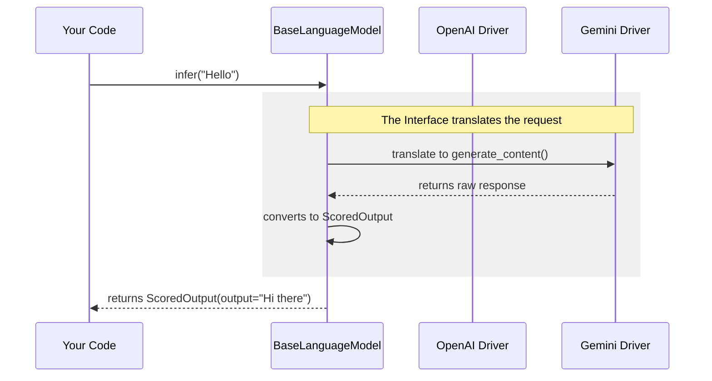

# Chapter 6: Language Model Interface

In [Prompt Engineering](05_prompt_engineering.md), we successfully built the perfect "package"—a prompt containing our instructions, examples, and text chunks.

Now, we need to deliver that package. But there is a problem: every delivery service speaks a different language.

## The Problem: The "Tower of Babel"

Imagine you want to send a message.
*   **OpenAI** demands you format it as a list of messages: `[{"role": "user", "content": "..."}]`.
*   **Google Gemini** demands a simple string or a `Content` object.
*   **Ollama** expects a JSON payload to a local URL.

If you wrote your extraction code to talk directly to OpenAI, and then wanted to switch to Gemini, you would have to rewrite your entire application. You would have messy `if/else` chains everywhere:

```python
# The messy way (AVOID THIS)
if provider == "openai":
    response = openai.chat.completions.create(...)
    text = response.choices[0].message.content
elif provider == "gemini":
    response = model.generate_content(...)
    text = response.text
```

## The Solution: The Universal Adapter

In `langextract`, we solve this with the **Language Model Interface**.

Think of it like a **Universal Power Adapter**. It doesn't matter if the wall socket is American, European, or British; the adapter changes the shape so you can plug your device in without worrying about the voltage or pin shape.

In code, this adapter is called `BaseLanguageModel`. It forces every provider (OpenAI, Gemini, Ollama) to follow the exact same rules.

### The One Method to Rule Them All: `infer()`

The core rule of this interface is simple: **Every model must have an `infer()` method.**

*   **Input:** A list of prompts (strings).
*   **Output:** A standard result object called `ScoredOutput`.

The rest of `langextract` (like the [Extraction Orchestrator](01_extraction_orchestrator.md)) *only* talks to this interface. It doesn't know (or care) if you are using GPT-4 or a local Llama 3 model.

## How to Use It

While the Orchestrator usually handles this for you, you can use the Interface directly to chat with models in a standardized way.

### Step 1: Get a Model (Any Model)

We use the factory (from [Provider Routing & Factory](03_provider_routing___factory.md)) to get an object.

```python
from langextract import factory

# We can swap this string for "gpt-4o" or "ollama/llama3" 
# and the rest of the code works exactly the same!
model = factory.create_model("gemini-2.5-flash")
```

### Step 2: Call `infer`

We don't call `generate_content` or `chat`. We just call `infer`.

```python
# The input is always a list of strings (to support batching)
prompts = ["What is the capital of France?"]

# The result is an Iterator (a stream of answers)
results_iterator = model.infer(prompts)
```
*Explanation: We send a list. We get back an iterator. This standardizes the flow regardless of the API.*

### Step 3: Read the Standard Output

The model returns a `ScoredOutput` object. This normalizes the answer so we don't have to dig through complex JSON responses.

```python
# Get the first result from the iterator
batch_result = next(results_iterator)

# Get the first answer in the batch
first_answer = batch_result[0]

print(f"Answer: {first_answer.output}")
# Output: Answer: The capital of France is Paris.
```
*Explanation: We access `.output` to get the text. We don't care if OpenAI calls it `.message.content` or Gemini calls it `.text`. The interface mapped it for us.*

## Visualizing the Interface

The Interface acts as a shield, protecting your application from the chaotic differences between APIs.



## Under the Hood: Implementation

Let's look at `langextract/core/base_model.py`. This is the abstract contract.

### 1. The Abstract Definition

This class defines what a model *must* look like.

```python
# From langextract/core/base_model.py
class BaseLanguageModel(abc.ABC):
    
    @abc.abstractmethod
    def infer(self, batch_prompts: list[str], **kwargs):
        """
        Every subclass MUST implement this method.
        It takes prompts and returns standardized outputs.
        """
        pass
```

### 2. The Gemini Implementation

Now let's see how Gemini adapts to this rule in `langextract/providers/gemini.py`.

```python
# From langextract/providers/gemini.py
class GeminiLanguageModel(base_model.BaseLanguageModel):
    
    def infer(self, batch_prompts, **kwargs):
        # 1. Translate standard configs to Gemini specific configs
        config = {'max_output_tokens': kwargs.get('max_tokens')}
        
        for prompt in batch_prompts:
             # 2. Call the specific Google API
             response = self._client.models.generate_content(
                 model=self.model_id, 
                 contents=prompt, 
                 config=config
             )
             
             # 3. Wrap result in standard ScoredOutput
             yield [core_types.ScoredOutput(score=1.0, output=response.text)]
```
*Explanation: Notice how it takes `max_tokens` (standard) and renames it to `max_output_tokens` (Gemini specific). It also wraps `response.text` into the standard object.*

### 3. The OpenAI Implementation

In `langextract/providers/openai.py`, the same method looks different internally, but behaves the same externally.

```python
# From langextract/providers/openai.py
class OpenAILanguageModel(base_model.BaseLanguageModel):

    def infer(self, batch_prompts, **kwargs):
        # 1. OpenAI needs messages, not just strings
        messages = [{'role': 'user', 'content': prompt}]
        
        # 2. Call the specific OpenAI API
        response = self._client.chat.completions.create(
            model=self.model_id,
            messages=messages
        )
        
        # 3. Extract text from OpenAI's specific structure
        text = response.choices[0].message.content
        yield [core_types.ScoredOutput(score=1.0, output=text)]
```

### 4. The Ollama Implementation

For local models in `langextract/providers/ollama.py`, we deal with raw HTTP requests.

```python
# From langextract/providers/ollama.py
def infer(self, batch_prompts, **kwargs):
    for prompt in batch_prompts:
        # 1. Send POST request to localhost:11434
        response = requests.post(
            self._model_url + '/api/generate',
            json={'model': self._model, 'prompt': prompt}
        )
        
        # 2. Parse raw JSON
        data = response.json()
        
        # 3. Standardize
        yield [core_types.ScoredOutput(score=1.0, output=data['response'])]
```

## Parameter Normalization

One of the most useful features of the Interface is **Parameter Normalization**.

*   You want the model to be creative? You set `temperature=0.9`.
*   You want the model to be concise? You set `max_tokens=100`.

You pass these to `infer()`. The Interface ensures they go to the right place.

| Your Parameter | OpenAI Destination | Gemini Destination | Ollama Destination |
| :--- | :--- | :--- | :--- |
| `temperature` | `temperature` | `temperature` | `options.temperature` |
| `max_tokens` | `max_tokens` | `max_output_tokens` | `options.num_predict` |

This means you learn **one** set of controls, and they work everywhere.

## Conclusion

The **Language Model Interface** is the quiet hero of `langextract`. It allows the complex machinery of extraction (Schema parsing, Chunking, Prompting) to remain completely agnostic to the AI provider.

It enforces a simple contract: **"I give you a prompt string, you give me a `ScoredOutput` string."**

But you might have noticed that `infer` accepts a *list* of prompts (`batch_prompts`). Why not just one? That is because sending prompts one by one is slow.

[Next Chapter: Batch Inference](07_batch_inference.md)

---

Generated by [Code IQ](https://github.com/adityasoni99/Code-IQ)