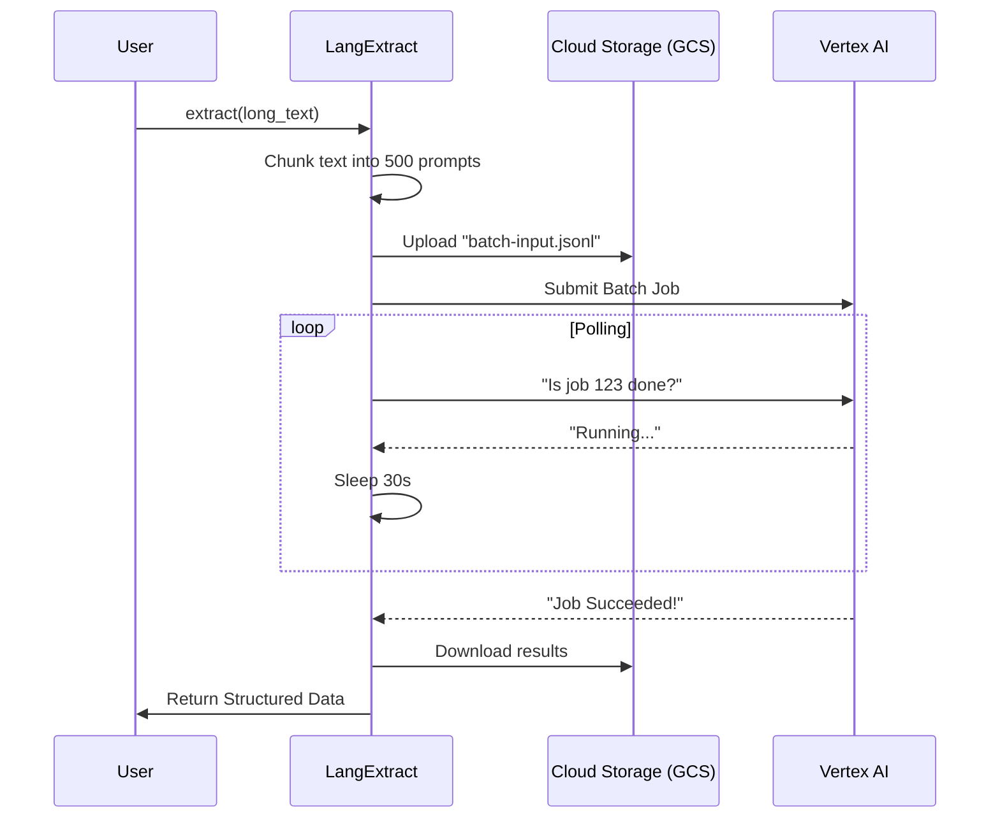

# Chapter 7: Batch Inference

In the previous chapter, [Language Model Interface](06_language_model_interface.md), we learned how to talk to any AI model using a standardized `infer()` method. We sent a prompt and got an immediate answer.

But what if you aren't analyzing one sentence? What if you are analyzing **10,000 medical reports** or the entire works of Shakespeare?

## The Problem: The Traffic Jam

Calling an API one by one for thousands of documents creates three problems:
1.  **Cost:** Real-time API calls are premium services. You pay for speed.
2.  **Rate Limits:** Most APIs will ban you if you send too many requests too fast (the dreaded `429 Too Many Requests` error).
3.  **Fragility:** If your internet blips halfway through document #5000, your script crashes.

## The Solution: Batch Inference

**Batch Inference** is like taking a moving truck instead of carrying boxes to your new house one by one.

Instead of asking the AI for an answer instantly, `langextract` does the following:
1.  **Packs** all your prompts into a single file.
2.  **Uploads** that file to a cloud warehouse (Google Cloud Storage).
3.  **Submits** a job to the AI to process it overnight (or whenever resources are free).
4.  **Polls** (checks status) until the job is done.
5.  **Downloads** the results and hands them to you.

**The Benefit:** This is often **50% cheaper** than real-time calls and allows for massive throughput without hitting rate limits.

### A Simple Use Case

You have a dataset of 5,000 customer reviews. You don't need the results *right now*. You are happy to wait 20 minutes if it saves you money and guarantees completion.

## How to Use It

Batch inference in `langextract` is currently optimized for **Google Vertex AI**. You enable it by passing a `batch` configuration dictionary to the `extract` function.

### Step 1: Define the Batch Configuration

We need to tell `langextract` how to behave.

```python
# Configuration for the batch process
batch_config = {
    "enabled": True,       # Turn on batch mode
    "threshold": 50,       # Only use batch if we have > 50 chunks
    "poll_interval": 30,   # Check for results every 30 seconds
    "enable_caching": True, # Save results so we don't re-run duplicates
    "retention_days": 7    # Auto-delete files from cloud after 7 days
}
```
*Explanation: We set a threshold. If you only have 5 chunks, `langextract` will ignore this and use the fast real-time API. If you have 100, it switches to Batch mode automatically.*

### Step 2: Call Extract

The `extract` function call looks almost identical to previous chapters, with one addition to `language_model_params`.

```python
import langextract as lx

# Assume 'long_text' is a string with 5,000 reviews
result = lx.extract(
    text_or_documents=long_text,
    prompt_description="Extract sentiment",
    examples=examples, 
    model_id="gemini-1.5-flash",
    language_model_params={
        "vertexai": True,        # Required for batching
        "batch": batch_config    # Pass our config here
    }
)
```
*Explanation: `langextract` detects the `batch` key. It chunks the text (see [Smart Chunking](04_smart_chunking.md)), realizes there are many chunks, and engages the Batch Engine.*

## Key Concepts

### 1. The Warehouse (GCS)
You cannot send a massive batch directly to the model. You must stage it. `langextract` automatically creates a **Google Cloud Storage (GCS)** bucket for you. It uploads a `.jsonl` file containing all your prompts.

### 2. Polling
Once the job is submitted, your code effectively "goes to sleep." It wakes up every `poll_interval` (e.g., 30 seconds), asks Google "Is it done yet?", and goes back to sleep. This saves your computer's CPU.

### 3. Caching & Resilience
Imagine your computer crashes 90% of the way through. With real-time calls, you lost everything. With Batch, the results are saved in the cloud. When you restart the script, `langextract` sees the cached results and downloads them instantly without charging you again.

## Visualizing the Flow

Here is the journey your data takes in Batch Mode:



## Under the Hood: Implementation

Let's look at `langextract/providers/gemini_batch.py` to see how this is engineered.

### 1. Building the Payload (`_submit_file`)

First, we need to convert your prompts into a specific file format (JSONL) that Vertex AI accepts.

```python
# From langextract/providers/gemini_batch.py
def _submit_file(client, model_id, requests, ...):
    # Create a temporary local file
    with tempfile.NamedTemporaryFile(suffix=".jsonl") as f:
        for req in requests:
            # Write each prompt as a JSON line
            line = {"request": req}
            f.write(json.dumps(line) + "\n")
            
    # Then upload this file to the GCS bucket...
```
*Explanation: We create a file where every line is a distinct request. This allows the AI to process them in parallel.*

### 2. The Waiting Game (`_poll_completion`)

This function manages the waiting process. It handles the "Are we there yet?" logic.

```python
# From langextract/providers/gemini_batch.py
def _poll_completion(client, job, cfg):
    while True:
        # Ask the API for current status
        job = client.batches.get(name=job.name)
        
        # If done, break the loop
        if job.state == "JOB_STATE_SUCCEEDED":
            return job
            
        # Otherwise, sleep and try again
        time.sleep(cfg.poll_interval)
```

### 3. Smart Caching (`GCSBatchCache`)

This is the money-saver. Before submitting a job, we check if we have done this work before.

```python
# From langextract/providers/gemini_batch.py
class GCSBatchCache:
    def _compute_hash(self, key_data):
        # Create a unique fingerprint for the prompt
        canonical_json = json.dumps(key_data, sort_keys=True)
        return hashlib.sha256(canonical_json).hexdigest()

    def _get_single(self, key_hash):
        # Check cloud storage for this fingerprint
        blob = self._bucket.blob(f"cache/{key_hash}.json")
        if blob.exists():
             return blob.download_as_text()
```
*Explanation: Every prompt gets a unique ID (Hash). If `langextract` finds that ID in the cloud folder, it skips the AI processing entirely and just reads the file.*

## Conclusion

This concludes the `langextract` tutorial series!

We have traveled a long way:
1.  We started with the **[Extraction Orchestrator](01_extraction_orchestrator.md)**, our high-level conductor.
2.  We learned how **[Format Handling](02_format_handling.md)** translates AI chatter into Python objects.
3.  We saw how the **[Provider Routing](03_provider_routing___factory.md)** lets us switch models instantly.
4.  We used **[Smart Chunking](04_smart_chunking.md)** to handle large documents safely.
5.  We built robust instructions with **[Prompt Engineering](05_prompt_engineering.md)**.
6.  We standardized communication with the **[Language Model Interface](06_language_model_interface.md)**.
7.  And finally, we optimized for scale with **Batch Inference**.

You now have all the tools necessary to turn unstructured chaos into structured order, whether it is a single sentence or a library of books.

Happy extracting!

---

Generated by [Code IQ](https://github.com/adityasoni99/Code-IQ)