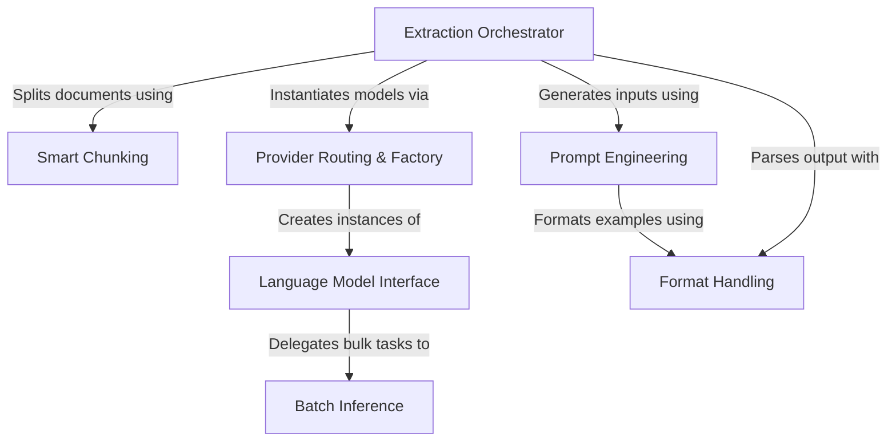

# Tutorial: langextract

**LangExtract** is a framework designed to turn unstructured text into structured data (like JSON or YAML) using **Large Language Models (LLMs)**. It orchestrates the entire pipeline by breaking long documents into *smart chunks*, selecting the appropriate model provider, and enforcing strict formatting rules to ensure accurate and reliable data extraction.

**Source Repository:** [https://github.com/google/langextract](https://github.com/google/langextract)

## Chapters

1. [Extraction Orchestrator](01_extraction_orchestrator.md)
2. [Format Handling](02_format_handling.md)
3. [Provider Routing & Factory](03_provider_routing___factory.md)
4. [Smart Chunking](04_smart_chunking.md)
5. [Prompt Engineering](05_prompt_engineering.md)
6. [Language Model Interface](06_language_model_interface.md)
7. [Batch Inference](07_batch_inference.md)

---

Generated by [Code IQ](https://github.com/adityasoni99/Code-IQ)