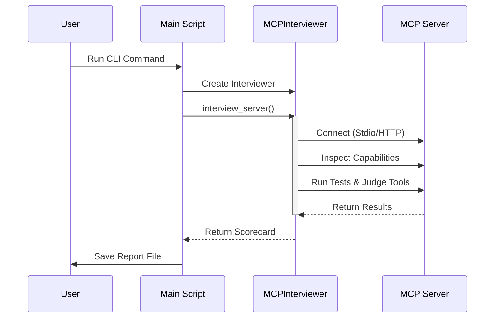

# Chapter 1: The Interviewer (Orchestrator)

Welcome to the **MCP Interviewer** tutorial! If you are building a Model Context Protocol (MCP) server, you need a way to verify that it works correctly, adheres to standards, and provides high-quality tools to Large Language Models (LLMs).

In this first chapter, we will introduce the **Interviewer (Orchestrator)**—the brain of this project.

## The "Hiring Manager" Analogy

Imagine your MCP Server is a job candidate applying for a position.
*   **The Job:** Serving tools and resources to an AI.
*   **The Interview:** A series of checks to ensure the candidate is qualified.

The **Interviewer (Orchestrator)** is the **Hiring Manager**. It doesn't necessarily do every single task itself, but it manages the entire process:
1.  **Schedules the interview** (Connects to the server).
2.  **Reviews the resume** (Inspects capabilities).
3.  **Asks questions** (Runs functional tests).
4.  **Grades the answers** (Validates constraints and judges quality).
5.  **Writes the offer letter** (Generates the final report).

Without this orchestrator, you would have to manually connect to your server, type out JSON requests by hand, and subjectively guess if the responses were good. The Interviewer automates this entire loop.

## How to Use It

Before diving into the code, let's look at how a user kicks off the Orchestrator. The project provides a Command Line Interface (CLI).

To interview a local server, you might run a command like this:

```bash
mcp-interviewer "python my_server.py" --test --judge
```

Here is what happens when you press Enter:
1.  **Parse Arguments:** The CLI reads your command.
2.  **Initialize:** It creates an instance of the `MCPInterviewer`.
3.  **Execute:** It tells the Interviewer to start the "interview."
4.  **Report:** It saves the results to a Markdown file.

## Under the Hood: The Flow

Here is a high-level view of what happens inside the Orchestrator during an interview. Notice how it acts as the central hub.



## Implementation: The Core Loop

Let's look at the code that powers this logic. The system is built in Python.

### 1. The Entry Point (`main.py`)

The `main.py` file contains the logic that ties everything together. It prepares the environment and launches the interviewer.

```python
# src/mcp_interviewer/main.py

# Create the interviewer instance
interviewer = MCPInterviewer(
    client,       # The AI Client (e.g., OpenAI)
    model,        # The AI Model name
    should_run_functional_test,
    should_judge_tool,
    should_judge_functional_test,
)

# Start the interview process!
interview = await interviewer.interview_server(params)
```

**Explanation:**
This snippet shows the creation of the Hiring Manager. We give it the tools it needs (an AI client to help judge answers) and instructions on what to test. Then, we `await` the result of the interview.

### 2. The Brain (`_interviewer.py`)

The class `MCPInterviewer` is where the magic happens. Its primary method is `interview_server`. This method orchestrates the phases of the interview.

```python
# src/mcp_interviewer/interviewer/_interviewer.py

async def interview_server(self, params: ServerParameters) -> ServerScoreCard:
    # Connect to the server using a context manager
    async with mcp_client(params) as (read, write):
        async with ClientSession(read, write, ...) as session:
            
            # Phase 1: Inspect what the server can do
            server = await self.inspect_server(params, session)

            # Phase 2: Evaluate the quality of the tools
            tool_scorecards = await self.judge_tools(server.tools)

            # Phase 3: Run actual functional tests
            functional_test = await self.generate_functional_test(server)
            results = await self.execute_functional_test(session, functional_test)
            
            # ... compiles results into a Scorecard ...
```

**Explanation:**
1.  **Connection:** It establishes a connection to your MCP server. We will cover this in [Server Connection & Inspection](03_server_connection___inspection.md).
2.  **Phase 1 (Inspection):** It asks the server "What tools do you have?"
3.  **Phase 2 (Grading):** It uses AI to look at tool definitions and grade them.
4.  **Phase 3 (Testing):** It tries to actually *use* the tools to see if they work.
5.  **Scorecard:** Finally, it bundles all this data into a `ServerScoreCard`.

### 3. Handling the Results

Once `interview_server` returns the data, the Orchestrator's job is nearly done. It passes the raw data back to the main script to be formatted into a report.

```python
# src/mcp_interviewer/main.py

# Generate a readable Markdown report
path = out_dir / Path("mcp-interview.md")
with open(path, "w") as fd:
    report = FullReport(interview, violations, options)
    fd.write(report.build())

# Save raw JSON data for machine reading
with open(out_dir / Path("mcp-interview.json"), "w") as fd:
    fd.write(interview.model_dump_json(indent=2))
```

**Explanation:**
The Orchestrator ensures that the "Hiring Decision" is written down. It saves a human-readable Markdown file (the one you see in your editor) and a JSON file (for programmatic use). We will learn more about this in the [Reporting System](08_reporting_system.md) chapter.

## Summary

The **Interviewer (Orchestrator)** is the central component that manages the lifecycle of an evaluation. It doesn't do all the heavy lifting alone; instead, it coordinates specialized subsystems to:

1.  **Connect** to the server.
2.  **Inspect** capabilities.
3.  **Test** functionality.
4.  **Report** results.

In the next chapter, we will look at the structured data objects the Interviewer uses to keep track of all this information.

[Next Chapter: Data Models (Scorecards)](02_data_models__scorecards_.md)

---

Generated by [Code IQ](https://github.com/adityasoni99/Code-IQ)