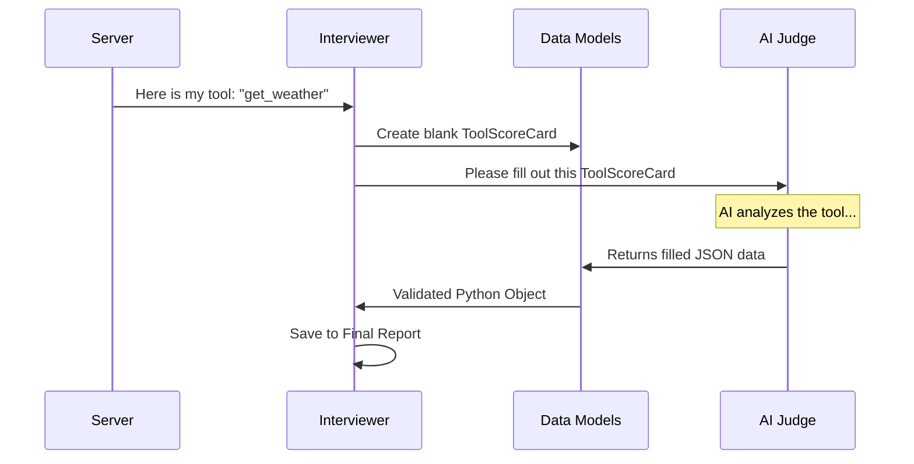

# Chapter 2: Data Models (Scorecards)

In the previous chapter, [The Interviewer (Orchestrator)](01_the_interviewer__orchestrator_.md), we introduced the "Hiring Manager" that conducts the interview. But a manager can't keep all the details in their head. They need paperwork: resumes, evaluation forms, test results, and a final report.

In **MCP Interviewer**, these forms are called **Data Models** or **Scorecards**.

## Why Do We Need Data Models?

Imagine if we asked an AI to "Evaluate this tool." The AI might write a poem, a three-page essay, or just say "It's good."

That is hard for a computer program to process. We need structure. We need to tell the AI:
*"Don't just talk. Fill out this specific form. Give me a Pass/Fail grade, and explain why in one sentence."*

These Data Models solve two problems:
1.  **Standardization:** Every server is judged against the exact same criteria.
2.  **Communication:** They act as the "common language" between the Orchestrator and the AI Judge.

## Key Concepts: The Evaluation Forms

Let's break down the different "forms" our system uses. We use a Python library called **Pydantic**, which allows us to define strict blueprints for data.

### 1. The Basic ScoreCard
At the atomic level, every single judgment in this system looks the same. It contains a **score** and a **justification**.

```python
class ScoreCard(BaseModel, Generic[TScore]):
    justification: str  # Why did you give this score?
    score: TScore       # The actual grade (e.g., "Pass", "Fail", 5, 10)
```

**Explanation:**
This is the base class. Every time the AI makes a decision, it must fill this out. It prevents the AI from giving a random score without a reason.

### 2. The Pass/Fail Card
Most of our checks are binary. Does the tool work? Yes or No.

```python
pass_fail_options = Literal["pass", "fail", "N/A"]

class PassFailScoreCard(ScoreCard[pass_fail_options]):
    # Inherits justification and score
    pass
```

**Explanation:**
This restricts the `score` field so the AI can *only* choose "pass", "fail", or "N/A". It cannot say "Sort of" or "Maybe."

### 3. The Tool ScoreCard (The Resume Review)
When the interviewer looks at a tool (like `get_weather`), it evaluates three specific areas: the Name, the Description, and the Schema (arguments).

```python
class ToolScoreCard(BaseModel):
    tool_name: ToolNameScoreCard
    tool_description: ToolDescriptionScoreCard
    tool_input_schema: ToolSchemaScoreCard
    tool_output_schema: ToolSchemaScoreCard
```

**Explanation:**
This acts like a checklist. The AI must fill out a scorecard for the name (Is it unique?), the description (Is it helpful?), and the schema (Is it too complex?).

### 4. The Functional Test (The Practical Exam)
This model is interesting because it represents a **sequence of events**. It holds the plan, the execution, and the final grade.

```python
class FunctionalTestScoreCard(
    FunctionalTest,                 # The Plan (Steps to take)
    FunctionalTestOutput,           # The Result (What happened)
    FunctionalTestEvaluationRubric  # The Grade (Did it work?)
): ...
```

**Explanation:**
This is a composite model. It tracks the lifecycle of a test:
1.  **Plan:** "I will call `get_weather` with `city='London'`."
2.  **Output:** "The server returned 15°C."
3.  **Rubric:** "Pass. The output matched the request."

## How It Works: The Flow of Data

How do these models actually travel through the system? Here is the lifecycle of a ScoreCard.



1.  The **Server** provides raw information (tools, resources).
2.  The **Interviewer** sends this info to the **AI** along with the schema of the **Data Model**.
3.  The **AI** responds with strict JSON that matches the model.
4.  **Pydantic** validates the JSON (ensuring no missing fields) and converts it into a Python object.

## Implementation Details

Let's look at the actual code in `src/mcp_interviewer/models.py`.

### Defining Specific Rubrics
We give the AI hints (docstrings) on how to grade. These comments are actually read by the AI to understand the rules!

```python
# src/mcp_interviewer/models.py

class ToolNameScoreCard(BaseModel):
    length: PassFailScoreCard
    """Fail = Too short (e.g., "q"). Pass = Optimal length."""
    
    uniqueness: PassFailScoreCard
    """Fail = Duplicate names. Pass = Clearly unique."""
    
    descriptiveness: PassFailScoreCard
    """Fail = Unclear (e.g., "do_it"). Pass = Clear (e.g., "sendEmail")."""
```

**Explanation:**
Notice the strings inside `""" ... """`. When we send this model to the AI, it sees these notes. This teaches the AI that a tool named "q" should fail the `length` check.

### The Big Container: ServerScoreCard
Finally, we have one massive object that holds the entire state of the interview. This is what gets saved to the `mcp-interview.json` file.

```python
# src/mcp_interviewer/models.py

class ServerScoreCard(Server):
    model: str  # The name of the AI Judge used (e.g., gpt-4o)
    tool_scorecards: list[ToolScoreCard]
    functional_test_scorecard: FunctionalTestScoreCard | None
```

**Explanation:**
*   It inherits from `Server` (so it includes the basic connection info).
*   `tool_scorecards`: A list of grades for every single tool the server offers.
*   `functional_test_scorecard`: The detailed results of the automated testing.

## Summary

The **Data Models** are the backbone of the Interviewer. They turn vague AI opinions into structured, actionable data.

*   **ScoreCard:** The basic unit (Score + Reason).
*   **ToolScoreCard:** Evaluates the definition of a tool.
*   **FunctionalTestScoreCard:** Evaluates the execution of a tool.
*   **ServerScoreCard:** The final report card.

Now that we have our "forms" ready, we need to find the "candidate." In the next chapter, we will learn how the Interviewer actually connects to the MCP server to start the process.

[Next Chapter: Server Connection & Inspection](03_server_connection___inspection.md)

---

Generated by [Code IQ](https://github.com/adityasoni99/Code-IQ)