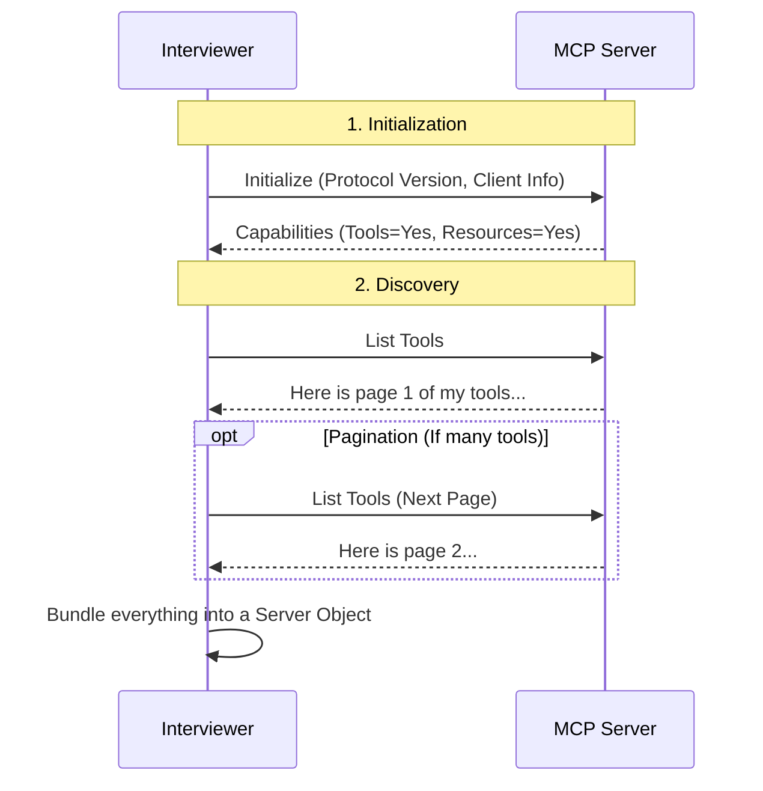

# Chapter 3: Server Connection & Inspection

In the previous chapter, [Data Models (Scorecards)](02_data_models__scorecards_.md), we prepared the "forms" and "rubrics" needed to evaluate an MCP server.

Now, it is time to invite the candidate into the room.

This chapter covers **Connection & Inspection**. Before we can test a server, we must:
1.  **Connect:** Establish a communication line (start the process or connect to a URL).
2.  **Inspect:** Perform the MCP "handshake" to discover what tools and resources the server actually possesses.

## The "Handshake" Analogy

Think of this phase as the first minute of a job interview.

1.  **Connection:** This is the logistics.
    *   **Stdio (Local):** It's like an in-person interview. You bring the candidate (the server process) into the room directly.
    *   **SSE (Remote):** It's like a Zoom call. The candidate is somewhere else, and you connect via a link (URL).

2.  **Inspection:** This is the introduction.
    *   **Initialize:** You say "Hello," and they say "Hello" back, confirming they speak the same language (Protocol Version).
    *   **Capabilities:** You ask, "What is your portfolio?" They hand you a list of their Tools, Resources, and Prompts.

Without this step, the Interviewer (Orchestrator) is flying blind. It wouldn't know which tools to test.

## Part 1: Establishing a Connection

MCP servers can communicate in different ways. The `mcp-interviewer` abstracts this complexity away so the rest of the system doesn't need to care if the server is local or remote.

We use a Python **Context Manager** (`async with`) to handle this. This ensures that if the interview crashes or finishes, the connection is closed cleanly (hanging up the phone).

### How to Use It

Here is how the Orchestrator opens a line of communication using the `mcp_client` helper:

```python
from mcp_interviewer.interviewer.connection import mcp_client

# 1. Define how to connect (e.g., a local command)
params = ServerParameters(command="python", args=["server.py"], connection_type="stdio")

# 2. Open the connection context
async with mcp_client(params) as (read_stream, write_stream):
    print("We are connected!")
    # We can now send messages to the server using these streams
```

**Explanation:**
The code inside the `async with` block runs while the connection is active. As soon as the code exits that block, the `mcp-interviewer` automatically kills the sub-process or closes the network socket.

### Under the Hood: `connection.py`

Let's look at how `src/mcp_interviewer/interviewer/connection.py` creates this abstraction. It acts like a switchboard operator.

```python
# src/mcp_interviewer/interviewer/connection.py

@asynccontextmanager
async def mcp_client(params: ServerParameters):
    """Selects the right client based on config."""
    
    if params.connection_type == "stdio":
        # Start a local process (stdin/stdout)
        async with stdio_client(params) as (read, write):
            yield read, write

    elif params.connection_type == "sse":
        # Connect to a remote URL (Server-Sent Events)
        async with sse_client(params.url, ...) as (read, write):
            yield read, write
```

**Explanation:**
*   It checks `params.connection_type`.
*   If it is `stdio`, it uses the official MCP SDK to launch a subprocess.
*   If it is `sse`, it uses the SDK to make an HTTP request.
*   It `yields` the streams, allowing the Interviewer to talk without knowing *how* the connection was made.

## Part 2: Inspecting the Server

Once connected, we can't just start sending random commands. We need to perform the **Initialization Handshake** and then ask for the "Menu" of available features.

This is handled by the `inspect_server` function.

### The Inspection Flow

Before looking at the code, let's visualize the conversation that happens during inspection.



### Implementation: `inspection.py`

The file `src/mcp_interviewer/interviewer/inspection.py` manages this conversation. It is broken down into specific steps.

#### Step 1: The Handshake (`initialize`)
First, we formally start the MCP session.

```python
# src/mcp_interviewer/interviewer/inspection.py

async def inspect_server(server_params, session):
    logger.info("Initializing client session...")
    
    # The official "Hello" of the MCP protocol
    initialize_result = await session.initialize()
    
    # Check what the server supports
    caps = initialize_result.capabilities
    logger.debug(f"Server capabilities: {caps}")
```

**Explanation:**
`session.initialize()` sends the standard MCP initialization JSON. The result tells us if the server even supports Tools. If `caps.tools` is `None`, we know not to bother asking for tools.

#### Step 2: Fetching Tools (With Pagination)
Servers might have hundreds of tools. The MCP protocol sends them in "pages." We use a loop to fetch them all.

```python
    tools = []
    if caps.tools is not None:
        # Get the first page
        result = await session.list_tools()
        
        # Keep asking for the "next page" until done
        while result.nextCursor:
            tools.extend(result.tools)
            result = await session.list_tools(result.nextCursor)

        # Add the final page
        tools.extend(result.tools)
```

**Explanation:**
1.  We request the list.
2.  If the server returns a `nextCursor` (a bookmark), it means there is more data.
3.  We loop, asking for the next chunk, until the cursor is empty.
4.  We collect everything into the `tools` list.

#### Step 3: Creating the Server Object
Finally, we bundle all the discovered information into a `Server` object (one of our Data Models).

```python
    # Create the final summary object
    server_obj = Server(
        parameters=server_params,
        initialize_result=initialize_result,
        tools=tools,
        resources=resources, # (Fetched similarly to tools)
        prompts=prompts,     # (Fetched similarly to tools)
    )
    
    return server_obj
```

## Why This Matters

By the end of this process, the Orchestrator has a complete snapshot of the server. It knows:
1.  **Protocol Version:** Is the server up to date?
2.  **Capabilities:** Does it support Resources, or just Tools?
3.  **The Inventory:** It has a list of every tool name, description, and input schema.

This `server_obj` is what we will pass to the **AI Judge** to evaluate the quality of the tool definitions, and what we will use to generate test cases.

## Summary

In this chapter, we learned how `mcp-interviewer` bridges the gap between the Orchestrator and the Server.

1.  **Connection:** We use a context manager to support both local (`stdio`) and remote (`sse`) servers seamlessly.
2.  **Inspection:** We perform a handshake and loop through paginated lists to build a full inventory of the server's capabilities.

Now that we know *what* tools the server has, we need a way to actually *run* them.

[Next Chapter: Functional Testing Engine](04_functional_testing_engine.md)

---

Generated by [Code IQ](https://github.com/adityasoni99/Code-IQ)