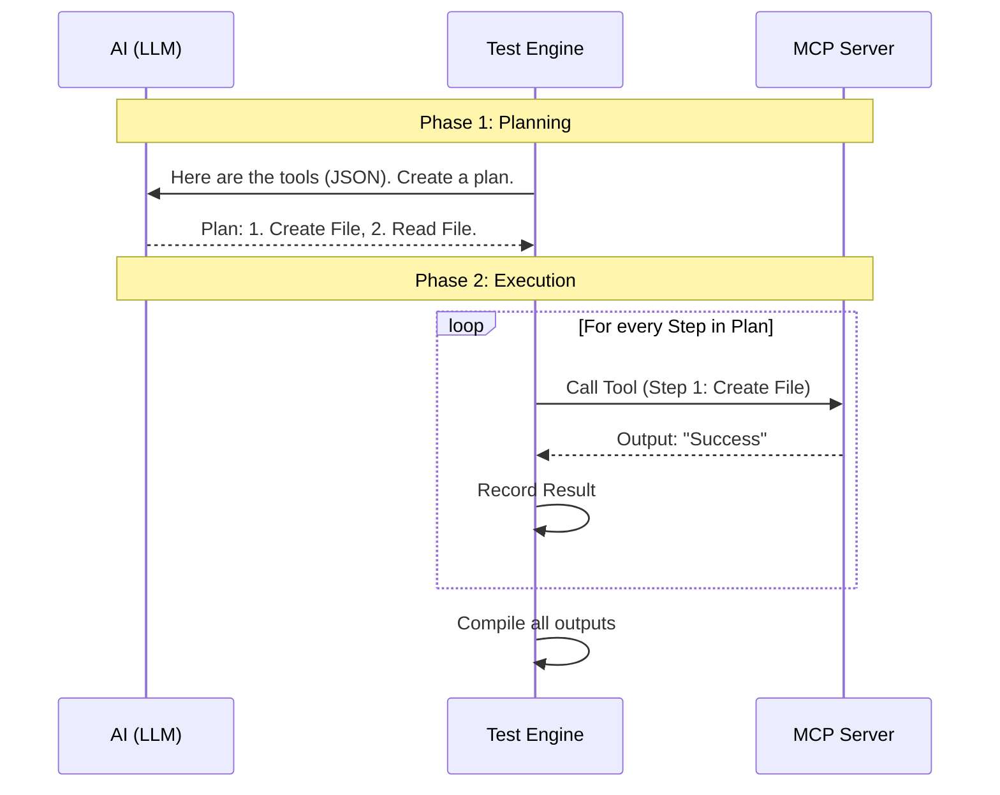

# Chapter 4: Functional Testing Engine

In the previous chapter, [Server Connection & Inspection](03_server_connection___inspection.md), we established a connection to the MCP server and retrieved its "Resume" (the list of tools).

Now, we move to the most critical part of the interview: **The Practical Exam**.

Knowing a tool *exists* isn't enough. Does `calculate_sum` actually add numbers? Does `write_file` actually create a file? To find out, we need to run the code. This is the job of the **Functional Testing Engine**.

## The Problem: How do you test the unknown?

If you were writing a unit test for your own code, you would know exactly what to test:
`assert add(2, 2) == 4`

But the **MCP Interviewer** is designed to interview *any* server. It might be a weather server, a database server, or a calculator. We don't know what it does until runtime. We can't hardcode tests.

## The Solution: AI-Generated Testing

The Functional Testing Engine solves this by acting like a smart QA Engineer. It works in two phases:

1.  **The Architect (Planning):** It asks an LLM (like GPT-4) to look at the tool definitions and write a test plan.
2.  **The Builder (Execution):** It takes that plan and mechanically executes the tool calls against the real server.

## Phase 1: Generating the Plan

First, the engine needs to figure out *what* to do. It takes the list of tools discovered in the previous chapter and sends them to the LLM with a specific prompt.

### The Logic
The LLM is asked to create a **sequence of steps**. It is smart enough to understand:
*   **Dependencies:** "I must call `create_file` *before* I call `read_file`."
*   **Context:** "If the tool is `get_weather(city)`, I should pass a real city like 'London', not '123'."

### How to Use It

The function `generate_functional_test` handles this interaction.

```python
# src/mcp_interviewer/interviewer/test_generation.py

async def generate_functional_test(client, model, server) -> FunctionalTest:
    # 1. Ask the AI to create a plan based on server.tools
    test_plan = await prompts.generate_functional_test(client, model, server)
    
    # 2. Return the structured plan
    return test_plan
```

**Explanation:**
We pass the `client` (to talk to the AI), the `model` name, and the `server` (which contains the tool definitions). We get back a `FunctionalTest` object (remember this Data Model from Chapter 2?).

## Phase 2: Executing the Plan

Once we have the plan (e.g., "Call `add(2,2)` then `subtract(4,1)`"), we need to run it. The Orchestrator hands this plan to the execution engine.

### How to Use It

The function `execute_functional_test` takes the plan and the live session.

```python
# src/mcp_interviewer/interviewer/test_execution.py

async def execute_functional_test(session, test_plan, counters):
    # Run the test and capture results
    results, step_outputs = await execute_functional_test(
        session, 
        test_plan, 
        counters
    )
    return results
```

**Explanation:**
*   `session`: The active connection to the MCP server.
*   `test_plan`: The list of steps the AI generated.
*   `counters`: A simple dictionary to track how many requests we make (for statistics).

## Under the Hood: The Workflow

Let's visualize how the Orchestrator uses the Testing Engine to bridge the gap between the AI's brain and the Server's tools.



## Implementation Details

Let's look at the actual code that powers these two phases.

### 1. The Prompt (`_generate_functional_test.py`)

This file constructs the message sent to the AI. It formats the available tools into a readable list and adds instructions.

```python
# src/mcp_interviewer/prompts/_generate_functional_test.py

prompt = f"""
You are creating a comprehensive testing plan for an MCP server.

Available Tools:
{tools_list}

Your task is to create a strategic testing plan that:
1. Identifies Dependencies (e.g., create before delete)
2. Orders Tool Calls logically
3. Generates Realistic Arguments

Respond with a JSON object following this schema...
"""
```

**Explanation:**
The most important part here is the instruction to **Identify Dependencies**. This ensures we don't try to delete a file that doesn't exist yet. The AI returns a JSON object that strictly matches our `FunctionalTest` schema.

### 2. The Execution Loop (`test_execution.py`)

This file contains the loop that actually talks to the server. It is designed to be resilient—if one step fails, we record the error and move on, rather than crashing the whole program.

```python
# src/mcp_interviewer/interviewer/test_execution.py

async def execute_functional_test(session, test, request_counters):
    step_outputs = []
    
    # Loop through every step the AI planned
    for i, step in enumerate(test.steps):
        try:
            # Execute a single step
            output = await execute_functional_test_step(session, step, request_counters)
            step_outputs.append(output)
        except Exception as e:
            # If the tool crashes, log it but don't stop the interview
            logger.error(f"Step {i} failed: {e}")
            raise # (In strict mode we might raise, otherwise we capture)

    return aggregate_results(step_outputs), step_outputs
```

**Explanation:**
We iterate through `test.steps`. For each step, we call a helper function `execute_functional_test_step` which wraps the official `session.call_tool` method.

### 3. The Single Step (`test_execution.py`)

This is the atomic unit of work.

```python
# src/mcp_interviewer/interviewer/test_execution.py

async def execute_functional_test_step(session, step, request_counters):
    try:
        # The actual MCP protocol call
        result = await session.call_tool(step.tool_name, step.tool_arguments)
        return FunctionalTestStepOutput(tool_output=result, exception=None)
        
    except Exception as e:
        # Capture exceptions as data, not crashes
        return FunctionalTestStepOutput(tool_output=None, exception=str(e))
```

**Explanation:**
*   `session.call_tool`: This sends the request over the wire (Stdio or HTTP) to the server.
*   `FunctionalTestStepOutput`: We wrap the result (or the error message) into a standard object so the Grading System (coming later) can analyze it.

## Summary

The **Functional Testing Engine** allows the Interviewer to dynamically test any server without prior knowledge of its code.

1.  **Generate:** It uses AI to understand the tools and create a logical script.
2.  **Execute:** It runs that script against the server, capturing real inputs and outputs.

At this point, we have run the tools. We have a list of inputs (from the AI plan) and outputs (from the Server). But... **did it work?** Just because the server returned *something* doesn't mean it returned the *right thing*.

In the next chapter, we will look at how we validate that the server behaved correctly according to the rules of the MCP protocol.

[Next Chapter: Constraint Validation](05_constraint_validation.md)

---

Generated by [Code IQ](https://github.com/adityasoni99/Code-IQ)