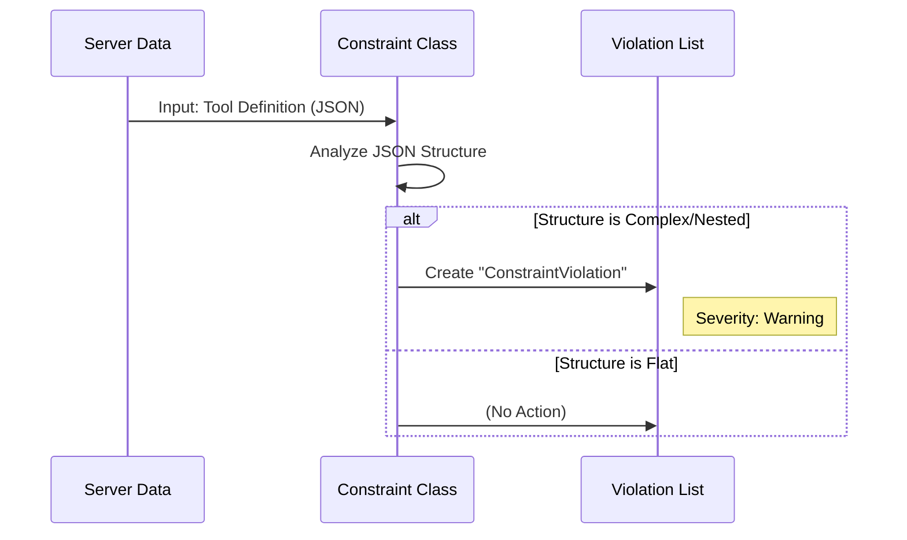

# Chapter 5: Constraint Validation

In the previous chapter, [Functional Testing Engine](04_functional_testing_engine.md), we learned how to verify that a server's tools actually run. We sent commands, and the server executed them.

But here is the catch: **Just because code runs, doesn't mean it is "good."**

A tool might work perfectly but have a confusing name, require 20 complex arguments, or output massive JSON blobs that confuse an LLM.

This brings us to **Constraint Validation**. If the Functional Test is the "Practical Exam," Constraint Validation is the **Building Inspector**. It checks your code against a strict set of safety rules and best practices.

## The "Building Inspector" Analogy

Imagine you built a house.
1.  **Functional Test:** You flip the light switch. The light turns on. *Success!*
2.  **Constraint Validation:** The inspector looks at the wiring behind the wall. "Wait," they say. "You used the wrong type of wire. The light works, but this is a fire hazard. **Fail.**"

In the world of MCP (Model Context Protocol), our "Building Code" consists of rules like:
*   **Flatness:** Don't make AI navigate deep, nested menus.
*   **Naming:** Don't name a tool `func_1`. Use descriptive names like `calculate_tax`.
*   **Size:** Don't return 10MB of text in a single turn.

## Key Concepts

The system is built around three simple concepts found in `src/mcp_interviewer/constraints/base.py`.

### 1. The Constraint (The Rule)
A `Constraint` is a Python class that defines a specific rule. It knows how to look at a specific part of the server (like a Tool definition) and decide if it is compliant.

### 2. The Violation (The Ticket)
If a server breaks a rule, the Constraint issues a `ConstraintViolation`. This contains a message explaining what went wrong.

### 3. Severity (The Fine)
Not all rules are equal.
*   **Critical:** The server is broken or dangerous.
*   **Warning:** The server works, but the AI might struggle to use it.

## Use Case: The "Russian Doll" Problem

Let's look at a specific problem: **Tool Schema Flatness**.

LLMs (Large Language Models) are smart, but they struggle when you ask them to fill out complex, nested forms (Objects inside Objects inside Objects).

**Bad (Nested):**
```json
{
  "user": {
    "profile": {
      "details": {
        "age": 25
      }
    }
  }
}
```

**Good (Flat):**
```json
{
  "user_age": 25
}
```

We want to write a constraint that automatically flags the "Bad" version.

## How to Use It

Using the validation system is straightforward. You instantiate a constraint and feed it data.

Here is how you might manually check a tool against the "Flatness" rule:

```python
from mcp_interviewer.constraints.tool_schema_flatness import ToolInputSchemaFlatnessConstraint

# 1. Load the rule
rule = ToolInputSchemaFlatnessConstraint()

# 2. Run the check against a tool (from your ServerScoreCard)
violations = list(rule.test_tool(my_tool))

# 3. Check results
if len(violations) > 0:
    print(f"Failed! {violations[0].message}")
else:
    print("Passed!")
```

**Explanation:**
We create the inspector (`rule`). We ask it to inspect a specific tool (`my_tool`). It returns a list of problems. If the list is empty, the tool is perfect!

## Under the Hood: The Logic

How does the system actually process these rules? Let's trace the flow.



### The Base Implementation

In `src/mcp_interviewer/constraints/base.py`, we define what a violation looks like. It is a simple data holder.

```python
# src/mcp_interviewer/constraints/base.py

class ConstraintViolation:
    """Represents a broken rule."""
    def __init__(self, constraint, message, severity=Severity.WARNING):
        self.constraint = constraint
        self.message = message
        self.severity = severity
```

**Explanation:**
When a rule is broken, we create an instance of this class. It records *who* found the error (`constraint`), *what* the error is (`message`), and *how bad* it is (`severity`).

### The Recursive Inspector

Now let's look at the actual logic for the "Flatness" check in `src/mcp_interviewer/constraints/tool_schema_flatness.py`.

This code needs to look inside the tool's input arguments. If it finds a dictionary inside another dictionary, it raises a flag.

```python
# src/mcp_interviewer/constraints/tool_schema_flatness.py

class ToolInputSchemaFlatnessConstraint(ToolConstraint):
    
    def test_tool(self, tool: Tool):
        # Helper function to check for nesting
        def has_nested_structure(obj, depth=0):
            # If we are deep inside and find MORE properties, it's nested!
            if depth > 0 and "properties" in obj:
                return True
            
            # ... (recursion logic to check children) ...
            return False

        # If the helper returns True, report a violation
        if has_nested_structure(tool.inputSchema):
            yield ConstraintViolation(
                self,
                f"Tool '{tool.name}' has nested structures. Keep it flat!",
                severity=Severity.WARNING
            )
```

**Explanation:**
1.  **Inheritance:** It inherits from `ToolConstraint`, which means it is designed to check Tools specifically.
2.  **Logic:** It defines a helper `has_nested_structure` that digs through the JSON layers.
3.  **Yield:** If nesting is found, it `yields` a `ConstraintViolation`. We use `yield` because one tool might have multiple violations (though here we just stop at the first one).

## Aggregating Constraints

In a real interview, we don't just run one rule. We run dozens.

The framework supports a `CompositeConstraint`. This is a container that holds many rules. When you tell the Composite to `test()`, it loops through all its children.

```python
# src/mcp_interviewer/constraints/base.py

class CompositeConstraint(Constraint):
    def __init__(self, *constraints):
        self._constraints = list(constraints)

    def test(self, server):
        # Run every single rule in the list
        for constraint in self._constraints:
            yield from constraint.test(server)
```

**Explanation:**
This allows the Orchestrator to treat a bundle of 50 rules exactly the same way it treats a single rule. It just calls `.test(server)` and gets back a stream of all violations found by all inspectors.

## Summary

Constraint Validation acts as the **Static Analysis** phase of the interview.

*   **It ensures quality:** It catches bad patterns that functional tests miss.
*   **It is standardized:** Every server is judged by the exact same "Building Code."
*   **It is extensible:** We can easily write new classes to enforce new rules as the MCP standard evolves.

However, strict rules can't catch everything. A tool name might follow the rules (no spaces, correct length) but still be confusing (e.g., `do_stuff_now`). To catch that, we need something smarter than code. We need AI.

In the next chapter, we will discuss how we use an LLM as a judge to evaluate the *semantics* and *quality* of the server.

[Next Chapter: AI Evaluation (Judging)](06_ai_evaluation__judging_.md)

---

Generated by [Code IQ](https://github.com/adityasoni99/Code-IQ)