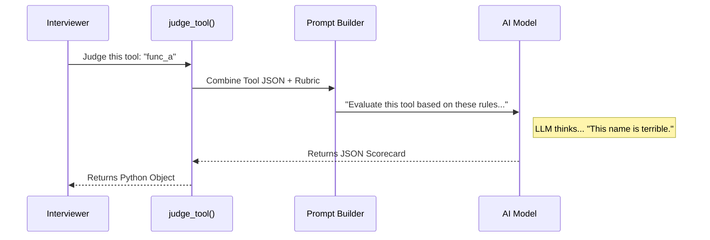

# Chapter 6: AI Evaluation (Judging)

In the previous chapter, [Constraint Validation](05_constraint_validation.md), we acted like a **Building Inspector**. We checked if the server followed strict rules, like "Don't nest JSON too deeply."

However, a tool can follow all the rules and still be bad.

Imagine a tool defined like this:
*   **Name:** `func_a`
*   **Description:** `does stuff`
*   **Input:** `{"x": "string"}`

Technically, this is valid JSON. The code will run. But if an AI tries to use this tool, it will have no idea what it does.

This is where **AI Evaluation (Judging)** comes in. Since we can't write a code rule for "Make the description helpful," we hire an AI to act as a **Critic**.

## The "Art Critic" Analogy

If Constraint Validation is checking if a painting fits in the frame, **AI Evaluation** is judging the art itself.

The Interviewer sends the server's tools to a smart LLM (like GPT-4) and asks:
1.  "Is this tool name descriptive?"
2.  "Is the description clear enough for another AI to understand?"
3.  "Are the inputs easy to generate?"

The LLM acts as the Judge, grading the server on **Quality** rather than just functionality.

## How to Use It

The judging system is designed to be optional because it uses LLM tokens (which might cost money or take time).

You don't need to write the prompts yourself. You just call the `judge_tool` function.

```python
from mcp_interviewer.interviewer.tool_judging import judge_tool

# 1. You need a tool to judge (usually found during Inspection)
my_tool = server.tools[0]

# 2. Ask the Judge to evaluate it
scorecard = await judge_tool(
    client=ai_client, 
    model="gpt-4o", 
    tool=my_tool, 
    should_judge=True
)

# 3. View the verdict
print(f"Name Score: {scorecard.tool_name.descriptiveness.score}")
print(f"Reason: {scorecard.tool_name.descriptiveness.justification}")
```

**Explanation:**
*   `should_judge=True`: This tells the system "Yes, please spend the tokens to grade this."
*   The result is a `ToolScoreCard` (from [Data Models (Scorecards)](02_data_models__scorecards_.md)) containing pass/fail grades and text explanations.

## Under the Hood: The Flow

How does the Python code talk to the AI Judge?



## Implementation Details

Let's look at the two key files that make this happen.

### 1. The Prompt (`prompts/_score_tool.py`)

This file constructs the message we send to the LLM. It's essentially a template.

```python
# src/mcp_interviewer/prompts/_score_tool.py

async def judge_tool(client, model, tool):
    # We embed the tool's raw JSON into the prompt
    prompt = f"""
    Evaluate the quality of this MCP tool.
    
    Tool:
    {tool.model_dump_json()}

    Instructions:
    Fill out the rubric and return JSON.
    """
    
    # We ask for a structured response (ToolScoreCard)
    return await create_typed_completion(client, model, prompt, ToolScoreCard)
```

**Explanation:**
*   We dump the tool data into the string.
*   We use `create_typed_completion`. This is a helper that forces the LLM to reply with valid JSON that matches our Scorecard data model.

### 2. The Logic (`interviewer/tool_judging.py`)

This file manages the process. Crucially, it handles the case where the user *doesn't* want to pay for AI judging.

#### Handling the "Skip" Case

If `should_judge` is `False`, we can't just return `None`, because the rest of the report expects a Scorecard. So, we return a "Blank" scorecard filled with "N/A".

```python
# src/mcp_interviewer/interviewer/tool_judging.py

async def judge_tool(client, model, tool, should_judge):
    
    # Optimization: Skip expensive calls if disabled
    if not should_judge:
        logger.info(f"Skipping judging for '{tool.name}'")
        
        # Return a dummy scorecard
        na_card = PassFailScoreCard(score="N/A", justification="Skipped")
        return ToolScoreCard(..., tool_name=na_card, ...)
```

**Explanation:**
This ensures the pipeline never breaks. Even if judging is turned off, the report generation system still receives a valid object structure—it just contains "N/A" grades.

#### Handling the "Run" Case

If judging is enabled, we make the actual network call.

```python
    try:
        logger.debug(f"Judging tool '{tool.name}'")
        
        # Call the prompt function we saw earlier
        scorecard = await prompts.judge_tool(client, model, tool)
        
        return scorecard
    except Exception as e:
        logger.error(f"Failed to judge: {e}")
        raise
```

**Explanation:**
This block delegates the heavy lifting to the `prompts` module. If the AI is down or the network fails, it logs the error so you know why the interview wasn't completed.

## Why This Matters

By combining **Constraint Validation** (Chapter 5) and **AI Evaluation** (Chapter 6), `mcp-interviewer` provides a 360-degree review:

1.  **Functional Test:** Does it work?
2.  **Constraint Validation:** Is it legal?
3.  **AI Evaluation:** Is it high quality?

This ensures that your MCP server isn't just "bug-free," but also friendly and usable for the AIs that will interact with it.

## Summary

In this chapter, we learned how to use an LLM as a qualitative critic.
*   We use `judge_tool` to send tool definitions to an AI.
*   The AI fills out a structured `ToolScoreCard`.
*   We handle "skipping" gracefully by returning "N/A" scorecards.

Now the interview is complete! We have connected, inspected, tested, validated, and judged. We have a mountain of data. In the next chapter, we will learn how to aggregate all these individual results into high-level numbers.

[Next Chapter: Statistics Collection](07_statistics_collection.md)

---

Generated by [Code IQ](https://github.com/adityasoni99/Code-IQ)