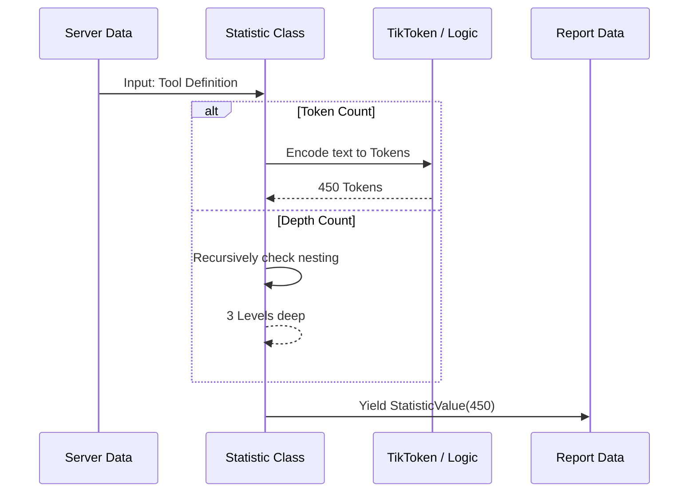

# Chapter 7: Statistics Collection

In the previous chapter, [AI Evaluation (Judging)](06_ai_evaluation__judging_.md), we acted like an art critic. We used an AI to look at the server's tools and give us a qualitative opinion ("Is this description helpful?").

But in engineering, feelings aren't enough. We also need **hard numbers**.

This brings us to **Statistics Collection**. If the AI Judge provides the *Quality*, the Statistics system provides the *Dimensions*.

## The "Luggage Size" Analogy

Imagine you are packing for a flight.
*   **The Suitcase:** This is the AI Model's "Context Window" (how much information it can hold at once).
*   **Your Clothes:** These are the Tools your server provides.

If you have a tool with a massive, complex schema (definition), it's like trying to pack a winter coat. It takes up a lot of space. If it's too big, the AI literally cannot "carry" it, and your tool becomes unusable.

**Statistics Collection** answers questions like:
1.  **Cost:** How many tokens does this tool definition consume? (Money/Space).
2.  **Complexity:** How many parameters does the user need to fill out?
3.  **Depth:** How deeply nested is the JSON structure?

## Key Concepts

The system breaks this down into small, calculable units using the `Statistic` class.

### 1. The Metric (The Calculator)
This is a small class designed to measure *one specific thing*.
*   `ToolInputSchemaTokenCount`: Calculates the "weight" in tokens.
*   `ToolInputSchemaMaxDepthCount`: Calculates the structural depth.

### 2. The Value (The Result)
When a Metric runs, it produces a `StatisticValue`. This isn't just a number; it links back to the calculator so the report knows *what* that number represents.

## How to Use It

Using the statistics engine is very similar to using the Constraint system. You pick a calculator and feed it the server data.

Here is how you might calculate the "Token Cost" of your tools manually:

```python
from mcp_interviewer.statistics.tool import ToolInputSchemaTokenCount

# 1. Create the calculator
calculator = ToolInputSchemaTokenCount()

# 2. Run it against your server's data (ServerScoreCard)
# This returns a generator, so we convert to a list
stats = list(calculator.compute(server_scorecard))

# 3. Print results
for stat in stats:
    print(f"Tool Cost: {stat.value} tokens")
```

**Explanation:**
We instantiate the `ToolInputSchemaTokenCount` class. When we call `.compute()`, it iterates through every tool in the server, does the math, and returns the results.

## Under the Hood: The Flow

How does the system actually count these abstract concepts?



## Implementation Details

Let's look at `src/mcp_interviewer/statistics/tool.py` to see how these calculations are implemented.

### 1. Counting Tokens (The Cost)

The most important statistic is the token count. We use a library called `tiktoken` (from OpenAI) to accurately simulate how an LLM reads text.

```python
# src/mcp_interviewer/statistics/tool.py

class ToolInputSchemaTokenCount(ToolStatistic):
    def compute_tool(self, tool: Tool):
        # 1. Convert our tool to OpenAI's format
        oai_tool = convert_to_openai_format(tool)
        
        # 2. Use helper to count tokens based on model "gpt-4o"
        token_count = num_tokens_for_tool(oai_tool, "gpt-4o")
        
        # 3. Yield the result
        yield StatisticValue(self, token_count)
```

**Explanation:**
*   `convert_to_openai_format`: MCP tools look slightly different from OpenAI tools. We align them first.
*   `num_tokens_for_tool`: This acts like a virtual scale. It weighs every letter, punctuation mark, and whitespace according to the specific rules of GPT-4.

### 2. Counting Depth (The Complexity)

Deeply nested JSON (objects inside objects inside objects) confuses AI models. We use a recursive function to measure this.

```python
# src/mcp_interviewer/statistics/tool.py

class ToolInputSchemaMaxDepthCount(ToolStatistic):
    def compute_tool(self, tool: Tool):
        # Recursive helper function
        def get_max_depth(obj, depth=0):
            if isinstance(obj, dict):
                # If it's a dictionary, dig deeper into values
                return max(get_max_depth(v, depth + 1) for v in obj.values())
            return depth

        # Run the check
        depth = get_max_depth(tool.inputSchema.get("properties", {}))
        yield StatisticValue(self, depth)
```

**Explanation:**
Think of Russian Nesting Dolls.
1.  The function looks at the outer shell (Level 0).
2.  Does it contain another doll (dict)? If yes, go to Level 1.
3.  It keeps going until it hits the bottom.
4.  It returns the highest number it reached.

### 3. Aggregating Statistics

Just like with Constraints, we often want to run *all* the math at once. We use a `CompositeStatistic` to bundle them.

```python
# src/mcp_interviewer/statistics/tool.py

class AllToolStatistics(CompositeStatistic):
    def __init__(self) -> None:
        super().__init__(
            ToolInputSchemaTokenCount(),
            ToolInputSchemaTotalParametersCount(),
            ToolInputSchemaMaxDepthCount(),
            # ... add more calculators here
        )
```

**Explanation:**
This `AllToolStatistics` class acts as a master dashboard. When the Interviewer calls this, it triggers every calculator in the list, returning a comprehensive set of metrics in one go.

## Why This Matters

This data is crucial for **Benchmarking**.

*   **Optimization:** If you notice your tool uses 2,000 tokens just for the definition, you know you need to shorten your descriptions to save money.
*   **Debugging:** If the AI consistently fails to use a tool, check the **Depth Statistic**. If it's 5 or 6 levels deep, that is likely the culprit.

## Summary

In this chapter, we added objective measurements to our interview process.

1.  **Statistics Collection** quantifies the "weight" and "complexity" of tools.
2.  We use **Token Counts** to estimate cost and context usage.
3.  We use **Depth and Parameter Counts** to estimate cognitive load for the AI.

We have now reached the end of the data gathering phase. We have:
*   Connection status
*   Tool definitions
*   Functional test results (Pass/Fail)
*   Constraint violations (Warnings)
*   AI Judgments (Quality scores)
*   Statistics (Metrics)

The final step is to take this massive pile of data and turn it into something a human can actually read.

[Next Chapter: Reporting System](08_reporting_system.md)

---

Generated by [Code IQ](https://github.com/adityasoni99/Code-IQ)