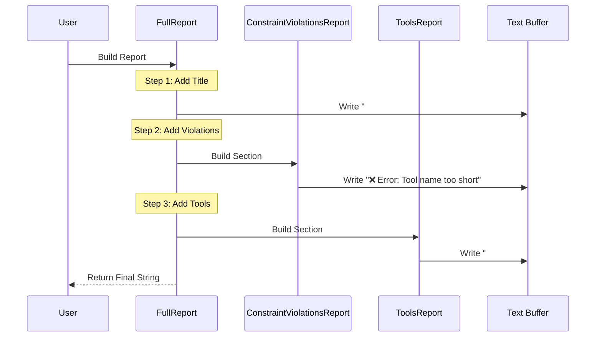

# Chapter 8: Reporting System

Welcome to the final chapter of the **MCP Interviewer** tutorial!

In the previous chapter, [Statistics Collection](07_statistics_collection.md), we finished gathering every possible metric about our server. We now have a mountain of data: connection details, tool definitions, test results, constraint violations, AI judgments, and token counts.

Currently, this data exists as a massive, complex Python object (`ServerScoreCard`). If we just printed it to the screen, it would look like a matrix of unreadable code.

This brings us to the **Reporting System**. Its job is to take that raw data and turn it into a beautiful, human-readable document—a **Report Card** that you can actually understand.

## The "School Report Card" Analogy

Imagine a student finishes a school year.
*   **Raw Data:** Every homework assignment, every pop quiz, attendance records, and teacher's notes scribbled in margins.
*   **The Report Card:** A single sheet of paper that summarizes the grades (A, B, C), highlights attendance, and offers a few sentences of teacher feedback.

The **Reporting System** is the administration office. It filters out the noise (like successful tests that don't need attention) and highlights the signal (failures, warnings, and high-level stats).

## Key Concepts

The reporting engine is built like a stack of building blocks.

### 1. The Base Report
This is the "blank piece of paper." It knows how to write Markdown features like Headers (`#`), lists (`-`), and code blocks.

### 2. Sub-Reports (Modules)
These are specific sections of the document. Each one is responsible for **one** topic.
*   `ToolsReport`: Lists available tools.
*   `ConstraintViolationsReport`: Lists rules that were broken.
*   `FailedTestsReport`: Lists only the tests that failed (ignoring the passing ones).

### 3. The Full Report (The Orchestrator)
This is the master container. It doesn't write content itself; instead, it organizes the Sub-Reports into a specific order to create the final document.

## How to Use It

Using the reporting system is the easiest part of the entire project. You simply feed your `ServerScoreCard` into the `FullReport` class and ask it to build.

Here is how the main application generates the final `mcp-interview.md` file:

```python
from mcp_interviewer.reports.full import FullReport

# 1. Initialize the report with your data
# 'interview_results' is the ServerScoreCard from previous chapters
report_generator = FullReport(interview_results, violations)

# 2. Build the string (Markdown content)
markdown_content = report_generator.build()

# 3. Save it to a file
with open("mcp-interview.md", "w") as f:
    f.write(markdown_content)
```

**Explanation:**
You don't need to manually format strings or worry about where to put emojis. The `FullReport` handles the layout, and `.build()` returns the complete text ready to be saved.

## Under the Hood: The Flow

How does the system assemble this document? It uses a **Composition Pattern**.



## Implementation Details

Let's look at the code to see how these blocks fit together.

### 1. The Master Plan (`full.py`)

The `FullReport` class defines the structure of the document. Notice how it simply adds other reports one by one.

```python
# src/mcp_interviewer/reports/full.py

class FullReport(BaseReport):
    def _build(self):
        # 1. Start with a title
        self.add_title("MCP Interviewer Report", 1)

        # 2. Add specific sections
        self.add_report(ServerInfoReport(self._scorecard))
        self.add_report(ToolStatisticsReport(self._scorecard))
        
        # 3. Add the Violations section
        self.add_report(ConstraintViolationsReport(
            self._scorecard, self._violations
        ))
        
        # ... add more reports ...
```

**Explanation:**
This method acts as the Table of Contents. If you wanted to change the order of the report (e.g., put Statistics at the top), you would just swap the lines here.

### 2. A Specific Module: Violations (`constraint_violations.py`)

This sub-report is responsible for displaying the "Red X" marks for broken rules. It loops through the data and formats a table.

```python
# src/mcp_interviewer/reports/interviewer/constraint_violations.py

class ConstraintViolationsReport(BaseReport):
    def _build(self):
        self.add_title("Constraint Violations", 2)

        # Calculate summary stats
        errors = sum(1 for v in self.violations if v.is_critical)
        warnings = sum(1 for v in self.violations if v.is_warning)

        # Draw a summary table
        self.add_table_header(["❌ Errors", "⚠️ Warnings"])
        self.add_table_row([str(errors), str(warnings)])
        
        # List details below
        # ... logic to print each error ...
```

**Explanation:**
This class focuses entirely on formatting violations. It calculates the totals for the summary table and then lists the specific problems. It doesn't care about Tools or Connection status.

### 3. Handling Complexity: Collapsible Sections

Reports can get very long. To keep the document readable, we use HTML `<details>` tags (Collapsibles).

In `ToolsReport`, we hide the raw JSON schemas unless the user clicks to expand them.

```python
# src/mcp_interviewer/reports/server/tools.py

class ToolsReport(BaseReport):
    def add_available_tools(self):
        self.add_title("Tools", 2)
        
        # Create a dropdown menu
        self.start_collapsible("Toggle details")

        for tool in self._scorecard.tools:
            self.add_title(f"{tool.name}", 3)
            self.add_code_block(tool.description)

        # Close the dropdown
        self.end_collapsible()
```

**Explanation:**
`start_collapsible` inserts `<details><summary>Toggle details</summary>`. This renders in Markdown viewers (like GitHub) as a clickable arrow. This keeps the report clean while preserving all technical details for debugging.

## Why Markdown?

We chose Markdown for the reporting format because:
1.  **Universal:** Every developer tool (VS Code, GitHub, GitLab) renders it beautifully.
2.  **Portable:** It is just plain text. You can email it, commit it to git, or paste it into ChatGPT.
3.  **Rich:** It supports tables, code blocks, bold text, and even HTML for advanced formatting (like the collapsible sections).

## Conclusion of the Tutorial

Congratulations! You have walked through the entire architecture of the **MCP Interviewer**.

Let's recap the journey:
1.  **[The Interviewer](01_the_interviewer__orchestrator_.md):** We met the "Hiring Manager" that coordinates the process.
2.  **[Data Models](02_data_models__scorecards_.md):** We defined the "Forms" used to capture data.
3.  **[Server Connection](03_server_connection___inspection.md):** We learned how to dial up a server and ask for its resume.
4.  **[Functional Testing](04_functional_testing_engine.md):** We used AI to plan and execute code tests.
5.  **[Constraint Validation](05_constraint_validation.md):** We acted as a Building Inspector to enforce rules.
6.  **[AI Evaluation](06_ai_evaluation__judging_.md):** We acted as an Art Critic to judge quality.
7.  **[Statistics Collection](07_statistics_collection.md):** We weighed and measured the tools.
8.  **Reporting System (This Chapter):** We compiled it all into a final result.

You now understand how to build a system that can interview *any* MCP server, validate its behavior, and generate a professional quality report. This ensures that the tools we give to Large Language Models are safe, reliable, and easy to use.

Thank you for following along!

---

Generated by [Code IQ](https://github.com/adityasoni99/Code-IQ)