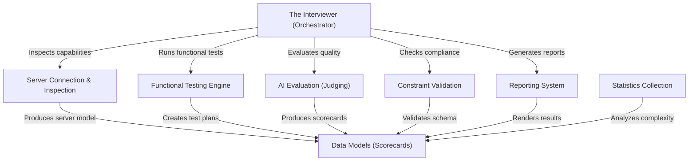

# Tutorial: mcp-interviewer

The **mcp-interviewer** is an automated evaluation framework for Model Context Protocol (MCP) servers. Acting as a *digital hiring manager*, it orchestrates a complete lifecycle that includes connecting to a server, inspecting its capabilities, running LLM-generated **functional tests**, and validating compliance with **constraints**. It produces comprehensive **scorecards** and reports that grade the server's tools, schema quality, and reliability.

**Source Repository:** [https://github.com/microsoft/mcp-interviewer](https://github.com/microsoft/mcp-interviewer)

## Chapters

1. [The Interviewer (Orchestrator)](01_the_interviewer__orchestrator_.md)
2. [Data Models (Scorecards)](02_data_models__scorecards_.md)
3. [Server Connection & Inspection](03_server_connection___inspection.md)
4. [Functional Testing Engine](04_functional_testing_engine.md)
5. [Constraint Validation](05_constraint_validation.md)
6. [AI Evaluation (Judging)](06_ai_evaluation__judging_.md)
7. [Statistics Collection](07_statistics_collection.md)
8. [Reporting System](08_reporting_system.md)

---

Generated by [Code IQ](https://github.com/adityasoni99/Code-IQ)