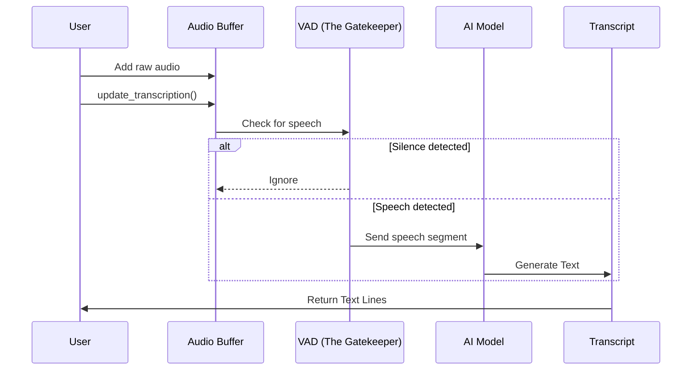

# Chapter 1: Transcriber (The Orchestrator)

Welcome to the **Moonshine** library! If you are looking to turn speech into text, you have come to the right place.

We start our journey with the most important component of the entire system: the **Transcriber**.

## The Problem: Chaos in Audio
Raw audio is messy. It contains silence, background noise, breathing, and actual speech. If you feed raw, continuous audio directly into an AI model, the model often gets confused or processes unnecessary silence, wasting battery and CPU power.

## The Solution: The Project Manager
Think of the **Transcriber** as a **Project Manager**. It doesn't do every single job itself. Instead, it hires specialized workers and coordinates them to get the job done efficiently.

When you give audio to the Transcriber, it follows this workflow:
1.  **VAD (The Gatekeeper):** It asks, "Is anyone actually talking right now?"
2.  **Segmentation:** It chops the continuous audio stream into neat little packages of speech.
3.  **Inference (The Worker):** It hands those packages to the AI model to turn sound into text.
4.  **Identification:** It optionally asks, "Who is speaking?" (Speaker ID).
5.  **Reporting:** It compiles the results into a clean transcript.

## Central Use Case: "Make it Type"
Imagine you are building a voice assistant. You want the user to speak into a microphone and see the words appear on the screen. The **Transcriber** is the engine that makes this happen.

### Basic Usage (Python Example)
Let's look at how simple it is to set up this manager in Python.

**1. Hire the Manager (Initialize)**
First, we load the Transcriber with a model.

```python
from moonshine_voice import Transcriber, ModelArch

# Initialize the orchestrator
# We tell it where the model files are located
transcriber = Transcriber(
    model_path="./moonshine_models",
    model_arch=ModelArch.BASE
)
```
*Explanation: We create an instance of the `Transcriber`. It loads the heavy AI weights into memory so it's ready to work.*

**2. Open a Line of Communication (Create Stream)**
Real-time audio isn't one big file; it flows like water. We create a "Stream" to handle this flow.

```python
# Create a dedicated stream for a specific audio source
stream = transcriber.create_stream()

# Start the stream so it's ready to accept data
stream.start()
```
*Explanation: The stream is a buffer. It holds audio temporarily while the Project Manager decides what to do with it.*

**3. Feed the Audio**
As audio comes in from your microphone or file, you feed it to the stream.

```python
# audio_chunk is a list of float values (raw audio)
# sample_rate is usually 16000 Hz
stream.add_audio(audio_chunk, sample_rate=16000)
```
*Explanation: You don't need to worry about silence or cutting the audio. You just dump the raw data into the stream.*

**4. Ask for a Report**
Finally, you ask the stream for the latest text.

```python
# Processes the audio in the buffer and returns text
transcript = stream.update_transcription()

for line in transcript.lines:
    print(f"{line.start_time}s: {line.text}")
```
*Explanation: The Transcriber checks the buffer, runs its workers, and gives you a list of text segments.*

---

## How It Works Under the Hood
What happens when you call `update_transcription`? The Transcriber coordinates a complex dance between the [Voice Activity Detection (VAD)](05_voice_activity_detection__vad_.md) system and the [Streaming Inference Engine](06_streaming_inference_engine.md).

Here is the flow of data:



### Internal Code Deep Dive
Let's look at the C++ core (`core/transcriber.cpp`) to see how the "Project Manager" handles this.

**1. The Coordination Loop**
When you ask to transcribe a stream, the Transcriber first checks the VAD.

```cpp
// From: core/transcriber.cpp
// Inside Transcriber::transcribe_stream

// 1. Run the Gatekeeper (VAD) on new audio
stream->vad->process_audio(audio_data, length, SAMPLE_RATE);

// 2. Get the segments containing actual speech
std::vector<VoiceActivitySegment> segments;
segments = *(stream->vad->get_segments());

// 3. Clear the buffer now that we've analyzed it
stream->clear_new_audio_buffer();
```
*Explanation: The Transcriber doesn't send everything to the AI model. It asks the `vad` object to find the `segments` where people are actually talking.*

**2. Dispatching to the AI Model**
Once we have segments of speech, we loop through them and send them to the model.

```cpp
// From: core/transcriber.cpp
// Inside Transcriber::update_transcript_from_segments

for (const auto &segment : segments) {
    // Only process if something changed
    if (!segment.just_updated) continue; 
    
    // Create a new line for the transcript
    TranscriberLine line;
    
    // HANDOFF: Send audio to the Streaming Model
    line.text = transcribe_segment_with_streaming_model(
        segment.audio_data.data(), ...
    );
    
    // Save the result
    stream->transcript_output->add_or_update_line(line);
}
```
*Explanation: This is the core loop. For every valid speech segment found by VAD, we call `transcribe_segment...`. This effectively converts the audio buffer into a `TranscriberLine` containing text.*

**3. Speaker Identification (Optional)**
The Transcriber can also identify *who* is speaking.

```cpp
// From: core/transcriber.cpp

if (options.identify_speakers) {
    // Calculate a unique "fingerprint" (embedding) for the voice
    speaker_embedding_model->calculate_embedding(..., &embedding);
    
    // Group similar voices together
    line.speaker_id = online_clusterer->embed_and_cluster(embedding, ...);
}
```
*Explanation: If enabled, the Transcriber adds another step. It runs a separate model to fingerprint the voice and assigns a `speaker_id` to the line.*

## Summary
The **Transcriber** is the heart of Moonshine. It abstracts away the complexity of managing audio buffers, detecting silence, and running neural networks. You simply feed it audio, and it coordinates the rest.

However, feeding audio manually (chunk by chunk) can be tedious if you just want to capture from a microphone. Wouldn't it be nice if there was a tool to handle the microphone input for us automatically?

[Next Chapter: MicTranscriber (Live Input Handler)](02_mictranscriber__live_input_handler_.md)

---

Generated by [Code IQ](https://github.com/adityasoni99/Code-IQ)