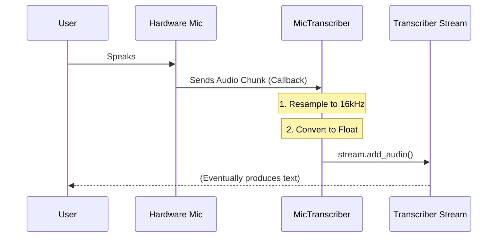

# Chapter 2: MicTranscriber (Live Input Handler)

Welcome back! In the previous chapter, [Transcriber (The Orchestrator)](01_transcriber__the_orchestrator_.md), we learned about the "Project Manager" that coordinates the AI models to turn audio into text.

However, we left off with a small problem: **Manual Labor**. In our previous examples, we had to manually feed chunks of audio data into the Transcriber. In a real-world app—like a voice assistant or a dictation tool—you don't want to load files manually. You want to just speak!

## The Problem: The Hardware Gap

Connecting a piece of software to a physical microphone is surprisingly difficult. You have to deal with:
1.  **Hardware Drivers:** Every operating system (Windows, macOS, Linux, Android, iOS) handles microphones differently.
2.  **Sample Rates:** Your microphone might record at 44,100 Hz, but the AI model expects 16,000 Hz.
3.  **Blocking:** If your program spends too much time listening to the mic, it might freeze the screen.

## The Solution: The Reporter

Meet the **MicTranscriber**.

If the **Transcriber** is the "Project Manager," think of the **MicTranscriber** as the **Field Reporter**.
*   It holds the microphone.
*   It ensures the audio feed is clean and continuous.
*   It handles the messy environment (hardware drivers).
*   It automatically feeds the "Project Manager" (Transcriber) without you having to lift a finger.

## Central Use Case: The "Always-On" Ear

Let's build a simple tool that listens to your microphone and prints text as you speak.

### Step 1: Initialization
Just like the standard Transcriber, we need to load it with a model.

```python
from moonshine_voice import MicTranscriber, ModelArch

# Initialize the Reporter
# It automatically creates an internal Transcriber
recorder = MicTranscriber(
    model_path="./moonshine_models",
    model_arch=ModelArch.BASE
)
```
*Explanation: This sets up the connection to the AI models. It also prepares the audio drivers in the background, but it hasn't started recording yet.*

### Step 2: Attaching a Listener
We need to know what the reporter hears. For now, we will use a simple function to print the output. (We will dive deeper into this in [Event Listener System](03_event_listener_system.md)).

```python
# Define what to do when we get text
def on_text_update(event):
    print(event.line.text)

# Tell the reporter to call this function
recorder.add_listener(on_text_update)
```
*Explanation: We are telling the MicTranscriber: "Every time you figure out what was said, send the result to `on_text_update`."*

### Step 3: Go Live!
Now, we simply tell the reporter to start working.

```python
import time

print("Speak now...")
recorder.start()

# Keep the program running so we can talk
try:
    while True:
        time.sleep(0.1)
except KeyboardInterrupt:
    recorder.stop()
```
*Explanation: `recorder.start()` opens the microphone and begins the loop. The `while` loop just keeps the Python script alive so the background threads can do their work.*

---

## How It Works Under the Hood

The `MicTranscriber` is essentially a loop that bridges the gap between **Audio Hardware** and the **Transcriber Stream**.

When you call `start()`, the MicTranscriber sets up a "Callback" with the audio hardware. A callback is like a bucket brigade. Every time the microphone fills up a small bucket of audio (a buffer), it taps the MicTranscriber on the shoulder and says, "Here is more data."

### The Data Flow



### Internal Code Deep Dive

Let's look at how this is implemented in Python (`python/src/moonshine_voice/mic_transcriber.py`). The magic happens inside the `_start_listening` method using the `sounddevice` library.

**1. The Callback Function**
This is the function that runs dozens of times per second.

```python
# Inside MicTranscriber class

def audio_callback(in_data, frames, time, status):
    # in_data is the raw audio from the hardware
    if in_data is not None:
        
        # 1. Prepare data (flatten to a list of numbers)
        audio_data = in_data.astype(np.float32).flatten()
        
        # 2. Feed the Project Manager
        self.mic_stream.add_audio(audio_data, self._samplerate)
```
*Explanation: This function is the bridge. It receives `in_data` from the hardware and immediately pushes it into `self.mic_stream` (which is the Transcriber we learned about in Chapter 1).*

**2. Starting the Stream**
We use `sounddevice` (aliased as `sd`) to activate the hardware.

```python
# Inside MicTranscriber._start_listening

self._sd_stream = sd.InputStream(
    samplerate=16000,
    blocksize=1024,
    callback=audio_callback  # <-- We attach our bridge here
)

self._sd_stream.start()
```
*Explanation: We ask the operating system for an input stream. Crucially, we pass `audio_callback`. This tells the OS: "Every time you have audio, run this specific function."*

### Cross-Platform Magic

The beauty of the `MicTranscriber` abstraction is that it looks the same to you, regardless of the platform, even though the internal code is very different.

*   **Python:** Uses `sounddevice` library.
*   **Swift (iOS/macOS):** Uses `AVAudioEngine` and installs a "tap" on the input node.
*   **Android:** Uses a custom `MicCaptureProcessor` thread.

For example, in **Swift** (`MicTranscriber.swift`), the logic is identical, just verbose:

```swift
// Swift implementation logic
inputNode.installTap(onBus: 0, bufferSize: bufferSize, format: inputFormat) { 
    (buffer, time) in
    
    // 1. Get data from buffer
    let audioData = /* extraction logic */
    
    // 2. Feed the Project Manager
    try self.micStream.addAudio(audioData, sampleRate: 16000)
}
```
*Explanation: Even in Swift, we are just waiting for a hardware buffer and passing it to `micStream.addAudio`.*

## Summary

The **MicTranscriber** solves the headache of real-time audio. It acts as a dedicated "Reporter" that manages the microphone hardware and constantly feeds clean audio data to the core **Transcriber**.

You learned how to:
1.  Initialize the MicTranscriber.
2.  Start the recording process.
3.  Let the MicTranscriber handle the loop of `Hardware -> Buffer -> AI`.

However, in our example, we used a very simple function: `print(event.line.text)`. In a real application, you might want to know when a sentence *starts*, when it *changes*, and when it is *finalized*.

To handle these complex updates, we need a robust system for listening to the Transcriber.

[Next Chapter: Event Listener System](03_event_listener_system.md)

---

Generated by [Code IQ](https://github.com/adityasoni99/Code-IQ)