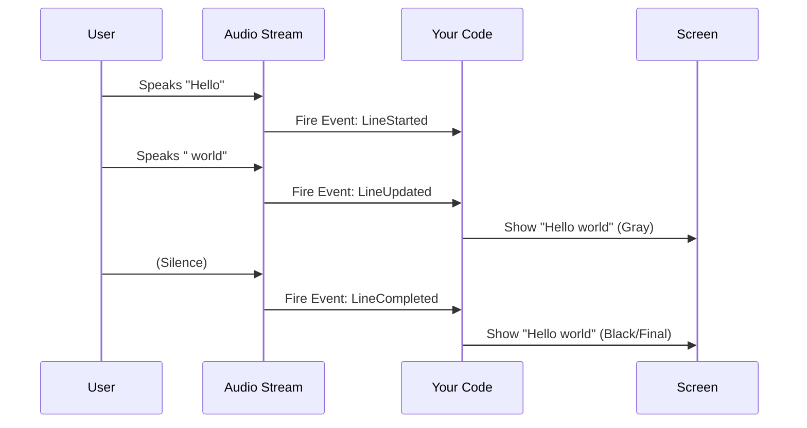

# Chapter 3: Event Listener System

Welcome to Chapter 3! In the previous chapter, [MicTranscriber (Live Input Handler)](02_mictranscriber__live_input_handler_.md), we learned how to capture audio from the microphone automatically.

However, we ended with a basic `print()` statement. Real-time speech is messy. The AI might think you said "The sky is **glue**," but a split second later, it realizes you said "The sky is **blue**."

If we just print every guess, the user sees a chaotic wall of text. We need a way to handle these corrections elegantly.

## The Problem: The "Are We There Yet?" Loop
In traditional programming, you might write a loop that constantly asks the Transcriber:
> *"Is the sentence done? Is it done now? How about now?"*

This is inefficient. It wastes computer resources and makes it hard to build smooth user interfaces.

## The Solution: The News Feed
Instead of asking for updates, your app should **subscribe** to them.

The **Event Listener System** is like a news feed. You tell Moonshine: *"Here is my phone number. Text me only when something interesting happens."*

Moonshine sends three specific types of "news" (Events):
1.  **LineStarted**: "The user just started speaking."
2.  **LineUpdated**: "I changed my mind about what they said (correction)."
3.  **LineCompleted**: "The user paused. This sentence is locked and finalized."

## Central Use Case: "Shimmering" Subtitles
Have you ever used voice dictation on your phone? You see the text appear in gray (uncertain), change as you speak, and finally turn black (confirmed). This effect is called **Shimmering**.

We achieve this by handling `LineUpdated` (show gray text) and `LineCompleted` (show black text).

### Basic Usage (Python Example)

To use this system, we create a "Listener" class. Moonshine provides a blueprint called `TranscriptEventListener`.

**1. Create the Listener**
We override specific methods to handle the events we care about.

```python
from moonshine_voice import TranscriptEventListener

class SubtitlePrinter(TranscriptEventListener):
    # This runs when the text is still changing (The "Shimmer")
    def on_line_updated(self, event):
        # We print with \r to overwrite the current line on screen
        print(f"Thinking... {event.line.text}", end="\r")
```
*Explanation: `on_line_updated` is called multiple times per second as the AI refines its guess. We use `\r` to refresh the same line in the terminal.*

**2. Handle Completion**
When the user pauses, the line is finished. We want to print it permanently.

```python
    # This runs when the AI is sure (The "Lock")
    def on_line_completed(self, event):
        # Print normally to move to the next line
        print(f"Finalized:  {event.line.text}")
```
*Explanation: Once `on_line_completed` fires, Moonshine promises it won't change that specific line of text again.*

**3. Attach the Listener**
Now we connect our listener to the [MicTranscriber (Live Input Handler)](02_mictranscriber__live_input_handler_.md).

```python
# Create the listener
my_listener = SubtitlePrinter()

# Initialize the microphone input
recorder = MicTranscriber(model_path="./moonshine_models")

# Subscribe to the feed!
recorder.add_listener(my_listener)

recorder.start()
```
*Explanation: `add_listener` connects the wires. Now, whenever the engine processes audio, it automatically calls the methods inside `my_listener`.*

---

## How It Works Under the Hood

This system uses a software design pattern called the **Observer Pattern**.

The `Stream` object (which holds the audio buffer) acts as the **Subject**. Your code acts as the **Observer**.

Here is the lifecycle of a single sentence:



### Internal Code Deep Dive

How does Moonshine know which event to fire? The logic lives inside `python/src/moonshine_voice/transcriber.py`.

When the C++ engine returns a transcript, it tags every line with flags like `is_new`, `is_updated`, or `is_complete`. The Python wrapper checks these flags.

**1. The Notification Logic**
Inside the `Stream` class, there is a method called `_notify_from_transcript`.

```python
# From: python/src/moonshine_voice/transcriber.py

def _notify_from_transcript(self, transcript: Transcript) -> None:
    for line in transcript.lines:
        # 1. Did a new sentence just begin?
        if line.is_new:
            self._emit(LineStarted(line=line, stream_handle=self._handle))
        
        # 2. Did the text change, but it's not done yet?
        if line.is_updated and not line.is_complete:
            self._emit(LineUpdated(line=line, stream_handle=self._handle))
```
*Explanation: The code iterates through the lines returned by the engine. It checks the boolean flags set by the low-level C library.*

**2. The Completion Logic**
The most important event for saving text to a file or database is completion.

```python
        # 3. Is the sentence finished?
        if line.is_complete and line.is_updated:
            self._emit(LineCompleted(line=line, stream_handle=self._handle))
```
*Explanation: `is_complete` means the VAD (Voice Activity Detector) heard silence and decided the user stopped talking.*

**3. The Emitter**
Finally, the `_emit` function loops through everyone who subscribed.

```python
def _emit(self, event: TranscriptEvent) -> None:
    for listener in self._listeners:
        # Check specifically which event type it is
        if isinstance(listener, TranscriptEventListener):
            if isinstance(event, LineStarted):
                listener.on_line_started(event)
            # ... checks other event types ...
```
*Explanation: This ensures that if you only implemented `on_line_completed`, the system won't crash when `LineStarted` happens. It simply ignores events you didn't define.*

### Cross-Platform Bindings
This system is consistent across languages.

*   **Python:** Uses `TranscriptEventListener` class inheritance.
*   **Swift:** Uses closures or delegate patterns.
*   **C++:** Uses `TranscriptEventListener` abstract base class.

For example, in **Swift** (`MicTranscriber.swift`), you can simply pass a function (closure):

```swift
// Swift Example
transcriber.addListener { event in
    // Check if the event is a completed line
    if let completedEvent = event as? LineCompleted {
        print("Final: \(completedEvent.line.text)")
    }
}
```

## Summary
The **Event Listener System** decouples your application logic from the complex audio processing loop.
1.  **LineStarted**: UI preparation.
2.  **LineUpdated**: Real-time feedback (Shimmering).
3.  **LineCompleted**: Finalizing and saving data.

Now that we have clean, finalized text arriving in `on_line_completed`, what do we do with it? Usually, we want the computer to *understand* what was said and take action (like "Turn on the lights").

[Next Chapter: Intent Recognizer (Action Dispatcher)](04_intent_recognizer__action_dispatcher_.md)

---

Generated by [Code IQ](https://github.com/adityasoni99/Code-IQ)