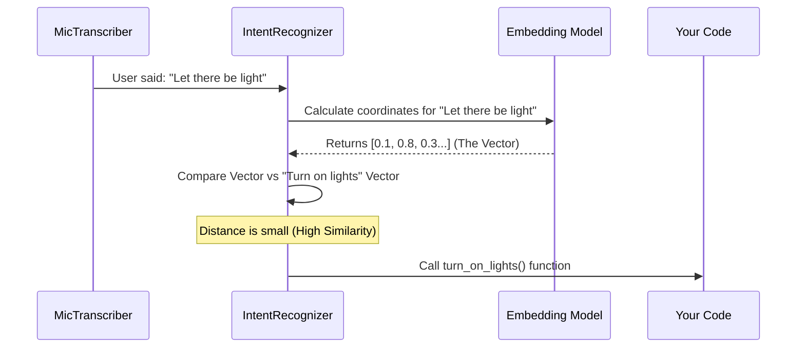

# Chapter 4: Intent Recognizer (Action Dispatcher)

Welcome to Chapter 4! In the previous chapter, [Event Listener System](03_event_listener_system.md), we built a news feed that notifies us when a user finishes a sentence.

Now we have a string of text, like *"Turn on the kitchen lights."* But how do we turn that text into an actual action in your code?

## The Problem: The "Exact Match" Trap

In traditional programming, you might try to use `if` statements to handle commands:

```python
# The Old Way (Brittle)
if text == "turn on lights":
    lights.turn_on()
```

This fails immediately if the user says:
*   *"Switch the lights on"*
*   *"Lights on please"*
*   *"Illumination"*

You can't write an `if` statement for every possible sentence in the English language. It's impossible.

## The Solution: The Semantic Interpreter

Meet the **Intent Recognizer**.

Instead of matching *words*, it matches *meanings*. It uses a "Semantic Embedding Model" (a specialized AI brain) to convert sentences into mathematical concepts.

*   **You register:** "Turn on the lights"
*   **User says:** "Let there be light"
*   **Intent Recognizer:** "These two phrases have a 92% similarity in meaning. Execute the command!"

## Central Use Case: The Smart Home Controller

Let's build a voice command system that can control a robot or a smart home. We want to define a specific "Trigger Phrase" and a function to run when that phrase (or something similar) is heard.

### Step 1: Initialize the Recognizer
Unlike the Transcriber (which turns sound into text), the Intent Recognizer needs an **Embedding Model** (which turns text into meaning).

```python
from moonshine_voice import IntentRecognizer, get_embedding_model

# Download the model that understands meaning
model_path, model_arch = get_embedding_model("embeddinggemma-300m", "q4")

# Create the recognizer
recognizer = IntentRecognizer(
    model_path=model_path,
    model_arch=model_arch,
    threshold=0.7  # 70% similarity required
)
```
*Explanation: We load a lightweight AI model called "Gemma". The `threshold` is the confidence bar. If the match is below 70%, we ignore it.*

### Step 2: Define Your Action
We need a standard Python function that will run when the command is triggered.

```python
def turn_on_lights(trigger, utterance, similarity):
    print(f"💡 Lights turned ON!")
    print(f"(User said: '{utterance}')")
    print(f"(Confidence: {similarity:.0%})")
```
*Explanation: This is a "Callback". When the AI finds a match, it calls this function and tells you exactly what the user said (`utterance`) and how confident it was (`similarity`).*

### Step 3: Register the Intent
Now we tell the recognizer to watch out for specific concepts.

```python
# Register the concept of turning on lights
recognizer.register_intent(
    "turn on the lights", 
    turn_on_lights
)
```
*Explanation: We are NOT just registering this exact string. We are registering the **concept** represented by this string. The AI calculates the "meaning vector" for "turn on the lights" and stores it.*

### Step 4: Connect to the Microphone
Finally, we attach this recognizer to our microphone input. Since `IntentRecognizer` is a type of Listener (see [Event Listener System](03_event_listener_system.md)), this is easy.

```python
from moonshine_voice import MicTranscriber

# Start the mic
recorder = MicTranscriber(model_path="./moonshine_models")

# Connect the recognizer to the recorder
recorder.add_listener(recognizer)

recorder.start()
```
*Explanation: Now, every time the user finishes a sentence, the `recorder` sends the text to the `recognizer`. The recognizer checks the meaning, and if it matches, it runs `turn_on_lights`.*

---

## How It Works Under the Hood

How does a computer know that "Illumination" is similar to "Lights"?

It maps words into a multi-dimensional "Meaning Space." Imagine a 3D map:
*   The coordinates for "Dog" and "Puppy" are very close together.
*   The coordinates for "Dog" and "Sandwich" are very far apart.

When you register an intent, Moonshine calculates its coordinates. When the user speaks, it calculates the user's coordinates and measures the distance between them.

### The Data Flow



### Internal Code Deep Dive

Let's look at the C++ core (`core/intent-recognizer.cpp`) to see how this comparison happens.

**1. Calculating the Vector**
When you register an intent, we immediately ask the model for its "embedding" (the list of numbers representing meaning).

```cpp
// From: core/intent-recognizer.cpp

void IntentRecognizer::register_intent(string trigger, IntentCallback callback) {
  Intent intent;
  intent.trigger_phrase = trigger;
  intent.callback = callback;
  
  // Ask the AI model for the meaning vector
  intent.embedding = embedding_model_->get_embeddings(trigger);
  
  intents_.push_back(intent);
}
```
*Explanation: We store the `embedding` alongside the text. This calculation is heavy, so we do it once at startup, not every time the user speaks.*

**2. Finding the Best Match**
When a new sentence arrives, we loop through all known intents to find the winner.

```cpp
// From: core/intent-recognizer.cpp

const Intent *IntentRecognizer::find_best_intent(string utterance, float &out_score) {
  // 1. Get embedding for what the user just said
  vector<float> user_embedding = embedding_model_->get_embeddings(utterance);

  float best_score = -1.0f;
  
  // 2. Compare against every registered command
  for (const auto &intent : intents_) {
    float score = embedding_model_->get_similarity(user_embedding, intent.embedding);

    if (score > best_score) {
      best_score = score;
      best_intent = &intent;
    }
  }
  return best_intent;
}
```
*Explanation: `get_similarity` usually performs a "Cosine Similarity" calculation. It returns `1.0` for a perfect match and `0.0` for no relation. We simply keep the highest score.*

**3. Triggering the Event**
Finally, we check if the best score is good enough.

```cpp
// From: core/intent-recognizer.cpp

if (best_intent != nullptr && similarity >= threshold_) {
  // It's a match! Run the code.
  best_intent->callback(utterance, similarity);
  return true;
}
```
*Explanation: This is where `threshold` matters. If the best match is only 30% similar, we assume the user was talking about something else entirely and do nothing.*

## Summary

The **Intent Recognizer** turns Moonshine from a transcription tool into a command center.
*   It abstracts away the complexity of Natural Language Processing (NLP).
*   It allows for "Fuzzy Matching" using embeddings.
*   It connects speech directly to Python functions.

Now you have a system that listens (MicTranscriber), reports events (Listener), and understands commands (Intent Recognizer).

But wait—how does the system know when to *start* listening and when to *stop*? If the room is silent, is the AI still crunching numbers on background noise? That sounds wasteful.

We need a Gatekeeper.

[Next Chapter: Voice Activity Detection (VAD)](05_voice_activity_detection__vad_.md)

---

Generated by [Code IQ](https://github.com/adityasoni99/Code-IQ)