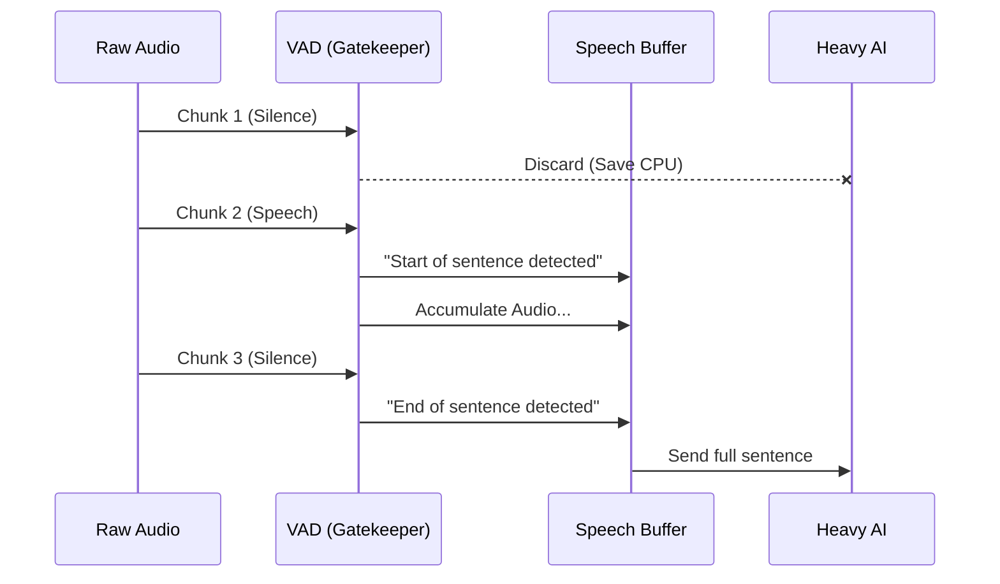

# Chapter 5: Voice Activity Detection (VAD)

Welcome to Chapter 5! In the previous chapter, [Intent Recognizer (Action Dispatcher)](04_intent_recognizer__action_dispatcher_.md), we learned how to turn text into actions.

However, there is a hidden cost to running these AI models. They are computationally heavy. If your microphone is on for 24 hours, but you only speak for 10 minutes, you don't want the heavy AI engine spinning for the 23 hours and 50 minutes of silence.

## The Problem: Processing Silence
Imagine a security guard who stares intensely at an empty hallway for 8 hours straight, analyzing every shadow to see if it's a burglar. That guard will get tired (drain battery) and might start hallucinating burglars (output garbage text like "thank you" or "he he" during silence).

## The Solution: The Motion Sensor
**Voice Activity Detection (VAD)** is the "Motion Sensor" of the audio world.

It is a tiny, ultra-fast, low-power AI model that sits right at the front door. Its only job is to answer a simple binary question:
> *"Is this sound human speech, or is it just noise?"*

If the answer is "Noise," it blocks the audio. If the answer is "Speech," it opens the gate for the heavy Transcriber to do its job.

## Central Use Case: The "Battery Saver"
In Moonshine, VAD isn't just a battery saver; it is also the **Editor**.

Real-time audio is one long, endless stream. The Transcriber can't process "infinity." It needs distinct chunks. The VAD listens for pauses in your speech to chop that endless stream into processable sentences.

### Configuring the Gatekeeper (Python)
You usually don't need to write code to *run* the VAD manually; the [Transcriber (The Orchestrator)](01_transcriber__the_orchestrator_.md) handles it internally. However, you can tune its sensitivity.

```python
from moonshine_voice import Transcriber

# Initialize with VAD settings
transcriber = Transcriber(
    model_path="./moonshine_models",
    vad_threshold=0.5  # 50% confidence required
)
```
*Explanation: `vad_threshold` controls how strict the gatekeeper is. Higher (0.8) means you need to speak loudly and clearly. Lower (0.3) might let background noise sneak in.*

---

## How It Works Under the Hood
The VAD uses a **Sliding Window** approach. It doesn't look at the whole file. It looks at tiny slices of time (e.g., 30 milliseconds) and assigns a probability to each slice.

### The "Sliding Window" Concept
Imagine the audio is a film strip. The VAD looks at one frame at a time.

1.  **Frame 1 (0.0s - 0.03s):** Fan noise. (Prob: 0.1) -> **Silence**
2.  **Frame 2 (0.03s - 0.06s):** "H-" sound. (Prob: 0.8) -> **Speech Start!**
3.  **Frame 3...10:** "ello wor..." (Prob: >0.5) -> **Speech Continues**
4.  **Frame 11:** Silence. (Prob: 0.1) -> **Speech End**

### The Data Flow
Here is how the VAD acts as the filter between the raw stream and the heavy model.



### Internal Code Deep Dive
Moonshine uses a specific VAD model called **Silero VAD**. Let's peek into the C++ implementation (`core/silero-vad.cpp`) to see how it makes predictions.

**1. Preparing the Window**
The VAD model requires a specific input context. It needs to know what happened just before the current moment to make a good guess.

```cpp
// From: core/silero-vad.cpp

void SileroVad::predict(const std::vector<float> &data_chunk,
                        float *out_probability, int *out_flag) {
  // 1. Combine previous context + new audio chunk
  input.resize(effective_window_size);
  std::copy(_context.begin(), _context.end(), input.begin());
  std::copy(data_chunk.begin(), data_chunk.end(),
            input.begin() + context_samples);
```
*Explanation: We take the "memory" of the previous sound (`_context`) and attach the new `data_chunk`. This gives the AI a complete picture.*

**2. Running the Tiny Model**
We feed this chunk into the ONNX runtime (a way to run AI models).

```cpp
  // 2. Run the lightweight VAD model
  ort_api->Run(session, nullptr, input_node_names.data(), ...);

  // 3. Get the probability (0.0 to 1.0)
  float *speech_prob_ptr = nullptr;
  ort_api->GetTensorMutableData(output_ort[0], (void **)&speech_prob_ptr);
  float speech_prob = speech_prob_ptr[0];
```
*Explanation: This happens extremely fast. We get a `speech_prob` back, for example, `0.92` (92% sure this is a person).*

**3. The Decision**
Finally, we update the state and decide if it's speech.

```cpp
  // 4. Save context for the next loop
  std::copy(input.end() - context_samples, input.end(), _context.begin());

  // 5. Compare against threshold (e.g., 0.5)
  if (out_flag) *out_flag = (speech_prob >= threshold) ? 1 : 0;
}
```
*Explanation: If the probability is higher than your setting, we flag it as speech (`1`). If not, it's silence (`0`).*

### Integration with Transcriber
Now, let's look at `core/transcriber.cpp` to see how the "Project Manager" uses this tool.

```cpp
// From: core/transcriber.cpp

// 1. Run VAD on the incoming audio
stream->vad->process_audio(audio_data, (int32_t)audio_length, INTERNAL_SAMPLE_RATE);

// 2. Ask: "Did you find any completed sentences?"
segments = *(stream->vad->get_segments());

// 3. Process only the valid speech segments
for (const auto &segment : segments) {
    // Pass this clean audio to the heavy transcriber
    transcribe_segment_with_streaming_model(...);
}
```
*Explanation: The Transcriber relies entirely on `stream->vad` to tell it which parts of the audio are worth processing. This is the mechanism that allows Moonshine to ignore background noise.*

## Summary
Voice Activity Detection (VAD) is the unsung hero of voice applications.
1.  It **filters noise**, ensuring the AI only processes human speech.
2.  It **saves resources** (battery/CPU) by keeping the heavy model asleep during silence.
3.  It **segments audio**, chopping endless streams into neat sentences.

So far, we have been processing audio sentence-by-sentence. You speak, pause, the VAD detects the pause, and *then* we transcribe.

But what if you want the text to appear on the screen *while* you are still talking, word by word?

[Next Chapter: Streaming Inference Engine](06_streaming_inference_engine.md)

---

Generated by [Code IQ](https://github.com/adityasoni99/Code-IQ)