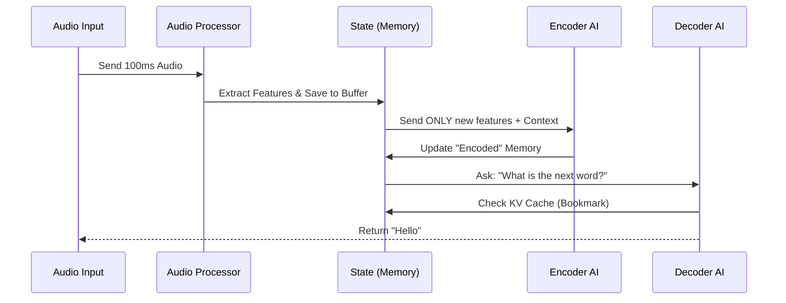

# Chapter 6: Streaming Inference Engine

Welcome to Chapter 6! In the previous chapter, [Voice Activity Detection (VAD)](05_voice_activity_detection__vad_.md), we learned how to detect *when* a user is speaking to chop audio into sentences.

But there is still a "waiting game." In a standard system, the AI waits for you to **finish** your sentence, processes the whole thing, and *then* types the text. If you speak for 15 seconds, the user stares at a blank screen for 15 seconds.

## The Problem: The "Loading..." Spinner
Imagine watching a live news broadcast. If the closed captions only appeared after the news anchor finished a long monologue, they would be useless. You want the words to appear *as they are spoken*.

## The Solution: The Simultaneous Interpreter
The **Streaming Inference Engine** changes the game.

*   **Standard Model:** Like a student listening to a lecture, recording it, and transcribing it later.
*   **Streaming Engine:** Like a simultaneous interpreter at the UN. They listen to a few words, translate them immediately, keep listening, and translate the next few words, all while maintaining the context of the speech.

## Central Use Case: "The Matrix" Effect
We want to achieve that cool sci-fi effect where text types out character-by-character on the screen in real-time, with near-zero latency.

### Conceptual Flow
Unlike the file-based approach, we don't pass a file path. We pass a continuous flow of data arrays.

```python
# Conceptual Python Pseudocode

# 1. Create the specialized Streaming State (The Brain's Short-term Memory)
state = streaming_model.create_state()

while microphone_is_on:
    # 2. Grab a tiny chunk of audio (e.g., 100ms)
    chunk = microphone.read_chunk()
    
    # 3. Feed it to the engine
    # The engine updates its internal 'state' and returns NEW tokens immediately
    new_text = streaming_model.process_chunk(state, chunk)
    
    # 4. Print immediately
    print(new_text, end="", flush=True)
```
*Explanation: We never wait for silence. We process sound as fast as it arrives.*

---

## How It Works Under the Hood

The magic of streaming lies in **Caching**. Neural networks usually need to see the *entire* past context to predict the next word. Re-calculating the entire past every 0.1 seconds would melt your CPU.

Instead, Moonshine uses a **KV Cache** (Key-Value Cache). Think of this as a "Bookmark" in a book.
1.  The AI reads the first word. It saves its calculations (the bookmark).
2.  When the second word arrives, it doesn't re-read the first word. It just loads the bookmark and continues.

### The Streaming Pipeline



### Internal Code Deep Dive
The logic resides in `core/moonshine-streaming-model.cpp`. It is more complex than the standard model because it has to manage the `state` object manually.

**1. The "Brain" (The State)**
First, we need a place to store the "Bookmark" and the audio history. This is the `MoonshineStreamingState`.

```cpp
// From: core/moonshine-streaming-model.cpp

struct MoonshineStreamingState {
    // Buffer for raw audio samples
    std::vector<float> sample_buffer;
    
    // The "Bookmark" (KV Cache) for the AI
    // Stores previous calculations so we don't redo them
    std::vector<float> k_self; 
    std::vector<float> v_self;
    
    // Encoded representation of speech heard so far
    std::vector<float> memory;
};
```
*Explanation: This struct is passed around everywhere. It holds the "Context" of the conversation. If you delete this, the AI forgets everything you just said.*

**2. Processing the Chunk (The Frontend)**
When new audio arrives, we don't immediately guess words. First, we turn audio waves into "Features" (mathematical representations of sound).

```cpp
// From: core/moonshine-streaming-model.cpp

int MoonshineStreamingModel::process_audio_chunk(
    MoonshineStreamingState *state,
    const float *audio_chunk, 
    size_t chunk_len,
    int *features_out
) {
    // 1. Run the Frontend AI model
    // It takes raw audio and updates the state's feature buffer
    ort_api->Run(frontend_session, ...);

    // 2. Accumulate features into the state
    state->accumulated_features.insert(..., new_features);
    
    return 0;
}
```
*Explanation: We feed raw audio into the `frontend_session`. It outputs features which we append to our `accumulated_features` list in the state.*

**3. The Encoder (Understanding the Sound)**
Once we have enough features, we run the Encoder. This turns "sound features" into "meaning vectors."

```cpp
// From: core/moonshine-streaming-model.cpp

int MoonshineStreamingModel::encode(MoonshineStreamingState *state, ...) {
    // 1. Check if we have enough new audio to process
    // (We use a sliding window approach)
    
    // 2. Run the Encoder AI
    // It looks at the new features + a little bit of history
    ORT_RUN(ort_api, encoder_session, ...);

    // 3. Save the result into 'state->memory'
    // This memory will be used by the Decoder to guess words
    state->memory.insert(..., new_encoded_data);
    
    return 0;
}
```
*Explanation: This is the heaviest part. The encoder analyzes the sound. We optimize it by only encoding the *new* parts (plus some context) and appending it to `state->memory`.*

**4. The Decoder (Generating Text)**
Finally, we ask the Decoder to predict words based on the `memory`. This uses the KV Cache (`k_self`, `v_self`) to be super fast.

```cpp
// From: core/moonshine-streaming-model.cpp

int MoonshineStreamingModel::decode_step(MoonshineStreamingState *state, 
                                         int token, 
                                         float *logits_out) {
    // 1. Prepare inputs: The current token and the cached memory
    // 2. Run the Decoder AI
    ORT_RUN(ort_api, decoder_kv_session, ...);
    
    // 3. Output: Logits (probabilities for the NEXT word)
    // 4. Update the KV Cache in 'state' automatically
    state->k_self = new_k_values;
    state->v_self = new_v_values;
    
    return 0;
}
```
*Explanation: We give the model the last token generated. It uses the `state->memory` (what was heard) and `state->k_self` (what was already thought) to instantly predict the next word.*

## Why is this hard?
The Streaming Engine is complex because of **Boundary Issues**.
*   If you chop a word in half (e.g., "Moon-shine"), the first chunk sounds like "Moon".
*   The second chunk sounds like "Shine".
*   The model might type "Moon Shine" (two words).
*   Later, when it has more context, it realizes it was one word.

Moonshine handles this by keeping a **Lookahead Buffer**. It waits just a tiny bit (a few milliseconds) to ensure the audio frame is stable before committing it to memory.

## Summary
The **Streaming Inference Engine** is the race-car driver of the Moonshine library.
1.  It uses a **State** object to remember the past.
2.  It uses **KV Caching** to avoid re-calculating known data.
3.  It processes audio in **Chunks** to provide real-time feedback.

You now understand the entire pipeline:
1.  [Transcriber](01_transcriber__the_orchestrator_.md) manages the flow.
2.  [MicTranscriber](02_mictranscriber__live_input_handler_.md) captures the audio.
3.  [VAD](05_voice_activity_detection__vad_.md) filters the silence.
4.  **Streaming Engine** (this chapter) interprets the audio in real-time.

But wait—all this code we looked at in this chapter is in **C++**. How do we actually use this in Python, Swift, or on Android without writing C++ ourselves?

We need a bridge.

[Next Chapter: Cross-Platform Bindings (C API Bridge)](07_cross_platform_bindings__c_api_bridge_.md)

---

Generated by [Code IQ](https://github.com/adityasoni99/Code-IQ)