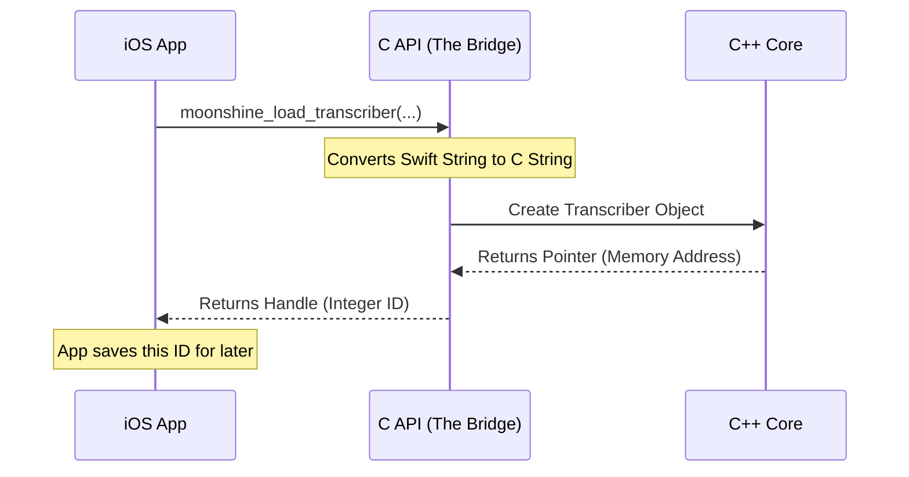

# Chapter 7: Cross-Platform Bindings (C API Bridge)

Welcome to the final chapter of the Moonshine tutorial!

In the previous chapter, [Streaming Inference Engine](06_streaming_inference_engine.md), we explored the high-performance C++ engine that powers real-time transcription. We learned how it uses memory states and caching to be incredibly fast.

However, most developers don't build mobile apps or web servers in raw C++. They use **Swift** (iOS), **Kotlin/Java** (Android), or **Python**.

## The Problem: The Language Barrier
Imagine you have a brilliant mathematician (the C++ Core) who solves problems instantly but only speaks ancient Greek.
You also have a Project Manager (your Python/Swift app) who needs those answers but only speaks English.

They cannot communicate directly. If you try to paste C++ code into a Python file, the program will crash immediately.

## The Solution: The Diplomat
The **C API Bridge** acts as the diplomat.

1.  **The Common Ground:** Almost every programming language in the world knows how to talk to **C** (the ancestor of modern languages).
2.  **The Wrapper:** We wrap our complex C++ objects inside simple C functions.
3.  **The Binding:** Python, Swift, and Java call these C functions, passing data back and forth.

This allows us to write the heavy AI logic **once** in C++, and use it **everywhere**.

## Central Use Case: "The Handshake"
Let's look at the simplest possible interaction: **Asking for the library version.**

Your Swift app wants to know: "What version of Moonshine is running?"
The C++ core knows the answer: `20000` (Version 2.0).

Here is how the message travels:
1.  **Swift:** Calls `MoonshineAPI.getVersion()`
2.  **Bridge:** Calls the C function `moonshine_get_version()`
3.  **C++:** Returns the integer `20000`.

---

## Key Concept: The "Handle" System
In high-level languages, we pass whole objects around. In the C Bridge, we can't easily pass complex C++ objects to Swift or Java.

Instead, we use **Handles**.
Think of a Handle like a **Coat Check Ticket**.
1.  **Swift:** "Here are my model files. Keep them safe."
2.  **C++:** "Okay, I loaded them. Here is ticket #42."
3.  **Swift:** (Later) "I want to transcribe audio using the model associated with ticket #42."

## How It Works Under the Hood

Let's visualize the flow of data when an iOS app asks to load a model.



### Internal Code Deep Dive

Let's look at the three layers of this bridge: The Contract (C), The Android side (JNI), and the iOS side (Swift).

### 1. The Contract (C Header)
The file `core/moonshine-c-api.h` defines the rules of engagement. Notice `extern "C"`. This tells the C++ compiler: "Don't mess up these function names. Keep them simple so other languages can find them."

```c
// From: core/moonshine-c-api.h

#ifdef __cplusplus
extern "C" {
#endif

// The function name is plain and simple
MOONSHINE_EXPORT int32_t moonshine_get_version(void);

// We return an int32_t (Handle), not a complex Object
MOONSHINE_EXPORT int32_t moonshine_load_transcriber_from_files(
    const char *path, 
    uint32_t model_arch,
    ...
);
```
*Explanation: This file is the "Menu" that Swift and Java read to know what functions are available to order.*

### 2. The iOS Bridge (Swift)
Swift allows us to call C functions directly, but we need to handle "Pointers" (direct memory addresses). Swift calls this `UnsafePointer`.

The wrapper `swift/Sources/MoonshineVoice/MoonshineAPI.swift` makes this safe for the rest of the app.

```swift
// From: swift/Sources/MoonshineVoice/MoonshineAPI.swift

func loadTranscriberFromFiles(path: String, ...) throws -> Int32 {
    // 1. Convert Swift String to a C-compatible string
    let pathCString = path.cString(using: .utf8)!

    // 2. Call the C function directly
    let handle = moonshine_load_transcriber_from_files(
        pathCString,
        modelArch.rawValue,
        nil, 0, 20000
    )

    // 3. Return the Ticket # (Handle)
    return handle
}
```
*Explanation: Swift handles the conversion of the string `path` into bytes that C can understand, calls the function, and returns the result.*

### 3. The Android Bridge (JNI)
Java/Kotlin is stricter. It requires a specific intermediary called **JNI (Java Native Interface)**. This is a C++ file that acts as the glue.

Look at `android/moonshine-jni/moonshine-jni.cpp`.

```cpp
// From: android/moonshine-jni/moonshine-jni.cpp

// This weird function name maps directly to a Java class method
extern "C" JNIEXPORT int JNICALL
Java_ai_moonshine_voice_JNI_moonshineLoadTranscriberFromFiles(
    JNIEnv *env, jobject, jstring path, ...) {
    
    // 1. Convert Java String to C String
    const char *path_str = env->GetStringUTFChars(path, nullptr);

    // 2. Call the Core API
    int handle = moonshine_load_transcriber_from_files(
        path_str, ...
    );

    // 3. Return the handle to Java
    return handle;
}
```
*Explanation: The function name `Java_ai_moonshine...` tells the Android system: "When the Java class `ai.moonshine.voice.JNI` calls `moonshineLoadTranscriberFromFiles`, run this C++ code."*

### Handling Complex Data (The "Marshaling" Problem)
Sending numbers is easy. Sending a list of text results (The Transcript) is hard.

In C, an array is just a pointer to the first item. In Swift/Java, an array is a smart object with a size and methods. The Bridge must convert them manually.

**Example: Converting Audio Data (Swift to C)**
To send audio to the [Streaming Inference Engine](06_streaming_inference_engine.md), we must give C access to the raw memory of the Swift array.

```swift
// From: swift/Sources/MoonshineVoice/MoonshineAPI.swift

func addAudioToStream(audioData: [Float], ...) {
    // "Open up" the array and give us the memory address (buffer)
    audioData.withUnsafeBufferPointer { buffer in
        
        // Pass the memory address (baseAddress) to C
        moonshine_transcribe_add_audio_to_stream(
            transcriberHandle,
            streamHandle,
            buffer.baseAddress, // <--- The Pointer
            UInt64(audioData.count),
            16000,
            0
        )
    }
}
```
*Explanation: `withUnsafeBufferPointer` effectively says: "Freeze this array in memory for a millisecond so I can show the C engine where the data lives."*

## Summary

The **Cross-Platform Bindings** are the unsung heroes of the project. They ensure that:
1.  **Consistency:** An iOS user and an Android user get the exact same transcription results because they use the exact same C++ core.
2.  **Performance:** The heavy lifting stays in C++, keeping the app interface snappy.
3.  **Ease of Use:** App developers simply call `transcriber.start()`, unaware of the complex pointer arithmetic happening in the background.

---

## Conclusion of the Tutorial

Congratulations! You have completed the Moonshine Architecture Tutorial.

We have traced the journey of a spoken word from the airwaves to the screen:
1.  **[MicTranscriber](02_mictranscriber__live_input_handler_.md)** captured the audio.
2.  **[VAD](05_voice_activity_detection__vad_.md)** ensured we only processed speech, not silence.
3.  **[Transcriber](01_transcriber__the_orchestrator_.md)** coordinated the workflow.
4.  **[Streaming Engine](06_streaming_inference_engine.md)** predicted text in real-time using KV-Caching.
5.  **[Intent Recognizer](04_intent_recognizer__action_dispatcher_.md)** understood the meaning behind the words.
6.  And finally, the **C API Bridge** (this chapter) delivered that text safely back to your Python, Swift, or Android application.

You are now ready to dig into the source code, build your own voice assistants, or contribute to the project! Happy coding!

---

Generated by [Code IQ](https://github.com/adityasoni99/Code-IQ)