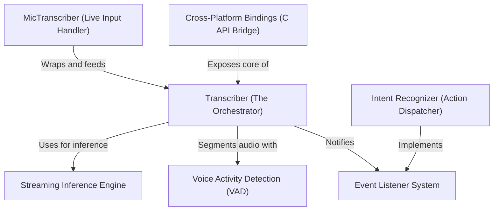

# Tutorial: moonshine

**Moonshine** is a lightweight, fast speech-to-text library designed for real-time applications on edge devices and the cloud. At its core, a **Transcriber** orchestrates the flow of audio through **Voice Activity Detection** and a **Streaming Inference Engine** to produce low-latency text. Developers can build interactive voice experiences by using **Intent Recognizers** and subscribing to transcription updates via a flexible **Event Listener System**.

**Source Repository:** [https://github.com/moonshine-ai/moonshine](https://github.com/moonshine-ai/moonshine)

## Chapters

1. [Transcriber (The Orchestrator)](01_transcriber__the_orchestrator_.md)
2. [MicTranscriber (Live Input Handler)](02_mictranscriber__live_input_handler_.md)
3. [Event Listener System](03_event_listener_system.md)
4. [Intent Recognizer (Action Dispatcher)](04_intent_recognizer__action_dispatcher_.md)
5. [Voice Activity Detection (VAD)](05_voice_activity_detection__vad_.md)
6. [Streaming Inference Engine](06_streaming_inference_engine.md)
7. [Cross-Platform Bindings (C API Bridge)](07_cross_platform_bindings__c_api_bridge_.md)

---

Generated by [Code IQ](https://github.com/adityasoni99/Code-IQ)