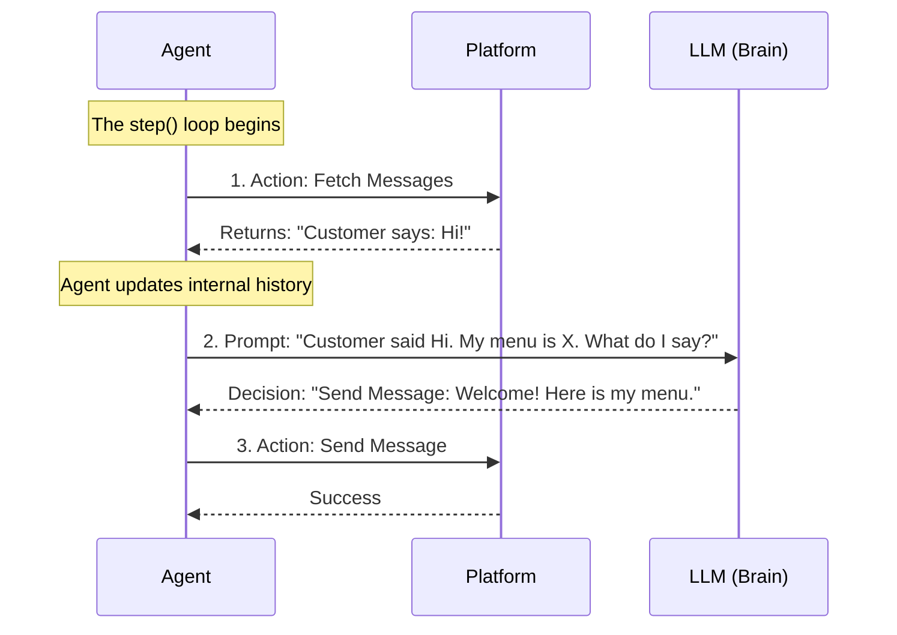

# Chapter 1: Marketplace Agents

Welcome to the **Multi-Agent Marketplace** tutorial! 

In this first chapter, we are going to explore the core "players" of our simulation: the **Marketplace Agents**.

## The Concept: RPG Characters for the Economy

Imagine you are playing a Massively Multiplayer Online Role-Playing Game (MMORPG). You have a character, an inventory, and quests. You log in, look around, chat with shopkeepers, and buy items.

In our project, we want to simulate an economy, but we can't have thousands of humans typing messages to each other 24/7. Instead, we use **Agents**.

**Marketplace Agents** are autonomous software programs that act like players in a game:
1.  **They have a Profile:** A name, a personality, and an inventory (or a shopping list).
2.  **They Perceive:** They check for new messages or search results.
3.  **They Think:** They use Large Language Models (LLMs) to decide what to do next.
4.  **They Act:** They send messages, make payments, or search the marketplace.

## The Core Loop: `step()`

How does an agent "live"? It runs in a continuous loop. 

Every few seconds, the agent wakes up and performs a single function called `step()`. Think of `step()` as one "tick" of the agent's brain.

```python
# Simplified concept of an Agent Runner
async def run_agent_loop(agent):
    await agent.register() # Log in to the world
    
    while True:
        # The agent takes one action or makes one decision
        await agent.step() 
        
        # Rest briefly before the next thought
        await asyncio.sleep(1) 
```

We have two specific types of agents in our marketplace: **Customers** and **Businesses**. They share the same underlying structure but have different goals.

## The Customer Agent

The **CustomerAgent** is designed to shop. Its goal is to fulfill a specific request (e.g., "I want a gluten-free pizza under $20").

Unlike a real human who might get distracted, the Customer Agent is mission-oriented. In its `step()` loop, it looks at its current state and asks the LLM, "What should I do next?"

Here is what the Customer Agent's logic looks like inside:

```python
# magentic_marketplace/marketplace/agents/customer/agent.py

class CustomerAgent(BaseSimpleMarketplaceAgent):
    async def step(self):
        # 1. Ask the LLM to decide the next move based on history
        action = await self._generate_customer_action()

        # 2. If the LLM chose an action (like Search or Pay), execute it
        if action:
            await self._execute_customer_action(action)
```

The `_generate_customer_action` method gathers the conversation history and search results, sends them to the AI, and the AI replies with a structured decision, such as "Search for Pizza" or "Message Business A."

## The Business Agent

The **BusinessAgent** plays the role of the shopkeeper. Its goal is to sell items from its menu and process payments.

The Business Agent is **reactive**. While the customer goes out hunting for deals, the business usually waits for the phone to ring.

```python
# magentic_marketplace/marketplace/agents/business/agent.py

class BusinessAgent(BaseSimpleMarketplaceAgent):
    async def step(self):
        # 1. Check the "mailbox" for new messages from customers
        messages = await self.fetch_messages()

        # 2. If we have mail, process it (reply, send invoice, etc.)
        if messages:
            await self._handle_customer_messages(messages)
        else:
            # Sleep if no customers are around
            await asyncio.sleep(self._polling_interval)
```

When `_handle_customer_messages` runs, the agent reads the customer's inquiry (e.g., "Do you have vegan options?") and uses the LLM to generate a polite, context-aware response based on its inventory.

## Under the Hood: The Agent "Brain"

Both agents inherit from a common parent called `BaseSimpleMarketplaceAgent`. This parent class handles the "boring" stuff: connecting to the internet, logging data, and talking to the AI.

Here is what happens systematically when an agent performs a `step()`:



### 1. Perception (`fetch_messages`)
The agent needs to know what is happening. It asks the platform if anyone has talked to it.

```python
# magentic_marketplace/marketplace/agents/base.py

async def fetch_messages(self):
    # Create an action to check the inbox
    action = FetchMessages()
    
    # Send request to the platform and wait for result
    result = await self.execute_action(action)
    
    return result.content
```

### 2. Thinking (`generate`)
The agent doesn't know *how* to be a shopkeeper hard-coded in Python. It relies on the LLM. The `generate` method sends a prompt to the AI model.

```python
# magentic_marketplace/marketplace/agents/base.py

async def generate(self, prompt: str):
    # Send the prompt to the configured LLM (e.g., GPT-4)
    response, usage = await generate(
        prompt, 
        log_metadata={"agent_id": self.id}
    )
    return response, usage
```

## Summary

In this chapter, we learned:
*   **Agents** are the autonomous participants in our economy.
*   They run in a continuous **`step()` loop**.
*   **CustomerAgents** proactively search and buy.
*   **BusinessAgents** reactively listen and sell.
*   They use a **Base** class to handle communication and thinking.

But wait—how exactly do agents "search" or "send money"? What does the data look like when it travels from the agent to the platform?

To answer that, we need to understand the language they speak.

[Next Chapter: Marketplace Protocol & Actions](02_marketplace_protocol___actions.md)

---

Generated by [Code IQ](https://github.com/adityasoni99/Code-IQ)