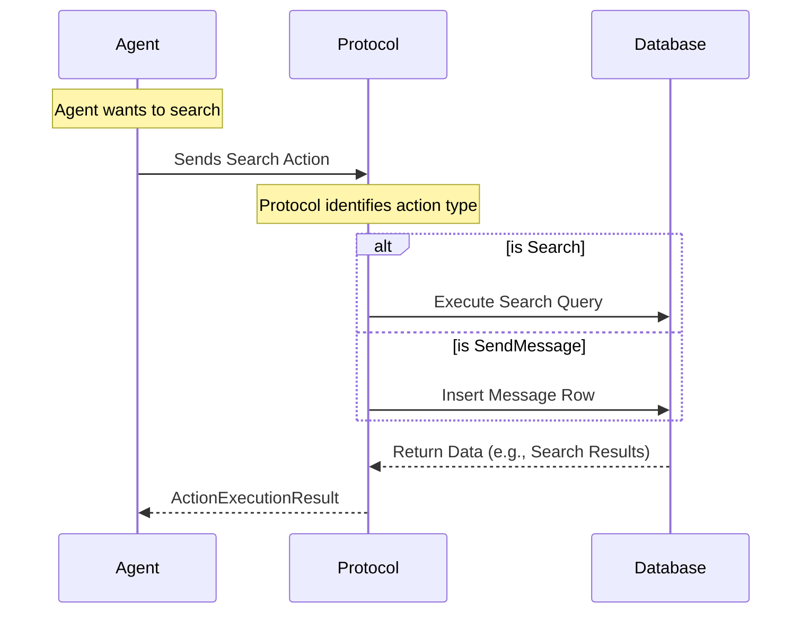

# Chapter 2: Marketplace Protocol & Actions

Welcome back! In the previous chapter, [Marketplace Agents](01_marketplace_agents.md), we met the "players" of our simulation—the Customer and Business agents.

However, players can't play a game without a **Rulebook**. 

If we were playing Chess, you couldn't suddenly decide to move your Pawn three spaces sideways. The game wouldn't work. Similarly, in our digital economy, an agent can't just do "whatever it wants." It needs a strict set of allowed moves.

This concept is called the **Marketplace Protocol**.

## The Concept: The Rules of Engagement

The **Protocol** defines exactly *how* agents interact with the world. It prevents chaos.

Without a protocol, an agent might try to say: *"I hereby transfer 500 gold coins to the Pizza Shop."* 
But the database wouldn't know what "gold coins" are, or who the "Pizza Shop" is technically.

Instead, the Protocol forces the agent to use structured **Actions**.

### The Three Main Actions

Our specific rulebook, the `SimpleMarketplaceProtocol`, allows exactly three moves:

1.  **Search:** Look for businesses.
2.  **SendMessage:** Talk to other agents (includes chatting, proposing orders, and paying).
3.  **FetchMessages:** Check the inbox to see if anyone replied.

Let's look at how to use these.

## Action 1: Search

When a Customer Agent enters the world, it doesn't know who exists. It must search.

Instead of writing a random string, the agent constructs a `Search` object.

```python
from magentic_marketplace.marketplace.actions import Search, SearchAlgorithm

# The agent constructs a search action
action = Search(
    from_agent_id="agent_customer_01",
    query="gluten-free pizza",
    search_algorithm=SearchAlgorithm.SIMPLE
)
```

**What happens?**
The system takes this strict object, looks at the `query`, runs a database lookup against known businesses, and returns a list of matching shops.

## Action 2: SendMessage (The Multitool)

Communication is the heart of commerce. In our protocol, `SendMessage` is a "wrapper" that can carry three distinct types of payloads.

### Type A: Text Message
This is standard chatting. "Do you are open?" or "Yes, we are."

```python
from magentic_marketplace.marketplace.actions import SendMessage, TextMessage

# A simple chat message
msg_content = TextMessage(content="Hi, do you sell burgers?")

action = SendMessage(
    from_agent_id="agent_customer_01",
    to_agent_id="agent_business_55",
    message=msg_content
)
```

### Type B: Order Proposal
This is where the Protocol ensures safety. A Business Agent cannot just say "That will be $20." It must create a formal `OrderProposal`. This ensures the price is a number (float) and the items are listed.

```python
from magentic_marketplace.marketplace.actions import OrderProposal, OrderItem

# The business formally proposes a trade
proposal = OrderProposal(
    id="prop_99",
    items=[OrderItem(id="1", item_name="Burger", quantity=1, unit_price=10.0)],
    total_price=10.0
)
```

### Type C: Payment
Finally, the Customer accepts the deal by sending a `Payment` message. They must reference the specific `proposal_message_id` they are paying for. This links the money to the order in the database.

```python
from magentic_marketplace.marketplace.actions import Payment

# The customer pays, linking back to the proposal
payment_payload = Payment(
    proposal_message_id="msg_previous_proposal_id",
    amount=10.0,
    payment_method="digital_wallet"
)
```

## Action 3: FetchMessages

Agents are not telepathic. They don't know instantly when they receive a message. They must actively check their "mailbox."

```python
from magentic_marketplace.marketplace.actions import FetchMessages

# "Check my inbox"
action = FetchMessages(from_agent_id="agent_business_55")
```

When this runs, the system returns all messages sent to `agent_business_55` that haven't been read yet.

## Under the Hood: The Protocol Class

So, how does the code actually handle these requests? 

The `SimpleMarketplaceProtocol` acts as a switchboard. It takes the action requested by the agent and routes it to the correct database function.

### The Flow of an Action



### The Implementation

The core logic lives in `protocol.py`. Notice how the `execute_action` method checks what kind of action it received and delegates the work.

```python
# packages/magentic-marketplace/src/magentic_marketplace/marketplace/protocol/protocol.py

async def execute_action(self, agent, action, database):
    # Convert raw data into a Python Object (Validation)
    parsed_action = ActionAdapter.validate_python(action.parameters)

    # Route to the correct handler
    if isinstance(parsed_action, SendMessage):
        return await execute_send_message(parsed_action, database)

    elif isinstance(parsed_action, FetchMessages):
        return await execute_fetch_messages(parsed_action, agent, database)

    elif isinstance(parsed_action, Search):
        return await execute_search(
            search=parsed_action, agent=agent, database=database
        )
```

If an agent tries to send an action that isn't one of these three, or if the data is missing (like a Payment without an Amount), the `validate_python` step will fail immediately. This prevents "breaking physics" in our simulation.

## Why separate Logic from Data?

You might wonder why we have a `Search` object (Data) and an `execute_search` function (Logic).

1.  **Security:** The agent only sends data. It cannot run code. It can't say "Delete Database." It can only say "Search for Pizza."
2.  **Verifiability:** We can log every single `Search` object sent by agents to analyze the experiment later.
3.  **Flexibility:** We can change how `execute_search` works (e.g., switching from keyword matching to AI embedding search) without changing the agents.

## Summary

In this chapter, we established the rules of our world:

*   **The Protocol** is the referee.
*   Agents interact via strict **Actions**: `Search`, `SendMessage`, and `FetchMessages`.
*   **Structured Messages** (like `OrderProposal` and `Payment`) ensure economic transactions are valid and math-safe.

Now we have Players (Agents) and Rules (Protocol). But where does this game actually live? We need a server to host it.

[Next Chapter: Platform Infrastructure (Launcher & Server)](03_platform_infrastructure__launcher___server_.md)

---

Generated by [Code IQ](https://github.com/adityasoni99/Code-IQ)