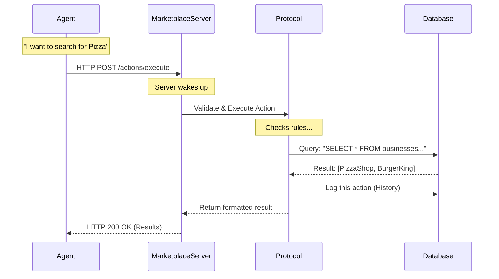

# Chapter 3: Platform Infrastructure (Launcher & Server)

Welcome to Chapter 3! 

In [Chapter 1: Marketplace Agents](01_marketplace_agents.md), we built our players. In [Chapter 2: Marketplace Protocol & Actions](02_marketplace_protocol___actions.md), we defined the rules of the game.

Now, we face a practical problem. If you have a chess piece (Agent) and a rulebook (Protocol), you still can't play the game unless you have a **Board** to put them on.

In software terms, we need a place for these agents to live, talk, and remember their history. We need **Platform Infrastructure**.

## The Concept: The Digital Board

The Platform Infrastructure is the "Game Engine" of our simulation. It solves three major problems:

1.  **Connectivity:** Agents act independently. They need a central hub (Server) to send messages to each other.
2.  **Persistence:** If an agent forgets its history, the game breaks. The infrastructure saves everything to a Database.
3.  **Orchestration:** Starting the database, the server, and 10 different agents manually is a pain. We need a "Launcher" to handle the chaos.

Let's break down the two main components: The **Server** and the **Launcher**.

## Part 1: The Marketplace Server

The `MarketplaceServer` is the town square. It is a web server (built with **FastAPI**) that stays online and listens for agents.

When an agent wants to do something (like `Search` or `SendMessage`), it doesn't talk directly to another agent. It makes an **API Request** to the server.

### How the Server is structured

The server acts as the glue between the **Database** (Memory) and the **Protocol** (Rules).

```python
# Simplified initialization of the Server
class MarketplaceServer(FastAPI):
    def __init__(self, database_factory, protocol):
        # 1. We tell the server how to create a database connection
        self._database_factory = database_factory
        
        # 2. We give the server the rulebook (Protocol)
        self._behavior_protocol = protocol
        
        # 3. We set up the API routes (like /action, /agent)
        super().__init__()
```

The server ensures that every time a request comes in, a database connection is ready, and the protocol is available to check the rules.

### The Database Models

Data in our marketplace isn't just loose text. It is wrapped in structured **Rows**. This is crucial for analyzing the experiment later.

For example, when an agent performs an action, we store it in an `ActionRow`.

```python
# magentic_marketplace/platform/database/models.py

class ActionRow(Row[ActionRowData]):
    """How an action is stored in the DB"""
    id: str                  # Unique ID for this event
    created_at: datetime     # Exact timestamp
    data: ActionRowData      # The actual content (Search, Message, etc.)
```

By wrapping data this way, we can easily answer questions like *"Who sent the most messages between 10:00 PM and 10:05 PM?"*

## Part 2: The Launcher (The Manager)

If the Server is the town square, the **Launcher** is the mayor. 

The `MarketplaceLauncher` manages the lifecycle of the entire simulation. It ensures the server starts *before* the agents try to connect, and it shuts everything down cleanly when the experiment is over.

### Using the Launcher

This is the code you would write in your main script to run an experiment. Notice how it uses `async with`—this is a Context Manager. It handles all the setup and cleanup automatically.

```python
# High-level usage of the Launcher
async def run_simulation():
    # Initialize the launcher with our rules (protocol) and database
    launcher = MarketplaceLauncher(
        protocol=SimpleMarketplaceProtocol(),
        database_factory=my_database_factory
    )

    # The 'async with' block starts the server automatically
    async with launcher:
        print("Server is running!")
        # ... logic to run agents goes here ...
```

Inside that `async with` block, the server is live at `http://127.0.0.1:8000`. You can actually open your web browser to that address and see the API documentation!

## Part 3: The Agent Launcher

We also have a helper called `AgentLauncher`. Its job is to run multiple agents at the same time (concurrently).

Imagine trying to play a game where Player 1 moves, then goes to sleep, then Player 2 moves. It's too slow. We want everyone "thinking" at once.

```python
# magentic_marketplace/platform/launcher.py

class AgentLauncher:
    async def run_agents(self, *agents):
        # Create a background task for every agent
        agent_tasks = [
            asyncio.create_task(agent.run()) 
            for agent in agents
        ]

        # Run them all together until they finish
        await asyncio.gather(*agent_tasks)
```

## Under the Hood: The Request Lifecycle

What actually happens when an agent makes a move? Let's trace the path of a request through our infrastructure.

### The Flow

1.  **Agent** decides to search. It sends an HTTP request.
2.  **Server** receives the request.
3.  **Protocol** validates the request (checks the rules).
4.  **Database** executes the query and saves the log.
5.  **Agent** gets the result back.



### Implementation Details

Let's look at how the `MarketplaceLauncher` actually starts the server. It uses a tool called `uvicorn` (a lightning-fast web server implementation for Python).

```python
# magentic_marketplace/platform/launcher.py

async def start_server(self):
    # 1. Create the Server object
    self.server = MarketplaceServer(...)

    # 2. Create a background task to run uvicorn
    self.server_task, self._stop_fn = self.server.create_server_task(
        host=self.host, 
        port=self.port
    )

    # 3. Wait until the server answers a "Health Check"
    # This prevents agents from crashing if they start too fast.
    await self._wait_for_health_check()
```

The `start_server` method is smart. It doesn't just start the process; it *pings* itself repeatedly ("Are you up? Are you up?") until the server is ready. Only then does it let the code proceed to start the agents.

## Putting It All Together

Here is how we combine [Chapter 1](01_marketplace_agents.md) (Agents), [Chapter 2](02_marketplace_protocol___actions.md) (Protocol), and this chapter into a running simulation.

```python
async def main():
    # 1. Setup the Infrastructure
    launcher = MarketplaceLauncher(protocol=SimpleMarketplaceProtocol, ...)
    agent_runner = AgentLauncher(base_url="http://127.0.0.1:8000")

    # 2. Start the Platform
    async with launcher:
        # 3. Initialize Agents
        customer = CustomerAgent(name="Alice")
        shop = BusinessAgent(name="Bob's Burgers")

        # 4. Run the Game!
        await agent_runner.run_agents(customer, shop)
```

## Summary

In this chapter, we built the "Board" for our game:

*   **MarketplaceServer:** The central hub (API) that agents talk to.
*   **Database Models:** The persistent memory that stores `ActionRows`.
*   **MarketplaceLauncher:** The utility that manages the lifecycle (startup/shutdown).
*   **AgentLauncher:** The utility that runs multiple agents concurrently.

Now that we have the Agents, the Rules, and the Board, there is one critical piece missing. 

Our agents are currently just Python scripts. How do we give them actual **intelligence**? How do we connect them to LLMs like GPT-4 or Claude?

[Next Chapter: LLM Client Interface](04_llm_client_interface.md)

---

Generated by [Code IQ](https://github.com/adityasoni99/Code-IQ)