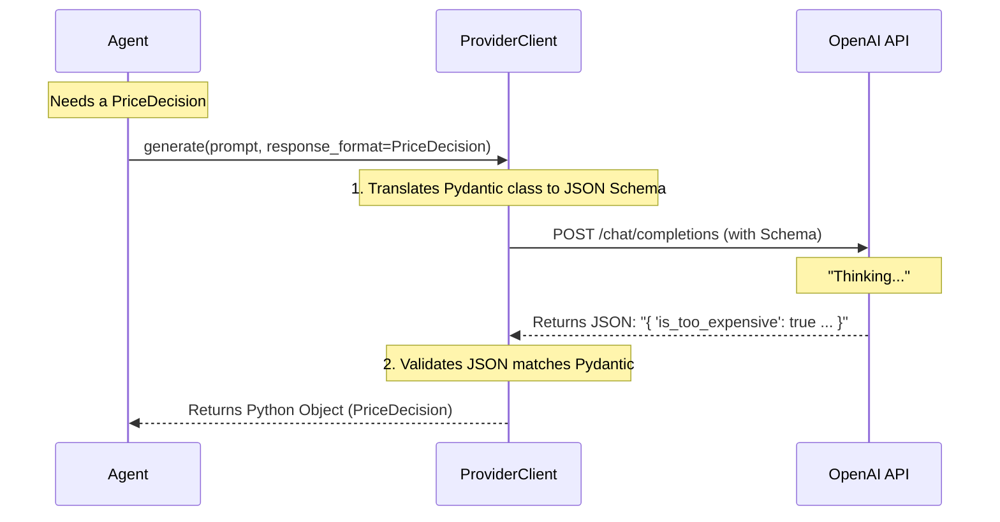

# Chapter 4: LLM Client Interface

Welcome to Chapter 4!

In the previous chapter, [Platform Infrastructure (Launcher & Server)](03_platform_infrastructure__launcher___server_.md), we built the digital world (the Server) and the game board (the Database).

Now, we have a fully functional world and agents standing in it. But there is a problem: **The agents are zombies.** They have bodies, but no brains.

To make an agent "intelligent"—to make it negotiate a price or choose a product—we need to connect it to a **Large Language Model (LLM)** like OpenAI's GPT-4.

This chapter introduces the **LLM Client Interface**, the translation layer that turns an Agent's game needs into AI prompts.

## The Concept: The Universal Translator

Connecting to an AI isn't as simple as just sending a string of text.

1.  **Different Providers:** OpenAI, Anthropic, and Llama all have different API shapes. We don't want to rewrite our agent code if we switch from GPT-4 to Claude.
2.  **Structured Output:** An agent can't use a poem about pizza. It needs a strict data object (like `{"action": "search", "query": "pizza"}`).
3.  **Accounting:** AI costs money (tokens). We need to count every word sent and received.

The **LLM Client Interface** solves this. It acts as a **Universal Translator**.

## The Solution: `ProviderClient`

The core of this system is a class called `ProviderClient`. It is an abstract blueprint. We then build specific versions for specific AIs, like `OpenAIClient`.

### Use Case: Making a Decision

Let's look at the most common task: **Structured Decision Making**.

Imagine a Customer Agent needs to decide if a pizza is too expensive. We don't want the AI to reply, *"Well, it depends on your budget..."* We want a strict `True` or `False`.

**Step 1: Define the Desired Output**
We use a library called **Pydantic** to define exactly what form the answer must take.

```python
from pydantic import BaseModel

# We define a strict "Form" for the AI to fill out
class PriceDecision(BaseModel):
    is_too_expensive: bool
    reasoning: str
```

**Step 2: Ask the Client**
Now we use the client to generate this specific object.

```python
# Assume 'client' is our configured OpenAIClient
response, usage = await client.generate(
    messages="The pizza is $50. My budget is $20.",
    response_format=PriceDecision  # <--- The Magic
)

print(f"Too expensive? {response.is_too_expensive}")
print(f"Cost in tokens: {usage.token_count}")
```

**Output:**
```text
Too expensive? True
Cost in tokens: 45
```

The `ProviderClient` handled all the complexity of forcing the AI to output valid JSON, parsed it, and gave us a ready-to-use Python object.

## Under the Hood: The Flow

What happens inside that `generate` function? It's a multi-step process designed for reliability.

The LLM is a chaotic text generator. The Client forces it to be a structured data generator.



## Implementation Details

Let's look at the code files that make this work.

### 1. The Blueprint (`base.py`)
This file defines the `ProviderClient`. It handles the "boring" administrative work: logging the call, tracking how long it took, and counting tokens.

```python
# magentic_marketplace/marketplace/llm/base.py

class ProviderClient(ABC, Generic[TConfig]):
    async def generate(self, messages, response_format=None, ...):
        # 1. Start the timer
        start_time = time.time()
        
        # 2. Call the actual API (implemented by subclasses)
        result, usage = await self._generate(messages, response_format...)

        # 3. Log the result and token usage for analysis
        logger.debug("LLM call succeeded", token_count=usage.token_count)

        return result, usage
```

By putting the logging here, every single agent—regardless of which AI model they use—will produce consistent data for our experiment analysis.

### 2. The Worker (`openai.py`)
This file implements the actual connection to OpenAI. It handles the specific details of the OpenAI SDK.

Crucially, it handles **Retries**. Sometimes, an AI makes a mistake and returns broken JSON. The client is smart enough to catch this and ask again.

```python
# magentic_marketplace/marketplace/llm/clients/openai.py

async def _generate(self, messages, response_format, ...):
    # Try up to 3 times to get valid data
    for attempt in range(3):
        try:
            # Call OpenAI with the "parse" feature
            response = await self.client.chat.completions.parse(
                response_format=response_format, 
                messages=messages
            )
            return response.choices[0].message.parsed
            
        except Exception as e:
            # If AI failed, tell it what went wrong and loop again
            messages.append({"role": "user", "content": f"Error: {str(e)}"})
```

This loop makes the agents much more robust. If the AI hallucinates invalid data, the system auto-corrects it before the game crashes.

### 3. Configuration

We configure these clients using environment variables. This allows us to switch from GPT-3.5 to GPT-4 without changing code.

```python
# magentic_marketplace/marketplace/llm/clients/openai.py

class OpenAIConfig(BaseLLMConfig):
    # Reads OPENAI_API_KEY from your .env file
    api_key: str = EnvField("OPENAI_API_KEY")
    
    # Defaults to "openai", but can be changed
    provider: Literal["openai"] = "openai"
```

## Why is this "Beginner Friendly"?

You typically don't need to touch `base.py` or `openai.py`. As a developer creating a new agent, you only need to know:

1.  **Import** your client.
2.  **Define** your desired Pydantic model (the output).
3.  **Call** `client.generate`.

This abstraction allows you to focus on the *psychology* of the agent (the prompt) rather than the *plumbing* of the API (HTTP requests and JSON parsing).

## Summary

In this chapter, we learned:
*   **ProviderClient** acts as the "Brain Interface," translating game needs into AI prompts.
*   We use **Pydantic Models** to force the AI to return structured data, not just text.
*   The client handles **Token Counting** and **Retries** automatically, ensuring robust experiments.

Now we have all the pieces: The Agents, the Protocol, the Server, and the Brains. 

It is time to zoom out. We don't just want to run one agent; we want to run a simulation with dozens of them to see what happens to the economy.

[Next Chapter: Experiment Orchestration](05_experiment_orchestration.md)

---

Generated by [Code IQ](https://github.com/adityasoni99/Code-IQ)