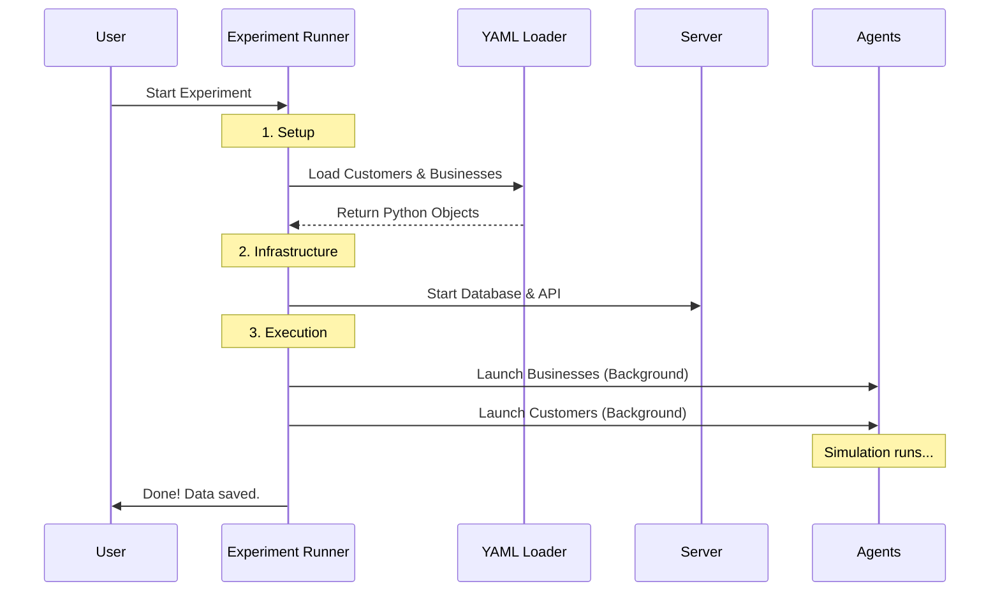

# Chapter 5: Experiment Orchestration

Welcome to Chapter 5!

In the previous chapter, [LLM Client Interface](04_llm_client_interface.md), we gave our agents brains by connecting them to AI models. Before that, in [Platform Infrastructure (Launcher & Server)](03_platform_infrastructure__launcher___server_.md), we built the server where they live.

Now we have a problem of scale. 

If you want to test a hypothesis—like "Do customers buy more if the price is lower?"—you can't just run one agent manually. You need to simulate **50 businesses** and **100 customers** interacting simultaneously. You need to run this simulation over and over again to get good data.

Manually starting 150 terminal windows is impossible.

We need a **Director** for our movie. We need **Experiment Orchestration**.

## The Concept: From Script to Screen

Orchestration is the layer that automates the entire lifecycle of a simulation. It connects **Static Data** (files on your disk) to **Dynamic Runtime** (active agents).

### 1. The Script (Static Data)
Instead of hard-coding "Bob the Builder" inside Python code, we define our agents in **YAML files**. This separates the *code* (logic) from the *content* (scenarios).

**Example Business (YAML):**
```yaml
id: "business_01"
name: "Luigi's Pizza"
menu_features:
  "Pepperoni Pizza": 15.00
  "Cheese Pizza": 12.00
amenity_features:
  "Outdoor Seating": true
```

### 2. The Director (The Runner)
The "Experiment Runner" is a Python script that reads these files and brings them to life. Its job is to:
1.  **Read** the YAML files.
2.  **Start** the Server and Database.
3.  **Spawn** the Business Agents (so shops are open).
4.  **Spawn** the Customer Agents (so they can start shopping).
5.  **Wait** for everyone to finish.

## Use Case: Running a Simulation

Let's see how we actually run an experiment using the Command Line Interface (CLI).

### The Command
We use a tool called `magentic-marketplace` to kick off the process.

```bash
magentic-marketplace run ./data/my_experiment \
  --experiment-name "pizza_price_test_v1" \
  --customer-max-steps 20 \
  --search-algorithm simple
```

### What happens?
When you run this, the computer takes over. You will see logs scrolling by as the database is created, agents log in, and transactions occur. When it stops, you have a database full of results.

## Under the Hood: The Orchestration Flow

How does the code turn text files into a living economy? Let's trace the flow.



## Implementation Details

The heart of this logic lives in `magentic_marketplace/experiments/run_experiment.py`.

Let's break down the code into understandable chunks.

### Step 1: Loading the Data

First, we need to turn those YAML files into Python objects. We use helper functions to scan the directories.

```python
# magentic_marketplace/experiments/run_experiment.py

async def run_marketplace_experiment(data_dir, ...):
    # Define paths to your data folders
    data_path = Path(data_dir)
    
    # Load the static profiles from YAML into lists of objects
    businesses = load_businesses_from_yaml(data_path / "businesses")
    customers = load_customers_from_yaml(data_path / "customers")

    print(f"Loaded {len(customers)} customers and {len(businesses)} businesses")
```

### Step 2: Preparing the Stage

Next, we initialize the `MarketplaceLauncher`. As we learned in [Chapter 3](03_platform_infrastructure__launcher___server_.md), this manages the server. We also create a unique database for this specific run so we don't mix up data from different experiments.

```python
    # Create a unique name for this run's database schema
    if experiment_name is None:
        experiment_name = f"run_{int(datetime.now().timestamp())}"

    # Initialize the Launcher (The Server Wrapper)
    marketplace_launcher = MarketplaceLauncher(
        protocol=SimpleMarketplaceProtocol(),
        database_factory=database_factory, # Connects to Postgres
        experiment_name=experiment_name,
    )
```

### Step 3: Initializing Agents

Now we take the loaded data (`customers` list) and wrap them in the actual Agent classes (`CustomerAgent`). We also tell them where the server is (`server_url`).

```python
    async with marketplace_launcher:
        # Create Business Agents (The Shopkeepers)
        business_agents = [
            BusinessAgent(profile, marketplace_launcher.server_url)
            for profile in businesses
        ]

        # Create Customer Agents (The Shoppers)
        customer_agents = [
            CustomerAgent(profile, marketplace_launcher.server_url, ...)
            for profile in customers
        ]
```

### Step 4: The Dependency Launch

This is a critical detail. In the real world, you can't buy pizza if the pizza shop isn't open yet.

The orchestration layer ensures **Businesses** start first. Only after they are ready do the **Customers** enter the world.

```python
        # We use the AgentLauncher helper
        async with AgentLauncher(marketplace_launcher.server_url) as runner:
            
            # This smart function starts 'dependent_agents' (Businesses) first,
            # waits for them, and then starts 'primary_agents' (Customers).
            await runner.run_agents_with_dependencies(
                primary_agents=customer_agents, 
                dependent_agents=business_agents
            )
```

## Generating the Data

You might be wondering: *"Do I have to write 100 YAML files by hand?"*

No! We have a script for that too.

In `data/data_generation_scripts/generate_customers_and_businesses.py`, we use LLMs to generate synthetic personalities.

1.  It picks a random food item (e.g., "Tacos").
2.  It asks GPT-4: "Write a business name and description for a Taco shop."
3.  It asks GPT-4: "Write a customer persona who loves spicy food."
4.  It saves the results as YAML.

This allows us to generate massive, diverse datasets in minutes.

## Summary

In this chapter, we learned how to be the **Director** of our simulation:

*   **Experiment Orchestration** automates the setup and execution of the marketplace.
*   We use **YAML files** to define the scenario (static data).
*   The **Experiment Runner** loads data, starts the server, and launches agents in the correct order (Businesses first, then Customers).
*   We use **Synthetic Data Generation** to create large-scale scenarios without manual typing.

Now, you have run your experiment. The agents have talked, traded, and finished their shopping. You have a database full of actions.

But... what actually happened? Did the agents make good deals? Did the price bias work? 

To answer these questions, we need to **Visualize** the data.

[Next Chapter: Simulation Visualization](06_simulation_visualization.md)

---

Generated by [Code IQ](https://github.com/adityasoni99/Code-IQ)