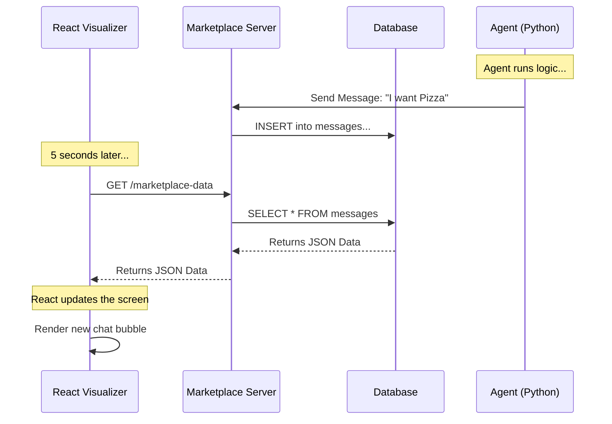

# Chapter 6: Simulation Visualization

Welcome to the final chapter of the Multi-Agent Marketplace tutorial!

In the previous chapter, [Experiment Orchestration](05_experiment_orchestration.md), we learned how to run large-scale simulations. We launched dozens of agents, and they interacted, traded, and generated a massive amount of data.

But now we have a new problem. 

Imagine you ran a simulation for an hour. You have a database filled with thousands of rows of text. How do you know if the agents actually behaved intelligently? Did they haggle? Did they get ripped off? Reading raw database logs (`SELECT * FROM messages`) is like trying to read the Matrix code—it's exhausting and unintuitive.

We need a way to **watch** the simulation. We need **Simulation Visualization**.

## The Concept: The Security Camera Room

The **Visualizer** is a web dashboard built with **React**. It acts like a security camera room for your marketplace.

It connects to the same database your agents are writing to, but it reads the data in "read-only" mode. It transforms raw text logs into a beautiful, chat-like interface (similar to WhatsApp or Slack) so you can observe the social dynamics of your AI agents.

### The Problem it Solves

1.  **Debugging:** If a Customer Agent buys a burger for $500, you can scroll back through the chat to see *why* (maybe it hallucinated the decimal point).
2.  **Monitoring:** You can watch negotiations happen in real-time as the experiment runs.
3.  **Analysis:** You can instantly filter conversations to see only interactions involving specific businesses (e.g., "Show me all chats with Luigi's Pizza").

## Component 1: The Main Dashboard (`App.tsx`)

The heart of the visualizer is the main `App` component. Its primary job is **Polling**. 

Since the simulation is live, the database changes every second. The React app needs to ask the server, "Anything new?" repeatedly.

Here is how the app keeps the data fresh:

```tsx
// packages/marketplace-visualizer/src/App.tsx

useEffect(() => {
  const initializeApp = async () => {
    // 1. Load the static list of agents once
    await loadInitialData();

    // 2. Load messages immediately
    loadMessages();

    // 3. Set up a timer to refresh messages every 5 seconds
    const interval = setInterval(loadMessages, 5000);

    return () => clearInterval(interval);
  };
  
  initializeApp();
}, [loadMessages]);
```

**Explanation:**
*   `loadInitialData`: Fetches the list of Shops and Customers (which usually doesn't change).
*   `setInterval`: Every 5,000 milliseconds (5 seconds), it runs `loadMessages` to fetch new chat bubbles.
*   This creates the illusion of a real-time feed without needing complex web-sockets.

## Component 2: The Marketplace Center

In the middle of the screen, we have the feed of all active conversations. This is handled by `MarketplaceCenter.tsx`.

A key feature here is **Filtering**. If you click on "Customer Alice" in the sidebar, the center panel updates to show *only* Alice's chats.

```tsx
// packages/marketplace-visualizer/src/App.tsx (Logic view)

const filteredMessageThreads = useMemo(() => {
  let filtered = data.messageThreads;

  // If a customer is clicked, keep only their threads
  if (selectedCustomer) {
    filtered = filtered.filter(
      (thread) => thread.participants.customer.id === selectedCustomer.id,
    );
  }

  return filtered;
}, [data?.messageThreads, selectedCustomer]);
```

**What happens here?**
The `useMemo` hook is a performance optimization. It says: "Only recalculate the list if the data changes or the user clicks a new customer." This keeps the interface snappy even if there are thousands of messages.

## Component 3: Visualizing the Conversation

The most important part of the visualizer is the `Conversation` component. 

In [Chapter 2: Marketplace Protocol & Actions](02_marketplace_protocol___actions.md), we learned that agents send different *types* of messages: `TextMessage`, `OrderProposal`, and `Payment`.

The visualizer needs to render these differently so humans can scan them quickly. A generic text bubble isn't enough for a financial transaction.

### Visualizing Message Types

We use a helper function to choose an icon based on the message type.

```tsx
// packages/marketplace-visualizer/src/components/Conversation.tsx

const getMessageIcon = (type: string) => {
  switch (type.toLowerCase()) {
    case "payment":
      return <CreditCard className="h-4 w-4" />; // 💳 Icon
    case "order_proposal":
      return <MessageSquare className="h-4 w-4" />; // 📋 Icon
    case "search":
      return <Search className="h-4 w-4" />; // 🔍 Icon
    default:
      return <Send className="h-4 w-4" />; // ✈️ Icon
  }
};
```

This simple visual cue allows a researcher to scroll through a long thread and immediately spot where the money changed hands (the Credit Card icon).

### Calculating Stats on the Fly

The visualizer also calculates "Utility" (how happy the customer was) and counts payments in real-time.

```tsx
// packages/marketplace-visualizer/src/components/Conversation.tsx

const conversationStats = useMemo(() => {
  // Count how many times money was sent
  const payments = thread.messages.filter(
    (m) => m.type === "payment"
  ).length;

  // Get the utility score (calculated by the backend)
  const utility = thread.utility;

  return { payments, utility };
}, [thread.messages]);
```

By calculating this in the browser, we can display stats like **"Payments: 1 | Utility: $5.00"** right on the conversation card.

## Under the Hood: The Data Flow

How does a Python backend talk to a React frontend?

The visualizer doesn't connect directly to the database (that is insecure for web browsers). Instead, it talks to the same API Server we built in [Chapter 3: Platform Infrastructure (Launcher & Server)](03_platform_infrastructure__launcher___server_.md).



1.  The **Agent** puts data into the system.
2.  The **Browser** polls the API.
3.  The **React State** updates, triggering a re-render of the UI.

## Analyzing Agent Psychology

Using this tool, we can spot interesting behaviors.

**Example Scenario: The Stubborn Shopkeeper**

1.  **Customer:** "Can I get the burger for $10?"
2.  **Shopkeeper:** "No, the price is $15."
3.  **Customer:** "How about $12?"
4.  **Shopkeeper:** "No, the price is $15."
5.  **Customer:** "Okay, I will pay $15." (Sends Payment)

In the visualizer, you would see this as a thread with 4 text bubbles followed by a **Payment Card**. You can immediately see that the negotiation failed (the customer paid full price), but the transaction succeeded.

## Conclusion

Congratulations! You have completed the **Multi-Agent Marketplace Tutorial**.

Let's recap your journey:
1.  **[Marketplace Agents](01_marketplace_agents.md):** You created the "players" (Customers and Businesses).
2.  **[Protocol & Actions](02_marketplace_protocol___actions.md):** You gave them a rulebook and a way to speak.
3.  **[Infrastructure](03_platform_infrastructure__launcher___server_.md):** You built the server and database where they live.
4.  **[LLM Client Interface](04_llm_client_interface.md):** You connected them to AI brains.
5.  **[Experiment Orchestration](05_experiment_orchestration.md):** You learned how to run massive simulations.
6.  **Simulation Visualization:** You learned how to watch and debug the economy in real-time.

You now have a fully functional, observable, and scalable simulation environment. You can use this to test economic theories, train better sales bots, or simply watch AI try to sell pizza to each other.

**Where to go from here?**
*   Try changing the `system_prompt` of the agents to make them aggressive negotiators.
*   Add a new Action type (e.g., `Refund`) to the Protocol.
*   Run an experiment with 1,000 agents and see if the server holds up!

Thank you for following along. Happy coding!

---

Generated by [Code IQ](https://github.com/adityasoni99/Code-IQ)