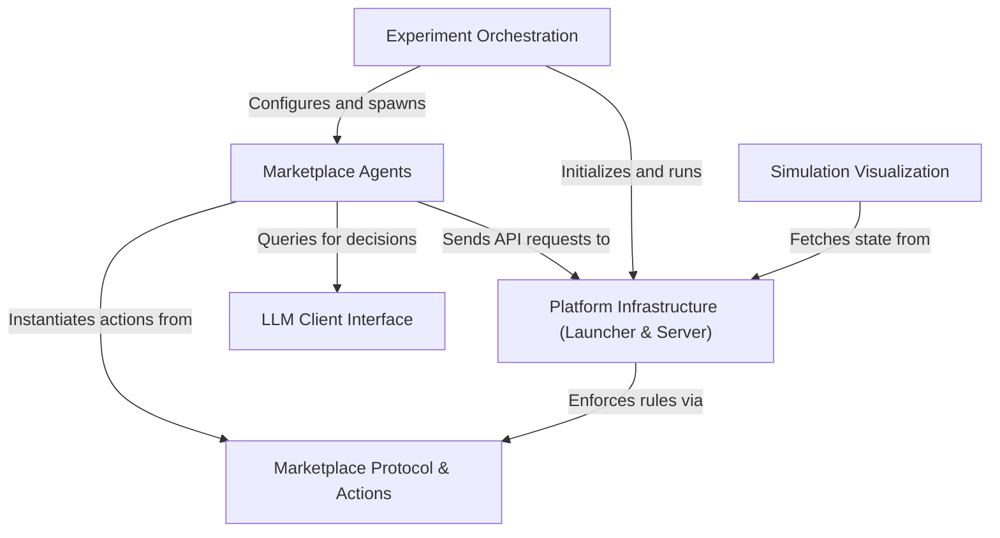

# Tutorial: multi-agent-marketplace

This project simulates a **digital economy** where autonomous *AI agents* (customers and businesses) interact to trade goods and services. It uses a **central platform** to enforce strict *market protocols*, ensuring all transactions like searching, messaging, and payments are structured and recorded. Researchers can orchestrate **controlled experiments** to study agent behavior and observe the resulting economic dynamics through a real-time *visual dashboard*.

**Source Repository:** [https://github.com/microsoft/multi-agent-marketplace](https://github.com/microsoft/multi-agent-marketplace)

## Chapters

1. [Marketplace Agents](01_marketplace_agents.md)
2. [Marketplace Protocol & Actions](02_marketplace_protocol___actions.md)
3. [Platform Infrastructure (Launcher & Server)](03_platform_infrastructure__launcher___server_.md)
4. [LLM Client Interface](04_llm_client_interface.md)
5. [Experiment Orchestration](05_experiment_orchestration.md)
6. [Simulation Visualization](06_simulation_visualization.md)

---

Generated by [Code IQ](https://github.com/adityasoni99/Code-IQ)