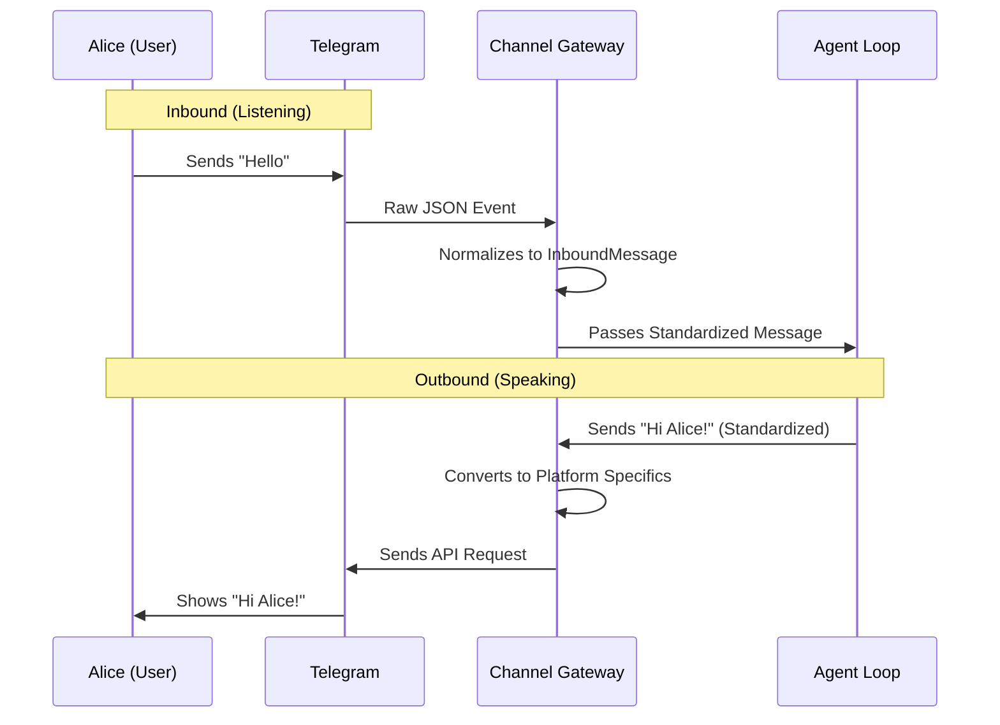

# Chapter 1: Channel Gateway

Welcome to the **nanobot** project! You are about to build a sophisticated AI agent, but before our bot can think, plan, or remember, it needs to perform a very basic human function: **Listening and Speaking**.

However, the internet is a messy place. Telegram speaks one language, Discord speaks another, and Slack speaks a third. If our bot had to learn the specific rules for every single chat app, the code would be a nightmare.

This is where the **Channel Gateway** comes in.

## 1. The Universal Translator

Imagine you are a diplomat who only speaks "Internal Bot Language." You have people approaching you speaking German, French, and Japanese. You need a translator.

The **Channel Gateway** is that translator (or in programming terms, an **Adapter**).

*   **The Problem:** Chat platforms send data in completely different formats.
*   **The Solution:** The Gateway converts everything into a standard format the bot understands.

### A Concrete Use Case
Let's say a user named **Alice** sends the message `"Hello"` to your bot.

1.  **Telegram** sends a complex JSON object with `update_id`, `message.chat.id`, and `message.text`.
2.  **Discord** sends a WebSocket event with `d.author.id` and `d.content`.
3.  **The Channel Gateway** catches both and converts them into a single, clean **InboundMessage**:
    ```json
    {
      "sender": "Alice",
      "content": "Hello",
      "platform": "telegram" (or "discord")
    }
    ```

Now, the rest of your bot (specifically [The Agent Loop](02_the_agent_loop.md)) only has to worry about that clean JSON. It doesn't care if the message came from a pigeon or a supercomputer.

---

## 2. How It Works (The Flow)

Before we look at the code, let's visualize the journey of a message.



1.  **Inbound:** The Gateway listens to the platform, extracts the text and user ID, and passes it to the system.
2.  **Outbound:** When the bot wants to reply, the Gateway figures out how to send that text back to the specific platform (e.g., formatting bold text as `**text**` for Markdown or `<b>text</b>` for HTML).

---

## 3. Implementation: The Base Blueprint

In object-oriented programming, we often create a "Base" class that acts as a template. All our specific channels (Telegram, Slack, etc.) will follow this template.

Here is the `BaseChannel` from `nanobot/channels/base.py`. It defines the rule: **Every channel must handle messages the same way.**

```python
# nanobot/channels/base.py

class BaseChannel(ABC):
    async def _handle_message(self, sender_id, chat_id, content, ...):
        # 1. Check if user is allowed to talk to bot
        if not self.is_allowed(sender_id):
            return

        # 2. Create the standardized message
        msg = InboundMessage(
            channel=self.name,
            sender_id=str(sender_id),
            content=content,
            # ... other fields
        )
        
        # 3. Send it to the internal bus (The Agent Loop)
        await self.bus.publish_inbound(msg)
```

**Explanation:**
*   `_handle_message`: This is a helper function. No matter which platform we are on, once we have the text, we call this function.
*   `InboundMessage`: This is our "clean" format.
*   `self.bus.publish_inbound`: This puts the message on the internal conveyor belt for processing.

---

## 4. Implementation: The Telegram Worker

Now let's look at a real worker: **Telegram**. This class inherits from our `BaseChannel` blueprint. It uses a technique called **Long Polling** (constantly asking the Telegram server "Do I have mail?").

Here is a simplified look at how `nanobot/channels/telegram.py` catches a message:

```python
# nanobot/channels/telegram.py

async def _on_message(self, update: Update, context: ContextTypes.DEFAULT_TYPE) -> None:
    message = update.message
    
    # 1. Extract the raw text from Telegram's specific format
    content = message.text
    
    # 2. Extract the user ID
    sender_id = str(message.from_user.id)
    
    # 3. Pass it to the BaseChannel logic we saw above
    await self._handle_message(
        sender_id=sender_id,
        chat_id=str(message.chat_id),
        content=content
    )
```

**Explanation:**
*   **Input:** It takes a `update` object (specific to Telegram).
*   **Extraction:** It pulls out `.text` and `.from_user.id`. If this were Discord, these property names would be different.
*   **Hand-off:** It calls `_handle_message` to standardize it.

### Sending Messages Back (Outbound)

The Gateway also handles sending replies. Telegram requires specific formatting (HTML) if we want bold or italic text.

```python
# nanobot/channels/telegram.py

async def send(self, msg: OutboundMessage) -> None:
    # 1. Convert our internal Markdown to Telegram's HTML
    html_content = _markdown_to_telegram_html(msg.content)
    
    # 2. Use the Telegram bot API to send the message
    await self._app.bot.send_message(
        chat_id=int(msg.chat_id),
        text=html_content,
        parse_mode="HTML"
    )
```

**Explanation:**
*   The bot core might say: "Hello **Alice**".
*   Telegram needs: "Hello `<b>Alice</b>`".
*   The `send` method handles this translation automatically.

---

## 5. The Manager

Finally, we have the **Channel Manager**. If the Channels are workers, the Manager is the boss who hires them based on your configuration file.

```python
# nanobot/channels/manager.py

class ChannelManager:
    def _init_channels(self) -> None:
        # Check config to see if Telegram is enabled
        if self.config.channels.telegram.enabled:
            # Create the Telegram Channel
            self.channels["telegram"] = TelegramChannel(
                self.config.channels.telegram,
                self.bus
            )
            logger.info("Telegram channel enabled")
```

**Explanation:**
*   The system doesn't need to know *which* channels are running. The Manager reads the `config` and starts the correct ones (Telegram, WhatsApp, Discord, etc.) automatically.

---

## Summary

In this chapter, we built the **ears and mouth** of our bot.

1.  **Abstraction:** We treat all chat platforms as generic sources of text.
2.  **Normalization:** We convert platform-specific "noise" into clean `InboundMessage` objects.
3.  **Routing:** We send these clean messages to the message bus.

Now that our bot can "hear" a message and standardize it, what happens next? The message travels to the brain of the operation.

Next, we will explore how the bot decides what to do with that message in **[The Agent Loop](02_the_agent_loop.md)**.

---

Generated by [Code IQ](https://github.com/adityasoni99/Code-IQ)