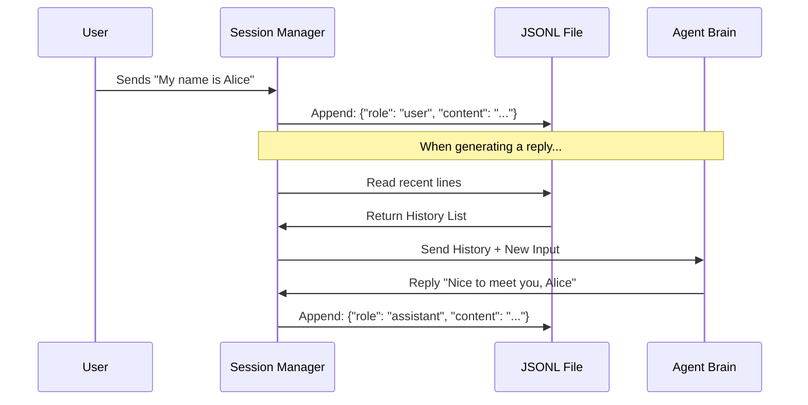

# Chapter 4: Memory & Persistence

In the previous chapter, **[LLM Provider Abstraction](03_llm_provider_abstraction.md)**, we gave our bot a "universal brain" capable of thinking by connecting to models like GPT-4 or Claude.

However, currently, our bot suffers from a severe case of **Amnesia**.

If you tell the bot: *"My name is Alice."*
And then restart the bot and ask: *"Who am I?"*
The bot will reply: *"I don't know."*

This is because LLMs are **stateless**. They treat every request as a brand-new interaction. In this chapter, we will fix this by building the **Memory System**.

## 1. The Notebook and The Journal

To make our bot feel "alive," we need to store information. In `nanobot`, we split memory into two distinct types, just like humans do.

### Type 1: Session History (The Notebook)
Imagine you are in a meeting. You take quick notes on a **Notebook** to remember what was said 5 minutes ago.
*   **Purpose:** Immediate context ("What did the user just say?").
*   **Format:** **JSONL** (JSON Lines).
*   **Storage:** `sessions/telegram_123.jsonl`

### Type 2: Long-Term Knowledge (The Journal)
At the end of the day, you summarize the important facts into a **Journal**. "Today I met Alice. She is a Python developer."
*   **Purpose:** Permanent facts ("What do I know about this user?").
*   **Format:** **Markdown**.
*   **Storage:** `memory/MEMORY.md`

---

## 2. Short-Term Memory: The Session Manager

Let's start with the "Notebook." We need to record every message that comes in (from the User) and every message that goes out (from the Bot).

We use a format called **JSONL**. It is simply a file where every line is a valid JSON object.

**Why JSONL?** It is "Append-Only." We never have to rewrite the whole file; we just add a new line to the bottom. This makes it very fast and safe.

### The Central Use Case
1.  **User:** "Hi!"
2.  **Bot:** (Saves "Hi" to file) -> (Reads last 10 lines) -> (Generates Reply "Hello!") -> (Saves "Hello!" to file).

### The Flow


### Implementation: The Session Class

In `nanobot/session/manager.py`, we define what a `Session` looks like.

```python
# nanobot/session/manager.py

@dataclass
class Session:
    key: str  # e.g., "telegram:12345"
    messages: list[dict] = field(default_factory=list)
    
    def add_message(self, role: str, content: str):
        """Add a message to the memory list."""
        self.messages.append({
            "role": role,
            "content": content,
            "timestamp": datetime.now().isoformat()
        })
```

**Explanation:**
*   **`messages`**: A simple list in Python memory holding the conversation.
*   **`add_message`**: A helper to format the data (User or Assistant) and timestamp it.

### Implementation: Saving to Disk

The `SessionManager` handles the files. It ensures we don't lose data if the bot crashes.

```python
# nanobot/session/manager.py

def save(self, session: Session) -> None:
    # 1. Calculate the file path based on the session key
    path = self._get_session_path(session.key)

    # 2. Open the file in Write mode
    with open(path, "w") as f:
        # 3. Write metadata (creation time, etc.)
        f.write(json.dumps(session.metadata) + "\n")
        
        # 4. Write every message as a new line
        for msg in session.messages:
            f.write(json.dumps(msg) + "\n")
```

**Explanation:**
*   We save the entire conversation history to a standardized file path.
*   Ideally, we would append, but for simplicity in this tutorial version, we rewrite the file to ensure consistency.

---

## 3. Long-Term Memory: The Memory Store

The Session History is great for chatting, but it gets too long. If you chat for a month, the file becomes huge, and sending all that text to the LLM is expensive and slow.

We need a place for **Consolidated Facts**.

This is handled in `nanobot/agent/memory.py`.

### The File Structure
We use Markdown files because they are easy for both humans and AI to read.

*   **`MEMORY.md`**: The core brain. Contains facts like:
    > User's name is Alice. She likes Python. We discussed the weather on Tuesday.
*   **`HISTORY.md`**: A raw log of interactions, useful for searching later.

### Implementation: Reading and Writing

```python
# nanobot/agent/memory.py

class MemoryStore:
    def __init__(self, workspace: Path):
        # Define where our brain files live
        self.memory_dir = ensure_dir(workspace / "memory")
        self.memory_file = self.memory_dir / "MEMORY.md"

    def read_long_term(self) -> str:
        """Read the persistent facts."""
        if self.memory_file.exists():
            return self.memory_file.read_text(encoding="utf-8")
        return ""
```

**Explanation:**
*   It's a very simple text reader.
*   The AI will treat the content of `MEMORY.md` as "Background Knowledge."

---

## 4. Putting It Together: The Context Sandwich

Now we have two memory sources. How does the **[Agent Loop](02_the_agent_loop.md)** use them?

We combine them into the **Context**. When we send a request to the LLM Provider, we construct a "prompt sandwich."

```mermaid
flowchart TD
    Sys[System Prompt: "You are Nanobot"] --> Context
    Mem[Long-Term Memory: "User is Alice"] --> Context
    Hist[Session History: "User: Hi / Bot: Hello"] --> Context
    
    Context --> Final[Final Input to LLM]
```

### Retrieving the Context

In the code, we merge these strings before sending them to the provider.

```python
# Inside your ContextBuilder (conceptual)

def build_context(self, session, memory_store):
    # 1. Get the deep memories
    long_term = memory_store.read_long_term()
    
    # 2. Get the recent chat
    recent_chat = session.get_history(max_messages=20)
    
    # 3. Combine them
    messages = [
        {"role": "system", "content": f"Here is what you know:\n{long_term}"},
        *recent_chat
    ]
    return messages
```

Now, even if the `recent_chat` is empty (because you just restarted the bot), the `long_term` variable still contains: *"User is named Alice."*

The bot will instantly "remember" Alice.

---

## 5. Under the Hood: Loading a Session

When a message arrives from the **[Channel Gateway](01_channel_gateway.md)**, the first thing the system does is load the session.

Here is the logic inside `SessionManager.get_or_create`:

```python
# nanobot/session/manager.py

def get_or_create(self, key: str) -> Session:
    # 1. Check if we already have this session in RAM (Cache)
    if key in self._cache:
        return self._cache[key]
    
    # 2. Try to load it from the .jsonl file on disk
    session = self._load(key)
    
    # 3. If file doesn't exist, create a brand new empty session
    if session is None:
        session = Session(key=key)
    
    # 4. Save to RAM for next time
    self._cache[key] = session
    return session
```

**Explanation:**
*   **Caching:** Reading files from the hard drive is slow. We keep active sessions in a Python dictionary (`self._cache`) so the bot responds instantly.
*   **Lazy Loading:** We only load the file when the user actually sends a message.

---

## Summary

In this chapter, we gave our bot a memory span longer than a goldfish.

1.  **Session Manager:** Handles the "Notebook" (JSONL files) for immediate conversation flow.
2.  **Memory Store:** Handles the "Journal" (Markdown files) for persistent facts.
3.  **Context Construction:** We feed both types of memory into the LLM so it knows *who* it is talking to and *what* was just said.

Now our bot can remember us! But currently, it can only talk. It cannot *do* anything. It can't check the weather, search the web, or run code.

To fix that, we need to give the bot "hands."

In the next chapter, we will build the **[Tooling System](05_tooling_system.md)**.

---

Generated by [Code IQ](https://github.com/adityasoni99/Code-IQ)