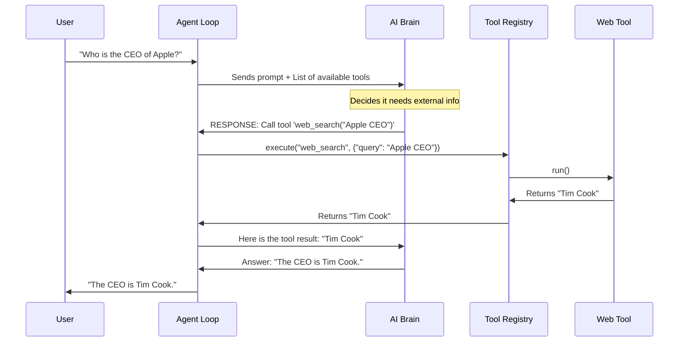

# Chapter 5: Tooling System

In the previous chapter, **[Memory & Persistence](04_memory___persistence.md)**, we gave our bot a long-term memory. It now knows who you are and what you talked about yesterday.

However, our bot is still like a **brain in a jar**.

It can think, remember, and speak, but it cannot **act**. If you ask it to "Check the weather in London" or "Create a file named report.txt," it will hallucinate an answer or apologize because it has no way to touch the outside world.

In this chapter, we will build the **Tooling System**—the hands and eyes of our agent.

## 1. Escaping the Jar

Large Language Models (LLMs) are frozen in time. Their knowledge cuts off when their training finished. To make them useful agents, we need to give them tools.

Think of the **Tooling System** as a **Swiss Army Knife**. The agent is the person holding the knife, and the tools are the specific attachments (screwdriver, scissors, blade) used to solve specific problems.

### The Central Use Case: "Search the Web"
Let's say a user asks: *"Who won the Super Bowl yesterday?"*

1.  **Without Tools:** The bot says, "I don't know, my training data is from last year."
2.  **With Tools:**
    *   The bot recognizes it doesn't know the answer.
    *   It picks the **Web Search** tool from its toolkit.
    *   It executes a search for "Super Bowl winner yesterday."
    *   It reads the result and answers the user accurately.

---

## 2. The Blueprint: What is a Tool?

To keep our code clean, we can't just write random functions. We need a standard **Blueprint** so the agent knows how to hold every tool, whether it's a web searcher or a file writer.

We define this blueprint in `nanobot/agent/tools/base.py`.

### The Base Class
Every tool must inherit from this `Tool` class. It enforces three rules:
1.  **Name:** What do we call it? (e.g., `"web_search"`)
2.  **Description:** What does it do? (The LLM reads this to decide when to use it).
3.  **Execute:** The actual Python code that runs.

```python
# nanobot/agent/tools/base.py

class Tool(ABC):
    @property
    @abstractmethod
    def name(self) -> str:
        """The tool's unique name (e.g., 'calculator')."""
        pass

    @abstractmethod
    async def execute(self, **kwargs) -> str:
        """The logic that runs when the tool is called."""
        pass
        
    def to_schema(self):
        """Converts the tool definition into JSON for the LLM."""
        # (Implementation details omitted for brevity)
```

**Explanation:**
*   **Abstraction:** The Agent doesn't care *how* a tool works. It just knows every tool has a `.name` and an `.execute()` method.
*   **`to_schema`**: This is a helper that translates our Python code into a JSON description that OpenAI or Anthropic can understand.

---

## 3. The Toolbox: The Registry

If the `Tool` is a screwdriver, the **Registry** is the toolbox where we keep everything organized.

The Agent shouldn't have to carry every tool in its hands at all times. It asks the Registry for what it needs.

### Implementation: `ToolRegistry`
Located in `nanobot/agent/tools/registry.py`, this class manages our collection.

```python
# nanobot/agent/tools/registry.py

class ToolRegistry:
    def __init__(self):
        self._tools = {}  # A dictionary to store tools

    def register(self, tool: Tool):
        """Add a new tool to the box."""
        self._tools[tool.name] = tool

    async def execute(self, name: str, params: dict):
        """Find the tool by name and run it."""
        tool = self._tools.get(name)
        
        if not tool:
            return f"Error: Tool '{name}' not found"
            
        return await tool.execute(**params)
```

**Explanation:**
*   **Registration:** When the bot starts, we load all our tools into `self._tools`.
*   **Execution:** When the **[Agent Loop](02_the_agent_loop.md)** decides to use a tool, it shouts: "Registry, run `web_search` with query `python tutorials`!" The registry handles the rest.

---

## 4. Building Real Tools

Now that we have the system, let's look at the actual tools included in `nanobot`.

### Tool A: Web Search (The Eyes)
This tool allows the bot to query a search engine (like Brave Search) to get up-to-date information.

```python
# nanobot/agent/tools/web.py

class WebSearchTool(Tool):
    name = "web_search"
    description = "Search the web. Returns titles, URLs, and snippets."
    
    async def execute(self, query: str, count: int = 5, **kwargs):
        # 1. Use an HTTP client to call the Search API
        async with httpx.AsyncClient() as client:
            response = await client.get(
                "https://api.search.brave.com/...",
                params={"q": query}
            )
        
        # 2. Format the results nicely
        results = response.json().get("web", {}).get("results", [])
        return self._format_results(results)
```

**Explanation:**
*   **Connectivity:** It uses `httpx` (a library like requests) to talk to the internet.
*   **Output:** It returns a text string containing the search results, which the LLM then reads to answer the user.

### Tool B: Shell Execution (The Hands)
This is a powerful (and dangerous) tool. It allows the agent to run terminal commands on your computer.

```python
# nanobot/agent/tools/shell.py

class ExecTool(Tool):
    name = "exec"
    description = "Execute a shell command. Use with caution."

    async def execute(self, command: str, **kwargs):
        # 1. Check safety guards (prevent 'rm -rf /')
        if self._is_dangerous(command):
            return "Error: Command blocked by safety guard."

        # 2. Run the command in the terminal
        process = await asyncio.create_subprocess_shell(
            command,
            stdout=asyncio.subprocess.PIPE
        )
        
        # 3. Return the output text
        stdout, stderr = await process.communicate()
        return stdout.decode()
```

**Explanation:**
*   **Capability:** This lets the bot do almost anything: create files, git clone repos, run Python scripts, etc.
*   **Safety:** Because LLMs can make mistakes, we add a `_is_dangerous` check to block commands that delete files or format drives.

---

## 5. The Flow: How It All Connects

How does a text request like "Check the weather" turn into code execution?

1.  **User** sends a message.
2.  **LLM** analyzes it and sends back a special "Tool Call" request (handled in **[LLM Provider Abstraction](03_llm_provider_abstraction.md)**).
3.  **Agent Loop** sees the request and calls the **Registry**.
4.  **Registry** runs the Python code and returns the result.



---

## 6. Integrating with the Agent Loop

In **[The Agent Loop](02_the_agent_loop.md)**, we saw code that looked like `self.tools.execute(...)`. Now we understand what that actually does.

Here is how the Loop interacts with the Registry.

```python
# Inside nanobot/agent/loop.py

# 1. Get the definitions (JSON Schema) to send to the LLM
tool_definitions = self.tools.get_definitions()

# 2. Ask the LLM to think
response = await self.provider.chat(history, tools=tool_definitions)

# 3. If the LLM wants to use a tool...
if response.tool_calls:
    for call in response.tool_calls:
        # 4. Execute it via the Registry
        result = await self.tools.execute(call.name, call.arguments)
        
        # 5. Add result to history so LLM can read it
        history.append({
            "role": "tool", 
            "content": result,
            "tool_call_id": call.id
        })
```

**Explanation:**
*   **`get_definitions`**: The LLM needs to know *what* tools are available before it can ask to use them.
*   **Looping**: The agent doesn't just run the tool and stop. It feeds the result *back* into the chat history so the LLM can read the output and formulate a final answer for the user.

---

## Summary

In this chapter, we transformed our bot from a passive conversationalist into an active agent.

1.  **Base Tool:** We created a standard blueprint for all capabilities.
2.  **Registry:** We built a central toolbox to manage these capabilities.
3.  **Connectivity:** We implemented `WebSearch` and `Exec` tools to interact with the world.

Now our bot can chat, remember, and use tools. But currently, it only does things when we **ask** it to. What if we want the bot to check the news every morning at 8:00 AM automatically?

In the next and final chapter, we will learn how to make the bot proactive using **[Task Scheduling](06_task_scheduling.md)**.

---

Generated by [Code IQ](https://github.com/adityasoni99/Code-IQ)