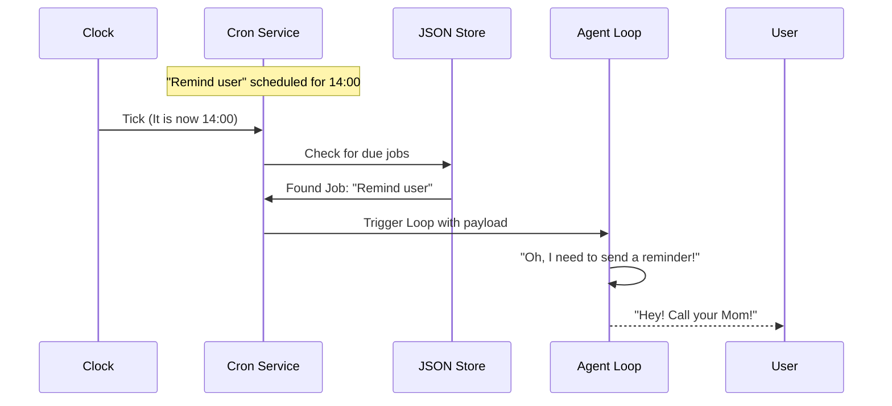

# Chapter 6: Task Scheduling

In the previous chapter, **[Tooling System](05_tooling_system.md)**, we gave our bot "hands" to perform actions like searching the web or running code.

However, our bot is currently like a genie in a lamp. It has phenomenal cosmic power, but it spends 99% of its life sleeping. It only wakes up when you "rub the lamp" (send a message).

If you want the bot to **"Check the news every morning at 8 AM"** or **"Remind me to buy milk in 20 minutes,"** the current system fails. The bot cannot start a conversation on its own.

In this final chapter, we will give the bot a **Sense of Time**.

## 1. From Reactive to Proactive

Currently, your bot is **Reactive**:
> Input (User Message) -> Processing -> Output

We want to make it **Proactive**:
> Time Event -> Processing -> Output

To achieve this, we introduce two internal clocks:
1.  **The Heartbeat:** A rough, periodic "wake up" to check a To-Do list.
2.  **The Cron Service:** A precise scheduler for specific future events.

### The Central Use Case: "The Morning Briefing"
Imagine you want the bot to research stock prices every morning and send you a summary, even if you haven't messaged it yet.

---

## 2. The Heartbeat Service

Think of the **Heartbeat** as a security guard doing rounds. Every 30 minutes (or whatever interval you set), the bot "wakes up" and looks at a specific file on your computer: `HEARTBEAT.md`.

*   **If the file is empty:** The bot goes back to sleep.
*   **If the file has tasks:** The bot reads them, executes them using the **[Agent Loop](02_the_agent_loop.md)**, and then goes back to sleep.

### Why a file?
Using a file (`HEARTBEAT.md`) allows **you** (the human) to edit the bot's background tasks simply by opening a text editor.

### Implementation: The Tick

Let's look at `nanobot/heartbeat/service.py`. The core logic happens in the `_tick` method.

```python
# nanobot/heartbeat/service.py

async def _tick(self) -> None:
    # 1. Read the instructions from the file
    content = self._read_heartbeat_file()
    
    # 2. If the file is empty or just checkboxes, go back to sleep
    if _is_heartbeat_empty(content):
        return
    
    # 3. Otherwise, wake up the Agent!
    # We send a special system prompt to the bot.
    await self.on_heartbeat(HEARTBEAT_PROMPT)
```

**Explanation:**
*   **`_read_heartbeat_file`**: Opens `HEARTBEAT.md`.
*   **`on_heartbeat`**: This triggers the Agent Loop, just as if a user had sent a message. But instead of "Hi," the message is: *"Read HEARTBEAT.md and follow instructions."*

### The Agent's Reaction
When the Agent receives this prompt, it uses its **[Tooling System](05_tooling_system.md)** to read the file, processes the request (e.g., "Summarize unread emails"), and then marks the task as done.

---

## 3. The Cron Service

The Heartbeat is great for general background tasks, but it's not precise. If you need a reminder exactly at **4:00 PM**, checking every 30 minutes isn't good enough.

For this, we use a **Cron Service**.

*   **Heartbeat:** "Check for work every X minutes."
*   **Cron:** "Do exactly [Task A] at [Time B]."

### Use Case: The Reminder
User: *"Remind me to call Mom in 10 minutes."*

1.  The Agent uses the `add_cron_job` tool.
2.  The Cron Service saves this job to a JSON file.
3.  The Cron Service watches the clock.
4.  In 10 minutes, it fires the event.

### Visual Flow



---

## 4. Implementation: The Cron Logic

The Cron Service is a bit more complex because it has to calculate math for dates and times. It lives in `nanobot/cron/service.py`.

### Storing a Job
We don't keep jobs just in memory (RAM). If the bot restarts, we don't want to lose our reminders. We save them to a `json` file.

```python
# nanobot/cron/service.py

def add_job(self, name, schedule, message, ...):
    # 1. Create a Job object
    job = CronJob(
        id=str(uuid.uuid4())[:8],
        name=name,
        schedule=schedule,  # e.g., "in 10 minutes"
        payload=CronPayload(message=message)
    )
    
    # 2. Calculate when it should run
    job.state.next_run_at_ms = _compute_next_run(schedule, _now_ms())
    
    # 3. Save to disk
    self._store.jobs.append(job)
    self._save_store()
```

**Explanation:**
*   **`_compute_next_run`**: A helper that adds "10 minutes" to "Right Now" to get the exact timestamp.
*   **`_save_store`**: Writes the list of jobs to a JSON file.

### Checking the Clock (The Loop)
The Cron Service runs its own mini-loop to watch the time.

```python
# nanobot/cron/service.py

async def _on_timer(self) -> None:
    now = _now_ms()
    
    # 1. Find jobs where "Next Run" is in the past
    due_jobs = [
        j for j in self._store.jobs
        if j.state.next_run_at_ms and now >= j.state.next_run_at_ms
    ]
    
    # 2. Execute them
    for job in due_jobs:
        await self._execute_job(job)
        
    # 3. Reset the timer for the next job
    self._arm_timer()
```

**Explanation:**
*   It compares `now` vs. `scheduled_time`.
*   If `now > scheduled_time`, the job is due!
*   It calls `_execute_job`, which sends the message into the **[Agent Loop](02_the_agent_loop.md)**.

---

## 5. Integrating with the Agent

So, how does the Agent actually use this? We need to expose the Cron Service via a **Tool**.

In Chapter 5, we learned how to make tools. Here is what the `ScheduleTool` looks like (simplified):

```python
# nanobot/agent/tools/schedule.py

class ScheduleTool(Tool):
    name = "schedule_reminder"
    description = "Schedule a reminder for the future."

    async def execute(self, message: str, minutes: int):
        # 1. Calculate milliseconds
        wait_ms = minutes * 60 * 1000
        
        # 2. Call the Cron Service
        cron_service.add_job(
            name=f"reminder_{minutes}m",
            schedule=CronSchedule(kind="every", every_ms=wait_ms),
            message=message
        )
        return "Reminder set."
```

Now, when you say *"Remind me in 5 minutes,"* the LLM selects this tool, and the Cron Service handles the waiting.

---

## 6. How it feels to the User

Let's trace the full experience of a **Proactive Agent**.

1.  **User:** "Monitor the weather in New York. If it rains, tell me."
2.  **Agent:** Writes a note in `HEARTBEAT.md`: `Check NY weather and alert user if raining.`
3.  **... Silence ...** (The bot is sleeping).
4.  **Heartbeat Service:** (30 mins later) Wakes up. Reads the note.
5.  **Agent:** "I am awake. I see a task: Check NY weather."
6.  **Agent:** Calls `weather_tool`. Result: "Sunny."
7.  **Agent:** "It is sunny. No action needed." (Goes to sleep).
8.  **... Silence ...**
9.  **Heartbeat Service:** (Next cycle) Wakes up. Reads note.
10. **Agent:** Calls `weather_tool`. Result: "Raining."
11. **Agent:** "It is raining! I must alert the user."
12. **Agent:** Sends message to User: *"Heads up! It's raining in New York."*

The user didn't do anything in step 12. The bot acted on its own.

---

## Summary & Course Conclusion

In this chapter, we added the element of **Time**.

1.  **Heartbeat:** Allows the bot to check a "To-Do List" file periodically.
2.  **Cron:** Allows the bot to schedule precise tasks for the future.
3.  **Proactivity:** The bot can now initiate conversations, reminders, and alerts without waiting for human input.

### Congratulations!

You have completed the **nanobot** tutorial series. Let's look at what you have built:

1.  **[Channel Gateway](01_channel_gateway.md):** You can talk to Telegram, Discord, and Slack.
2.  **[The Agent Loop](02_the_agent_loop.md):** You have a central brain that processes information in cycles.
3.  **[LLM Provider Abstraction](03_llm_provider_abstraction.md):** You can swap between OpenAI, Claude, and local models.
4.  **[Memory & Persistence](04_memory___persistence.md):** Your bot remembers who you are.
5.  **[Tooling System](05_tooling_system.md):** Your bot can surf the web and run code.
6.  **Task Scheduling:** Your bot acts on its own.

You now possess the blueprint for a modern, sophisticated AI Agent. The only limit left is your imagination. Go build something amazing!

---

Generated by [Code IQ](https://github.com/adityasoni99/Code-IQ)