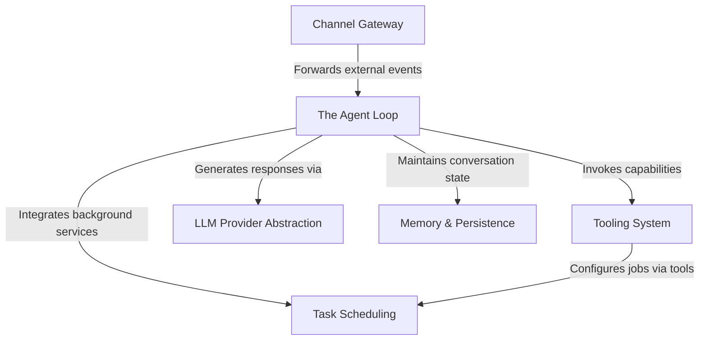

# Tutorial: nanobot

**Nanobot** is a modular AI assistant designed to bridge external chat platforms (like *Telegram* and *WhatsApp*) with powerful Large Language Models. Its core "brain," the **Agent Loop**, orchestrates conversations by maintaining persistent **memory**, executing practical **tools** (such as file editing or web searching), and managing **scheduled tasks** to allow the bot to act proactively as well as reactively.

**Source Repository:** [https://github.com/HKUDS/nanobot](https://github.com/HKUDS/nanobot)

## Chapters

1. [Channel Gateway](01_channel_gateway.md)
2. [The Agent Loop](02_the_agent_loop.md)
3. [LLM Provider Abstraction](03_llm_provider_abstraction.md)
4. [Memory & Persistence](04_memory___persistence.md)
5. [Tooling System](05_tooling_system.md)
6. [Task Scheduling](06_task_scheduling.md)

---

Generated by [Code IQ](https://github.com/adityasoni99/Code-IQ)