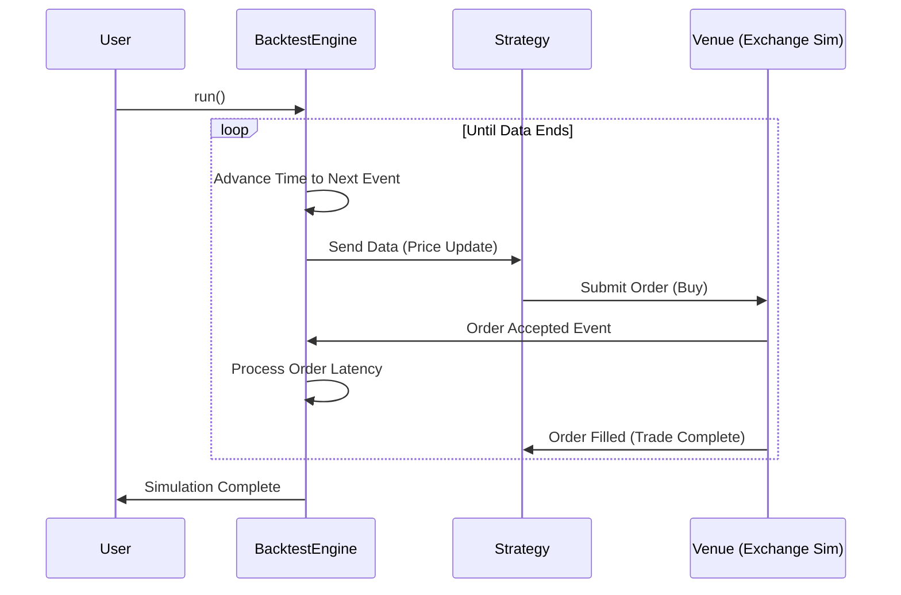

# Chapter 1: BacktestEngine

Welcome to the first chapter of your journey with **Nautilus Trader**!

Before we write complex trading algorithms, we need a safe environment to test them. Imagine you are a pilot. Before flying a real jet worth millions of dollars, you train in a flight simulator.

In the world of algorithmic trading, the **BacktestEngine** is your flight simulator.

## What is the BacktestEngine?

The `BacktestEngine` is the core system that lets you travel back in time. It takes your trading strategy and simulates how it would have performed in the past using historical market data.

It acts as the "Director" of a movie:
1.  **It controls Time:** It moves the clock forward tick-by-tick.
2.  **It controls the Environment:** It feeds market data (prices) to your strategy.
3.  **It controls the Rules:** It simulates the exchange (Venue) where you buy and sell, calculating fees and execution times.

### The Central Use Case

Let's imagine a simple goal: **"I want to simulate buying Bitcoin on Binance starting from January 1st, 2024."**

To do this, we cannot just write a strategy; we need the *Engine* to run it.

## Setting Up Your Engine

Let's look at how to construct this engine step-by-step. We will use the `BacktestEngine` struct found in `crates/backtest/src/engine.rs`.

### 1. Configuration

First, we tell the engine the basic rules of our simulation, like when it starts.

```rust
use nautilus_backtest::BacktestConfig;

// Create a simple configuration
let config = BacktestConfig::builder()
    .event_buffer_size(1024) // How many events to hold in memory
    .build();
```
*Explanation:* We use a "builder" to set up our settings. Here, we are just defining the buffer size, but this is also where you would define other limits.

### 2. Creating the Instance

Now, we spin up the engine itself.

```rust
use nautilus_backtest::BacktestEngine;

// Initialize the engine with our config
let mut engine = BacktestEngine::new(config);
```
*Explanation:* We create a mutable variable `engine`. It is "mutable" (`mut`) because the engine changes state as the simulation runs (time moves forward, orders get filled).

### 3. Adding a Venue

A "Venue" is a place where trading happens, like the Binance or Nasdaq exchange. The engine needs to know which exchanges exist in your simulation.

```rust
use nautilus_model::identifiers::Venue;

// Define the venue (e.g., Binance)
let venue = Venue::from("BINANCE");

// Add it to the engine
engine.add_venue(&venue, Default::default());
```
*Explanation:* We tell the engine, "Hey, there is an exchange called BINANCE." The `Default::default()` part would normally contain specific rules for that exchange (like latency simulation), but we are keeping it simple for now.

### 4. Adding Data

The engine needs fuel! In trading, fuel is **Data** (historical prices).

```rust
// Assume 'data' is a list of historical price ticks
// We load this into the engine
engine.add_data(data);
```
*Explanation:* You load historical bars or ticks into the engine. The engine sorts them by time and prepares to feed them to your strategy one by one.

### 5. Adding a Strategy

Finally, we introduce the brain—your trading strategy.

```rust
// Assume 'my_strategy' is a struct implementing the Strategy trait
let strategy_id = engine.add_strategy(my_strategy);
```
*Explanation:* We register your strategy. The engine returns an ID so you can track it later. The engine now knows to send price updates to `my_strategy`.

### 6. Running the Simulation

Everything is set. We hit the "Play" button.

```rust
// Run the simulation
engine.run();
```
*Explanation:* This method blocks your program and runs the loop. It won't return until the simulation is finished (either it ran out of data or you stopped it).

## Under the Hood: How it Works

What actually happens inside `engine.run()`? It's not magic; it's an **Event Loop**.

The engine maintains a priority queue of events sorted by time. As it processes events, it moves the "internal clock" forward.

Here is a simplified sequence of what happens:



### The Internal Loop

If we peek inside `crates/backtest/src/engine.rs`, the logic resembles this simplified pattern:

```rust
// Simplified logic of what happens inside engine.run()
pub fn run(&mut self) {
    // While there are events in the queue...
    while let Some(event) = self.event_queue.pop() {
        
        // 1. Update the official simulation clock
        self.clock.update(event.time);

        // 2. Process the event (Data, Order, Fill, etc.)
        self.handle_event(event);
    }
}
```

*   **`event_queue.pop()`**: The engine grabs the next thing that is supposed to happen (e.g., "Price update at 09:00:01").
*   **`clock.update`**: It instantly teleports the simulation time to that moment.
*   **`handle_event`**: It routes the event. If it's a price update, it goes to your Strategy. If it's a "Buy" order from your strategy, it goes to the simulated Venue.

## Why is this cool?

The `BacktestEngine` guarantees **causality**. 

Because it processes events strictly in time order, your strategy cannot "cheat" by looking at future prices. It ensures that if you place an order at 10:00 AM, it is processed *after* 10:00 AM, just like in real life.

## Conclusion

In this chapter, we explored the `BacktestEngine`. You learned that it is the conductor of the simulation orchestra. It manages time, data, and the interactions between your strategy and the simulated exchanges.

**Key Takeaways:**
*   The **BacktestEngine** simulates time and exchanges.
*   You must add **Venues**, **Data**, and **Strategies** before running it.
*   The `run()` method starts an event loop that processes history event-by-event.

Now that we have our engine, we are ready to start building the specific components that go inside it!

---

Generated by [Code IQ](https://github.com/adityasoni99/Code-IQ)