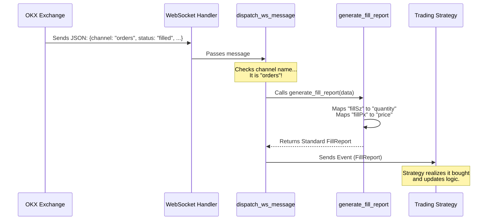

# Chapter 1: crates/adapters/okx/src/execution/mod.rs

Welcome to the first chapter of the Nautilus Trader OKX Adapter tutorial!

In this chapter, we will explore a critical component of any trading system: the **Execution Client**. Specifically, we will look at how the OKX adapter handles the "inbound" information flow—translating raw messages from the crypto exchange into something our trading bot can understand.

## The Motivation: The "Translator"

Imagine you are a trader yelling orders into a telephone. You say, "Buy 1 Bitcoin!" to the OKX exchange.

OKX processes this and shouts back a stream of information:
*   "Order received!"
*   "Price changed!"
*   "Deal done at $50,000!"
*   "Your wallet balance is now lower!"

However, OKX speaks its own specific language (JSON messages with specific field names). Your Nautilus trading strategy speaks a different, standardized language.

**The file `crates/adapters/okx/src/execution/mod.rs` acts as the Translator.**

It listens to the WebSocket stream, figures out what kind of message arrived (is it a trade? a balance update?), and converts it into a standardized "Report" that the rest of the system can use.

## Key Concepts

We will focus on three main jobs this file performs:

1.  **Dispatching:** Acting as a traffic cop for incoming messages.
2.  **Order Reports:** notifying the system when orders fill or change status.
3.  **Account Reports:** notifying the system about position changes or balance updates.

### 1. The Dispatcher (`dispatch_ws_message`)

When a message arrives from the OKX WebSocket, it looks like a blob of text. The `dispatch_ws_message` function looks at the "channel" name in that message to decide where it should go.

Here is a simplified view of how the dispatcher works:

```rust
// Simplified logic inside dispatch_ws_message
fn dispatch_ws_message(&self, msg: &JsonMessage) {
    match msg.channel.as_str() {
        "orders" => self.handle_order_update(msg),
        "positions" => self.handle_position_update(msg),
        "account" => self.handle_balance_update(msg),
        _ => log::warn!("Unknown channel received"),
    }
}
```

**Explanation:**
*   The code looks at `msg.channel`.
*   If the channel is **"orders"**, it knows an order status changed (e.g., a fill).
*   If the channel is **"account"**, it knows money moved.
*   It routes the data to specific helper functions to do the heavy lifting.

### 2. Generating Fill Reports

One of the most important events in trading is a **Fill**—when your order actually trades. OKX sends raw data (e.g., `fillSz` for fill size), but Nautilus expects a strict `FillReport`.

This file contains the logic to map one to the other:

```rust
// Inside OKXExecutionClient
fn generate_fill_report(&self, raw: &OkxOrderData) -> FillReport {
    FillReport::new(
        self.map_order_id(&raw.clOrdId), // Map ID
        raw.fillSz.parse().unwrap(),     // Map Quantity
        raw.fillPx.parse().unwrap(),     // Map Price
        raw.ts.parse().unwrap(),         // Map Time
    )
}
```

**Explanation:**
*   We take `raw` data (the OKX format).
*   We extract specific fields like `fillSz` (Size) and `fillPx` (Price).
*   We return a `FillReport`, which is a standard object used throughout Nautilus Trader.

### 3. Position and Mass Status

Sometimes, the system needs a snapshot of everything going on.
*   **Position Status:** "What do I currently own?"
*   **Mass Status:** "Tell me the status of ALL my active orders right now."

This file implements methods to loop through lists of raw data and convert them all at once.

```rust
// Simplified loop for Mass Status
fn generate_mass_status_report(&self, orders: Vec<OkxOrder>) -> Vec<OrderReport> {
    let mut reports = Vec::new();
    for order in orders {
        // Convert every single order into a standard report
        reports.push(self.generate_order_status_report(&order));
    }
    return reports;
}
```

**Explanation:**
*   If we disconnect and reconnect, we might ask OKX "Give me everything."
*   This function takes that list and converts every single item into a Nautilus report so our internal state matches reality.

---

## Internal Implementation: The Workflow

To help you visualize what happens when a message hits this code, let's look at a sequence diagram.

**Scenario:** You have a buy order sitting on the exchange. Suddenly, someone sells to you. OKX sends a WebSocket message saying "Filled".



### Deep Dive: The Code Structure

The file `crates/adapters/okx/src/execution/mod.rs` essentially implements the `ExecutionClient` trait for the `OKXExecutionClient` struct.

Here is how the actual implementation block usually looks (conceptually):

```rust
impl OKXExecutionClient {
    // 1. The entry point for all WebSocket text
    pub fn on_message(&self, text: &str) {
        let json: JsonMessage = serde_json::from_str(text).unwrap();
        self.dispatch_ws_message(&json);
    }

    // 2. The mapping logic
    fn map_side(&self, side: &str) -> Side {
        match side {
            "buy" => Side::Buy,
            "sell" => Side::Sell,
            _ => Side::Unknown,
        }
    }
}
```

**Explanation:**
*   **`on_message`**: This is the very edge of the system. It takes the raw string, turns it into a generic JSON object, and hands it to the dispatcher we saw earlier.
*   **`map_side`**: This is a small utility helper. OKX might use lowercase "buy", but Nautilus uses a strictly typed `Side::Buy` enum. This file handles all these tiny translations so the rest of the codebase doesn't have to worry about string parsing.

## Conclusion

In this chapter, we learned about **`crates/adapters/okx/src/execution/mod.rs`**.

We discovered that its primary purpose is to be a **Translator**:
1.  It listens to chaotic **WebSocket** streams via `dispatch_ws_message`.
2.  It converts specific OKX data into **standardized Reports** (Fill, Position, Status).
3.  It ensures your strategy knows exactly what is happening with your money and your orders.

This foundation ensures that no matter how complex the OKX API is, your trading strategy always receives clean, standardized data.

There is currently no next chapter, but you have successfully taken the first step into understanding Nautilus Trader adapters!

---

Generated by [Code IQ](https://github.com/adityasoni99/Code-IQ)