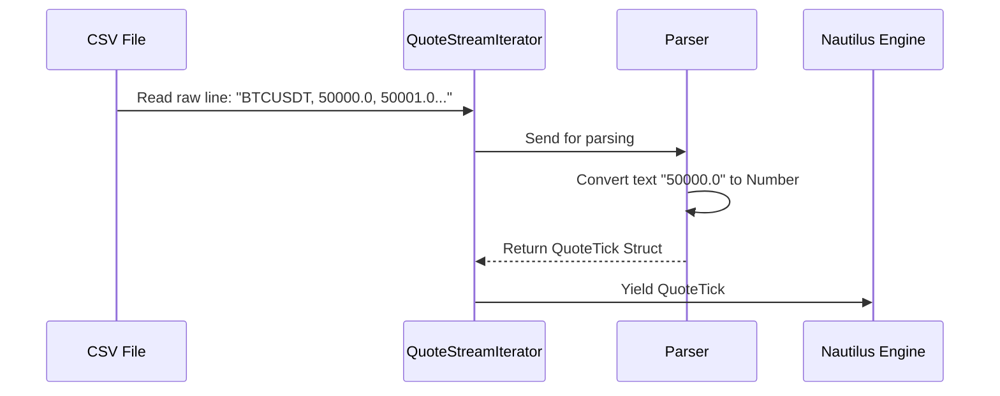

# Chapter 1: QuoteTick

Welcome to the first chapter of the **Nautilus Trader** tutorial! 

Before we can build complex trading robots, we need to understand the fuel that powers them: **Data**. In the world of algorithmic trading, the most fundamental unit of "Top of Book" market data is the **QuoteTick**.

## Motivation: The Price Tag
Imagine you are at a very busy auction house. 
1.  **Buyers** are shouting how much they are willing to pay (**Bid**).
2.  **Sellers** are shouting how much they want to sell for (**Ask**).

The auctioneer updates the current "Best Price" constantly. If you want to write a program to buy an item automatically, your program needs to know these numbers the instant they change.

In Nautilus Trader, a `QuoteTick` is a snapshot of this auction at a specific millisecond. It tells you the best price to buy and the best price to sell right now.

## What is a QuoteTick?

A `QuoteTick` represents the **Best Bid** and **Best Ask** (BBO - Best Bid and Offer) for a specific financial instrument (like Bitcoin or Apple stock) at a specific time.

It consists of four main numbers:

| Component | Description | Analogy |
| :--- | :--- | :--- |
| **Bid Price** | The highest price a buyer is offering. | "I'll buy it for $100!" |
| **Ask Price** | The lowest price a seller is accepting. | "I'll sell it for $101!" |
| **Bid Size** | How many units the buyer wants. | "I want 5 of them." |
| **Ask Size** | How many units the seller has. | "I have 2 available." |

### Use Case: The "Buy Low" Bot
Let's say you want to build a simple bot: **"If Bitcoin represents a good deal (Ask price drops below $50,000), buy it."**

To do this, your bot needs to listen to a stream of `QuoteTick` objects.

## Using QuoteTicks

In the Nautilus system, `QuoteTicks` usually arrive one by one (or in small batches) as time moves forward. Here is a conceptual look at what a `QuoteTick` looks like in code.

### The Structure
While the actual code is highly optimized Rust, conceptually, a `QuoteTick` looks like this data container:

```rust
struct QuoteTick {
    instrument_id: InstrumentId, // e.g., "BTCUSDT"
    bid_price: Price,            // e.g., 49,999.00
    ask_price: Price,            // e.g., 50,000.00
    bid_size: Quantity,          // e.g., 1.5 BTC
    ask_size: Quantity,          // e.g., 2.0 BTC
    ts_event: u64,               // Timestamp when it happened
}
```

### Handling a Tick
When your strategy receives a tick, you can access these fields to make decisions.

```rust
// Simplified logic inside a strategy
fn on_quote_tick(&mut self, tick: QuoteTick) {
    // Check if the selling price is cheap enough for us
    if tick.ask_price < 50000.0 {
        println!("Cheap price detected! Buy now!");
    }
}
```
*Explanation: This function runs every time the market price updates. We check the `ask_price` (the price we would pay if we bought immediately).*

## Internal Implementation: How Nautilus Reads Quotes

Nautilus Trader is designed to handle massive amounts of historic data quickly. It often reads this data from CSV files (comma-separated values) provided by services like **Tardis**.

Let's look at how the system takes a raw text line from a file and turns it into a `QuoteTick`.

### The Flow



### Code Deep Dive: The Iterator

In the file `crates/adapters/tardis/src/csv/stream.rs`, Nautilus defines a helper called `QuoteStreamIterator`. Its job is to read a file line-by-line and produce `QuoteTick` objects.

Here is a simplified view of how it initializes:

```rust
// crates/adapters/tardis/src/csv/stream.rs

struct QuoteStreamIterator {
    reader: Reader<Box<dyn Read>>, // The CSV file reader
    buffer: Vec<QuoteTick>,        // A holding area for ticks
    chunk_size: usize,             // How many to read at once
    // ... logic for precision ...
}
```
*Explanation: The iterator keeps a `reader` to look at the file and a `buffer` to store parsed ticks before handing them over to the engine.*

### Parsing the Record
When the system asks for the `next()` batch of data, the iterator reads the CSV record and converts it.

```rust
// Inside the iterator's next() function
match self.reader.read_record(&mut self.record) {
    Ok(true) => {
        // We have a text line, now convert it
        let quote = parse_quote_record(
            &data,
            self.price_precision, // e.g., 2 decimal places
            self.size_precision,  // e.g., 8 decimal places
            self.instrument_id,
        );
        
        self.buffer.push(quote);
    }
    // ... handle errors or end of file ...
}
```
*Explanation: `read_record` gets the raw text. `parse_quote_record` does the heavy lifting of converting strings like "50000.00" into highly efficient numeric types that Nautilus understands.*

## Why is this important?

Without `QuoteTick`, your strategy is blind. It doesn't know the price of assets, so it cannot trade. 

However, a single `QuoteTick` isn't enough to test a strategy. We need thousands, or millions, of them played back in perfect order to simulate a trading day.

## Conclusion

You now understand the atom of market data: the **QuoteTick**. It tells you the best price to buy or sell at a specific moment. 

But how do we feed a continuous stream of these ticks into our engine to simulate months of trading in just a few seconds?

In the next chapter, we will learn about the **BacktestDataIterator**, the machinery responsible for feeding these ticks into your strategy.

[Next Chapter: BacktestDataIterator](02_backtestdataiterator.md)

---

Generated by [Code IQ](https://github.com/adityasoni99/Code-IQ)