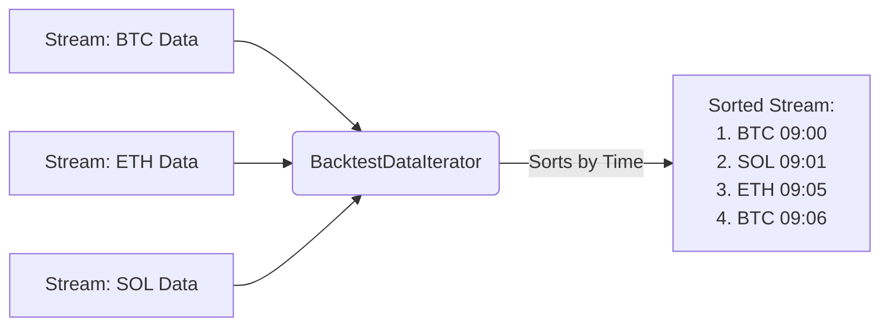
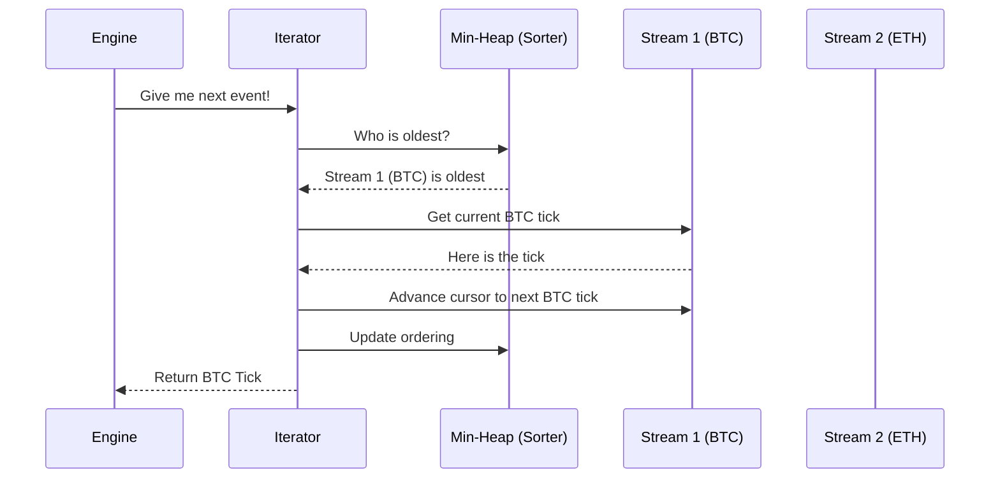

# Chapter 2: BacktestDataIterator

Welcome back! In the previous chapter, [QuoteTick](01_quotetick.md), we learned that a `QuoteTick` is a snapshot of the market price at a specific moment.

Now we face a new challenge. Real trading strategies often look at **multiple** things at once. Imagine you want to buy Bitcoin, but only if Ethereum is going up. You have two separate history files: `btc_history.csv` and `eth_history.csv`.

You cannot read all of the Bitcoin file and *then* all of the Ethereum file. You need to mix them together so events play back exactly as they happened in time.

Enter the **BacktestDataIterator**.

## Motivation: The Time Machine

Think of the `BacktestDataIterator` as a **DJ mixing deck**. 

1.  You have multiple "audio tracks" (Data streams: BTC, ETH, AAPL, etc.).
2.  Each track has events with specific timestamps.
3.  The Iterator plays them all back through a single speaker (the Engine) in perfect chronological order.

If a Bitcoin price update happens at `10:00:01` and an Ethereum update happens at `10:00:02`, the Iterator ensures your robot sees the Bitcoin update first, no matter which file you loaded first.

## Concept: The "Zipper" Merge

The `BacktestDataIterator` acts like a zipper. It looks at the next available item in *every* open file, picks the one with the oldest timestamp, and processes it.



## How to Use It

Let's look at how we control this time machine in code.

### Step 1: Create the Iterator
First, we simply create a new, empty iterator.

```rust
// Create the mixing deck
let mut iterator = BacktestDataIterator::new();
```

### Step 2: Add Data Streams
We load our data (lists of `QuoteTick` from the previous chapter) into the iterator. We give each stream a name so we can identify it later.

```rust
// Assume 'btc_ticks' and 'eth_ticks' are Vectors of QuoteTick
// We loaded these from CSV files previously

// Add Bitcoin data
iterator.add_data("binance-btc", btc_ticks, true);

// Add Ethereum data
iterator.add_data("binance-eth", eth_ticks, true);
```
*Explanation: `add_data` registers a list of ticks. The `true` flag is an advanced setting for handling ties (events happening at the exact same nanosecond), which we will stick to default for now.*

### Step 3: Play the Music
Now, the backtest engine will ask the iterator for the `next()` item continuously until the data runs out.

```rust
// The Engine does this in a loop:
while let Some(tick) = iterator.next() {
    
    // Logic: Send tick to strategy
    println!("Processing: {:?} at {}", tick, tick.ts_event);
    
}
```
*Explanation: calling `next()` automatically finds the oldest event across both Bitcoin and Ethereum streams and returns it. When all streams are empty, it returns `None`, and the loop ends.*

## Internal Implementation: How It Works

How does the iterator know which item is the oldest without scanning millions of records every time? It uses a clever computer science structure called a **Min-Heap** (or Priority Queue).

### The Logic Flow

Imagine a ticket line at a cinema where people from different buses are arriving. The `BacktestDataIterator` is the ticket collector.

1.  It looks at the **first person** in line from every bus (Stream).
2.  It compares their arrival times.
3.  It lets the person with the **earliest** time enter.
4.  It then looks at the *next* person from that specific bus and repeats the process.



### Code Deep Dive

Let's look at the actual Rust code in `crates/backtest/src/data_iterator.rs` to see how this is built.

#### The Struct
The iterator holds a collection of streams and a `heap` to sort them.

```rust
pub struct BacktestDataIterator {
    // Map of priority ID to the actual data list
    streams: AHashMap<i32, Vec<Data>>, 
    
    // Current position (index) in each stream
    indices: AHashMap<i32, usize>,     
    
    // The "Sorter" that always keeps the oldest item on top
    heap: BinaryHeap<HeapEntry>,
}
```
*Explanation: `streams` holds the actual data. `indices` remembers that we are, for example, at item #50 in the BTC list and item #20 in the ETH list. The `heap` is the brain that decides which one goes next.*

#### The `next()` Method
This is the heart of the iterator. It pulls the winner from the heap and prepares the next round.

```rust
pub fn next(&mut self) -> Option<Data> {
    // 1. Ask the heap for the stream with the oldest event
    let entry = self.heap.pop()?;
    
    // 2. Retrieve the data from that stream
    let stream_vec = self.streams.get(&entry.priority)?;
    let element = stream_vec[entry.index].clone();

    // 3. Prepare the next item from this specific stream
    let next_index = entry.index + 1;
    self.indices.insert(entry.priority, next_index);
    
    // ... logic to push next item back into heap ...

    Some(element)
}
```
*Explanation: This code is highly efficient. Even if you have 100 different data streams, the `heap` allows the iterator to pick the next event instantly without searching through everything.*

## Why is this important?

In algorithmic trading, **Causality** is king. 

If your backtest shows you buying Bitcoin because Ethereum moved up, but your data iterator fed you the Bitcoin price *before* the Ethereum price occurred, your backtest is a lie. This is called "Look-ahead bias."

The `BacktestDataIterator` guarantees that your robot experiences history exactly as it unfolded, millisecond by millisecond, across the entire market.

## Conclusion

You now understand the two pillars of data in Nautilus Trader:
1.  **[QuoteTick](01_quotetick.md)**: The atomic unit of market data.
2.  **BacktestDataIterator**: The timeline manager that ensures all ticks flow correctly.

With these tools, we can reconstruct the past accurately. This is the foundation upon which we can simulate trading strategies to see if they would have been profitable.

---

Generated by [Code IQ](https://github.com/adityasoni99/Code-IQ)