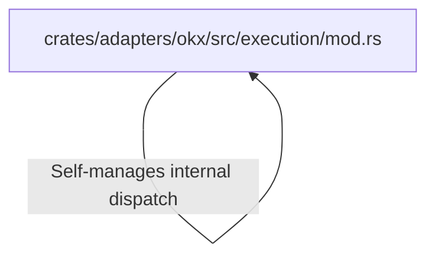

# Tutorial: nautilus_trader

**Nautilus Trader** is a high-performance, event-driven platform designed for **algorithmic trading** and *backtesting*. It features a modular architecture written in Rust, utilizing various adapters to connect with major cryptocurrency exchanges, enabling users to simulate strategies on historical data or deploy them in live trading environments with low latency.

**Source Repository:** [https://github.com/nautechsystems/nautilus_trader](https://github.com/nautechsystems/nautilus_trader)

## Chapters

1. [crates/adapters/okx/src/execution/mod.rs](01_crates_adapters_okx_src_execution_mod_rs.md)

---

Generated by [Code IQ](https://github.com/adityasoni99/Code-IQ)