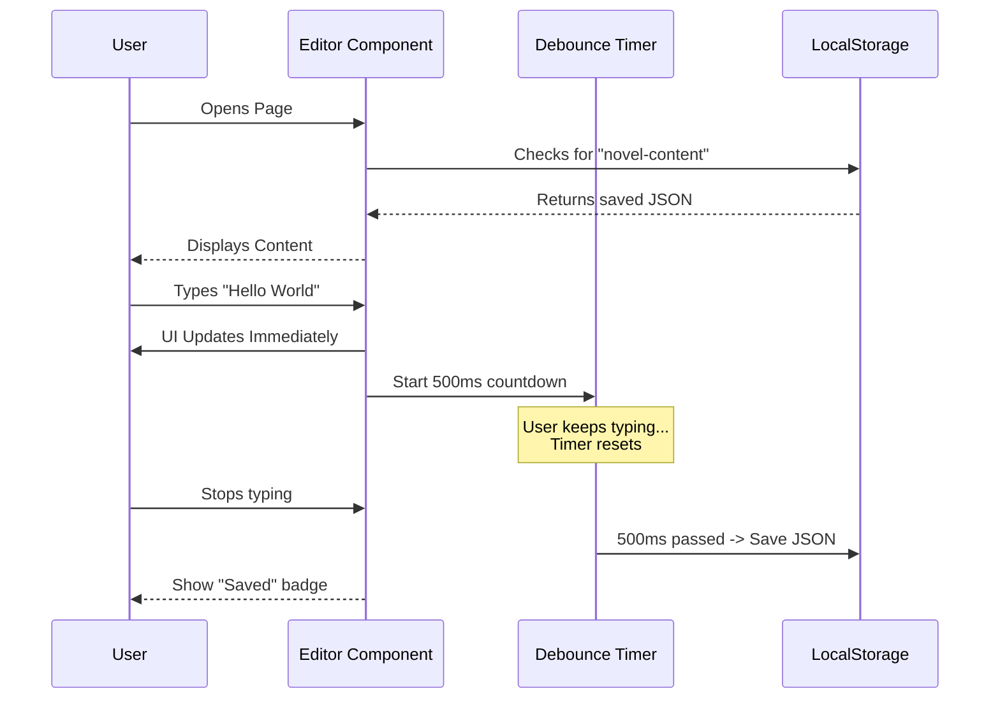

# Chapter 1: Consumer Application Implementation

Welcome to the **Novel** project tutorial! 

If you are building a modern web application, you likely want a rich text editor that feels just like Notion. You want slash commands, markdown support, and a clean interface. 

The `novel` package provides the *engine* to do this. However, an engine needs a car chassis to actually drive. This chapter explains how to build that chassis—the **Consumer Application**.

## The Motivation

Why do we need a "Consumer Application"?

The `novel` library is **headless**. This means it handles the logic (like "make this text bold" or "insert an image") but doesn't force a specific look or database on you.

To use it, you need to create a component in your own Next.js project that:
1.  **Imports** the editor core.
2.  **Styles** it (using Tailwind CSS).
3.  **Saves** the data (to LocalStorage or a Database).

This chapter walks you through `apps/web/app/page.tsx` and `apps/web/components/tailwind/advanced-editor.tsx` to show you how to set this up.

## Key Concepts

Before looking at the code, let's understand the three pillars of our implementation:

1.  **The Container (Page):** The standard Next.js page that holds the editor.
2.  **The Wrapper (Advanced Editor):** A custom component where we configure `novel` with specific extensions and styles.
3.  **Persistence:** The strategy for saving what the user types so it isn't lost on refresh.

---

## Step-by-Step Implementation

Let's build a blog post editor that saves your work automatically.

### 1. The Page Layout

First, we need a place to put the editor. In `apps/web/app/page.tsx`, we create a simple layout. We import our custom editor wrapper (which we will build in a moment).

```tsx
// apps/web/app/page.tsx
import TailwindAdvancedEditor from "@/components/tailwind/advanced-editor";
import { Button } from "@/components/tailwind/ui/button";

export default function Page() {
  return (
    <div className="flex min-h-screen flex-col items-center gap-4 py-4">
       {/* Menu buttons and UI elements go here */}
      <TailwindAdvancedEditor />
    </div>
  );
}
```

This acts as the canvas. The real magic happens inside `<TailwindAdvancedEditor />`.

### 2. The Editor Wrapper

We create a new component called `TailwindAdvancedEditor`. This is where we bring the headless pieces together. We use `EditorRoot` (the context provider) and `EditorContent` (the visual text area).

This setup is covered in detail in [Headless Editor Wrapper](02_headless_editor_wrapper.md), but here is the basic structure:

```tsx
// apps/web/components/tailwind/advanced-editor.tsx
import { EditorRoot, EditorContent } from "novel";

const TailwindAdvancedEditor = () => {
  return (
    <EditorRoot>
      <EditorContent
        className="min-h-[500px] w-full max-w-screen-lg border rounded-lg shadow-lg"
      />
    </EditorRoot>
  );
};
```

### 3. Adding Extensions

An empty editor isn't very useful. We need to add capabilities like "Slash Commands" or "Image Uploads." In `novel`, these are called **Extensions**.

We pass an array of extensions to `EditorContent`.

```tsx
// ... imports
import { defaultExtensions } from "./extensions";
import { slashCommand } from "./slash-command";

// Combine default tools with our custom Slash Command
const extensions = [...defaultExtensions, slashCommand];

// Inside your component:
<EditorContent
  extensions={extensions}
  // ... other props
/>
```

*Note: We will learn how to build these in [Custom Tiptap Extensions](03_custom_tiptap_extensions.md) and [Slash Command System](04_slash_command_system.md).*

### 4. Styling with Tailwind

Since the editor is headless, it looks like plain HTML by default. We use the `editorProps` attribute to inject Tailwind classes directly into the editor's DOM elements.

```tsx
<EditorContent
  editorProps={{
    attributes: {
      class: "prose prose-lg dark:prose-invert focus:outline-none",
    },
  }}
  // ...
/>
```
Here, `prose` (from `@tailwindcss/typography`) instantly gives us beautiful typography for headings, paragraphs, and lists.

### 5. Saving Data (Persistence)

We want to save content to `localStorage`. However, we shouldn't save on *every* keystroke (that's too expensive). We use a technique called **Debouncing**—waiting for the user to stop typing for 500ms before saving.

```tsx
import { useDebouncedCallback } from "use-debounce";

// Inside the component
const debouncedUpdates = useDebouncedCallback(async (editor) => {
  const json = editor.getJSON();
  window.localStorage.setItem("novel-content", JSON.stringify(json));
  setSaveStatus("Saved");
}, 500);
```

We hook this up to the `onUpdate` event provided by the editor:

```tsx
<EditorContent
  onUpdate={({ editor }) => {
    setSaveStatus("Unsaved"); // Immediate feedback
    debouncedUpdates(editor); // Delayed save
  }}
  // ...
/>
```

---

## Under the Hood: How It Works

What happens when a user opens the page and starts typing? Let's visualize the flow.

### Sequence Diagram



### Internal Implementation Details

Let's look deeper into `advanced-editor.tsx` to see how the state is initialized.

The editor needs to know what content to show when it first loads. We use a React `useEffect` to check `localStorage` before the editor renders.

```tsx
const [initialContent, setInitialContent] = useState(null);

useEffect(() => {
  const content = window.localStorage.getItem("novel-content");
  if (content) {
    setInitialContent(JSON.parse(content));
  } else {
    setInitialContent(defaultEditorContent);
  }
}, []);
```

Until `initialContent` is set, we return `null` to prevent the editor from flashing empty.

```tsx
if (!initialContent) return null;

return (
   // ... Render EditorRoot and EditorContent
)
```

This pattern ensures that users always pick up exactly where they left off.

---

## Conclusion

You have now set up the **Consumer Application**. You have a working editor that:
1.  Lives inside a Next.js page.
2.  Uses Tailwind for styling.
3.  Automatically saves content to the user's browser.

However, we used a lot of "magic" components like `EditorRoot` and `EditorContent`. How are those actually built? What makes them "Headless"?

In the next chapter, we will peel back the wrapper and look at the core architecture.

[Next Chapter: Headless Editor Wrapper](02_headless_editor_wrapper.md)

---

Generated by [Code IQ](https://github.com/adityasoni99/Code-IQ)