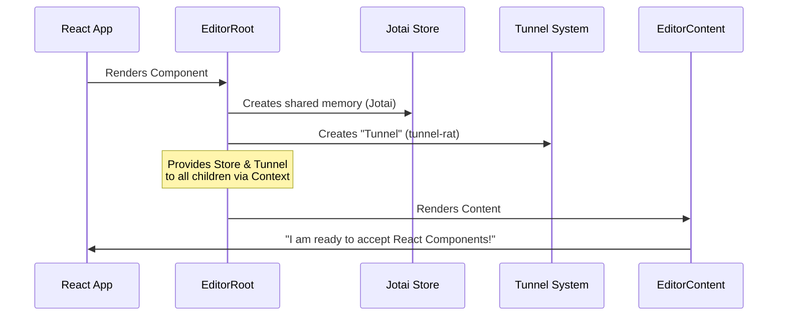

# Chapter 2: Headless Editor Wrapper

In the previous chapter, [Consumer Application Implementation](01_consumer_application_implementation.md), we built a Next.js page that renders our editor. We used two key components: `<EditorRoot>` and `<EditorContent>`.

But what exactly are these components? Why do we need them?

Welcome to the **Headless Editor Wrapper**. If the `novel` library is a car, this chapter explains the **Chassis**. It is the metal frame that holds the engine (Tiptap), the electronics (State Management), and the interior features (React Components) together.

## The Motivation

### The Problem: React vs. The DOM
The underlying engine we use is **Tiptap**. Tiptap is powerful, but it works directly with the raw HTML (DOM).

However, we are building a **React** application. We want to use React components for our "Slash Menu" or "Floating Bubble Menu."
1.  **State Problem:** How do different parts of the editor share data without messy code?
2.  **Rendering Problem:** How do we put a complex React component (like a command list) inside a raw HTML text editor?

### The Solution: The Wrapper
The Headless Editor Wrapper solves this by creating a **Context** and a **Tunnel**.

Imagine a house with two floors:
*   **Floor 1 (React Land):** Where your application logic lives.
*   **Floor 2 (Editor Land):** Where the text editor lives.

The Wrapper installs a "dumbwaiter" (a small elevator) so you can send items (React Components) from Floor 1 directly into a specific room on Floor 2.

## Key Concepts

To understand the wrapper, we need to understand three small concepts:

1.  **The Root (`EditorRoot`):** The parent container. It sets up the shared memory (State) and the elevator system (Tunnel).
2.  **The Content (`EditorContent`):** The actual text box user types in. It connects the Tiptap engine to the Root.
3.  **The Tunnel (`tunnel-rat`):** A library we use to teleport React components into the editor.

## Using the Wrapper

Let's look at how we use this in code to solve the "State and Rendering" problem.

### 1. Setting up the Root

First, we wrap everything in `EditorRoot`. This doesn't render any visible UI. It just sets up the invisible wiring.

```tsx
import { EditorRoot } from "novel";

const MyEditor = () => {
  // EditorRoot creates the "context" for state and tunnels
  return (
    <EditorRoot>
      {/* The editor goes here */}
    </EditorRoot>
  );
};
```
*Result: Nothing is visible yet, but the application is now ready to share data.*

### 2. Adding the Content

Next, we place the `EditorContent` inside the root. This initializes Tiptap.

```tsx
import { EditorContent } from "novel";

// Inside EditorRoot...
<EditorContent
  className="border p-4"
  initialContent={{ type: "doc", content: [] }} 
/>
```
*Result: Now you see a text box. You can type in it. It has access to the wiring set up by the Root.*

## Under the Hood: How It Works

How does `EditorRoot` actually set up this "Tunnel"? Let's visualize the initialization process.

### Sequence Diagram



### Internal Implementation Details

Let's look at the actual source code in `packages/headless/src/components/editor.tsx` to see this magic.

#### 1. The EditorRoot
This component is surprisingly simple. It uses two specific tools:
1.  **Jotai:** For global state management (stores data).
2.  **Tunnel-Rat:** For creating the "elevator" for components.

```tsx
// packages/headless/src/components/editor.tsx
export const EditorRoot: FC<EditorRootProps> = ({ children }) => {
  // 1. Create the tunnel instance
  const tunnelInstance = useRef(tunnel()).current;

  return (
    // 2. Provide the Store (Jotai)
    <Provider store={novelStore}>
      {/* 3. Provide the Tunnel (Context) */}
      <EditorCommandTunnelContext.Provider value={tunnelInstance}>
        {children}
      </EditorCommandTunnelContext.Provider>
    </Provider>
  );
};
```
We create the tunnel *once* (`useRef`) and pass it down so any child component (like the Slash Command menu we will build in [Slash Command System](04_slash_command_system.md)) can access it.

#### 2. The EditorContent
This component wraps Tiptap's native `EditorProvider`. It acts as the bridge.

```tsx
// packages/headless/src/components/editor.tsx
export const EditorContent = forwardRef<HTMLDivElement, EditorContentProps>(
  ({ children, initialContent, ...rest }, ref) => (
    <div ref={ref}>
      {/* Initialize Tiptap Engine */}
      <EditorProvider {...rest} content={initialContent}>
        {children}
      </EditorProvider>
    </div>
  ),
);
```
By placing `EditorProvider` *inside* `EditorRoot`, the Tiptap engine can now access the Jotai store and the Tunnel we created earlier.

#### 3. The Shared Store
We mentioned `novelStore`. In `packages/headless/src/utils/store.ts`, this is simply an empty container created by Jotai.

```tsx
import { createStore } from "jotai";

// A global bucket to hold state like "is the menu open?"
export const novelStore: any = createStore();
```

## Why is this "Headless"?

You might notice there are no buttons, toolbars, or styles defined here.
*   **The Root** only provides logic (Context).
*   **The Content** only provides the editable area.

This allows **you** (the developer) to build your own UI around it, while `novel` handles the hard part of connecting React state to the text editor engine.

## Conclusion

You now understand the chassis of our car.
1.  **`EditorRoot`** sets up the electrical wiring (Jotai) and the portals (Tunnel).
2.  **`EditorContent`** installs the engine (Tiptap).

But a chassis without wheels or customized parts is boring. To make the editor do cool things—like Markdown shortcuts or AI text generation—we need to plug things into the engine.

In the next chapter, we will learn how to add features to this engine.

[Next Chapter: Custom Tiptap Extensions](03_custom_tiptap_extensions.md)

---

Generated by [Code IQ](https://github.com/adityasoni99/Code-IQ)