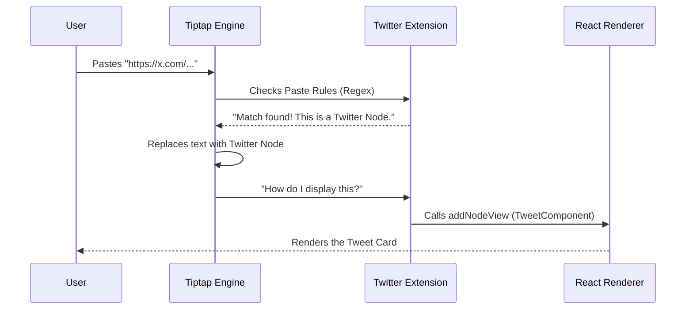

# Chapter 3: Custom Tiptap Extensions

In the previous chapter, [Headless Editor Wrapper](02_headless_editor_wrapper.md), we built the chassis of our car. We have a working editor engine connected to our React application.

However, right now, our car is pretty boring. It can only handle basic text.

What if we want to do something cool, like **embed a Tweet** directly inside the document? Or have a checklist that actually checks off?

Welcome to **Custom Tiptap Extensions**. This is where we define the unique features of `novel`.

## The Motivation

### The Problem: Text is Boring
By default, an editor sees everything as a paragraph of text. If you paste a URL like `https://x.com/user/status/123`, the editor just displays that ugly link.

### The Solution: Smart Blocks
We want the editor to recognize that URL and say: *"Wait, that's not text! That's a Tweet!"*

We want it to transform into a beautiful, interactive card like this:


To do this, we need to teach the editor a new trick. In Tiptap (the engine powering `novel`), these tricks are called **Extensions**.

## Key Concepts

To build a custom extension, you need to understand three concepts. Think of it like defining a new species of animal:

1.  **The Schema (DNA):** What data does this block hold? (e.g., The Tweet URL).
2.  **The View (Appearance):** How does it look? We will use a **React Component** for this.
3.  **The Behavior (Instincts):** How is it created? (e.g., When the user pastes a specific link).

---

## Step-by-Step Implementation

Let's build a **Twitter Extension** that converts links into Tweet cards.

### 1. The React Component (The View)

First, we need the visual part. This is just a standard React component.

However, since this lives *inside* a text editor, we wrap it in a special tag called `<NodeViewWrapper>`. This tells the editor: "Don't treat the stuff inside here as editable text."

```tsx
import { NodeViewWrapper } from "@tiptap/react";
import { Tweet } from "react-tweet";

const TweetComponent = ({ node }) => {
  // We get the URL from the node's data (attributes)
  const url = node.attrs.src;
  const tweetId = url.split("/").pop(); // Extract ID

  return (
    <NodeViewWrapper className="my-4">
      {/* Render the actual Tweet card */}
      <div data-twitter="">
        <Tweet id={tweetId} />
      </div>
    </NodeViewWrapper>
  );
};
```

### 2. Creating the Extension (The DNA)

Now we define the extension logic using `Node.create`. We give it a name (`twitter`) and tell it about the data it needs to store.

```tsx
import { Node } from "@tiptap/core";
import { ReactNodeViewRenderer } from "@tiptap/react";

export const Twitter = Node.create({
  name: "twitter",
  group: "block", // It takes up the whole line
  draggable: true, // You can drag it around

  // What data does this node store?
  addAttributes() {
    return {
      src: { default: null }, // It stores the Source URL
    };
  },
  
  // ... more config coming
});
```

### 3. Connecting the React View

We need to link the Logic (Step 2) with the Visuals (Step 1). We do this in the `addNodeView` function.

```tsx
// Inside Node.create({ ... })

addNodeView() {
  // Tell Tiptap to render 'TweetComponent' for this node
  return ReactNodeViewRenderer(TweetComponent);
},
```

### 4. Input Rules (The Behavior)

How does the user actually *make* a tweet appear? We want it to happen automatically when they paste a link. We use `addPasteRules`.

```tsx
import { nodePasteRule } from "@tiptap/core";

// Regex to find Twitter URLs
const TWITTER_REGEX = /^https?:\/\/(www\.)?x\.com\/([a-zA-Z0-9_]{1,15})(\/status\/(\d+))?(\/\S*)?$/;

// Inside Node.create({ ... })
addPasteRules() {
  return [
    nodePasteRule({
      find: TWITTER_REGEX,
      type: this.type,
      // Extract the URL and save it to 'src' attribute
      getAttributes: (match) => {
        return { src: match.input };
      },
    }),
  ];
},
```

Now, whenever a user pastes a Twitter URL, the editor intercepts it, hides the text, and renders our `TweetComponent` instead!

---

## Under the Hood: How It Works

What exactly happens when you paste that link? It feels like magic, but it's a structured pipeline.

### Sequence Diagram



### Internal Implementation Details

Let's look at a specific part of the code in `packages/headless/src/extensions/twitter.tsx` to understand **Parsing**.

When you save your document, you save a JSON object. But sometimes you might copy-paste HTML from another site. How does the editor know that `<div data-twitter>` is a Tweet?

We define `parseHTML`:

```tsx
// packages/headless/src/extensions/twitter.tsx

parseHTML() {
  return [
    {
      tag: "div[data-twitter]", // Look for divs with this attribute
    },
  ];
},
```

And conversely, when we export to HTML (for emails or SEO), we define `renderHTML`:

```tsx
renderHTML({ HTMLAttributes }) {
  // Output a simple div with the data attribute
  return ["div", mergeAttributes({ "data-twitter": "" }, HTMLAttributes)];
},
```

This creates a cycle:
1.  **JSON State:** The editor's internal memory.
2.  **Render:** React component shows the interactive card.
3.  **Export:** HTML output shows a simple `<div>`.
4.  **Import:** Parser sees the `<div>` and converts it back to a Node.

### Another Example: AI Highlight

`novel` also includes an extension called `AIHighlight` (`packages/headless/src/extensions/ai-highlight.ts`).

Unlike the Twitter node (which is a **Block** that takes up a whole line), this is a **Mark** (like Bold or Italic) that wraps text.

```tsx
// ai-highlight.ts
export const AIHighlight = Mark.create({
  name: "ai-highlight",
  
  renderHTML({ HTMLAttributes }) {
    // Renders a <mark> tag with a specific color
    return ["mark", mergeAttributes(this.options.HTMLAttributes, HTMLAttributes), 0];
  },
});
```

This demonstrates the flexibility of extensions: they can be complex React apps (Twitter) or simple HTML tag wrappers (Highlight).

---

## Conclusion

You have learned how to extend the capabilities of the editor.
1.  **Extensions** are modules that group logic for specific features.
2.  **Node Views** allow us to render React components inside the text editor.
3.  **Paste Rules** allow us to magically transform text into rich content.

Now that we have these cool custom blocks, we need an easy way for users to insert them without memorizing URLs. We need a menu that pops up when you type `/`.

In the next chapter, we will build the Slash Command menu.

[Next Chapter: Slash Command System](04_slash_command_system.md)

---

Generated by [Code IQ](https://github.com/adityasoni99/Code-IQ)