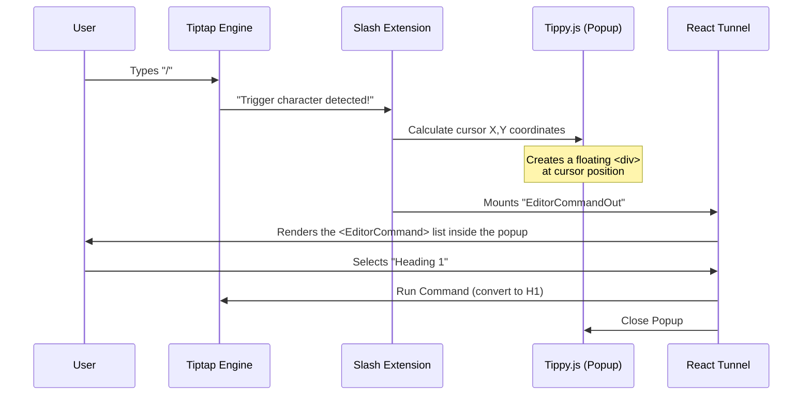

# Chapter 4: Slash Command System

In the previous chapter, [Custom Tiptap Extensions](03_custom_tiptap_extensions.md), we created powerful custom blocks like Tweet embeds and Highlighting.

But right now, the only way to use them is by pasting a URL or manually running code. That's not very user-friendly!

We need a "Magic Wand." In modern editors like Notion or Slack, you type `/` and a menu pops up, letting you choose what to insert.

Welcome to the **Slash Command System**.

## The Motivation

### The Problem: Where do we put the menu?
Building a dropdown menu sounds easy, but doing it inside a text editor is surprisingly hard.
1.  **Z-Index Hell:** If the editor is inside a scrollable box with `overflow: hidden`, the popup menu might get cut off.
2.  **Positioning:** The menu needs to follow the blinking cursor exactly, wherever it is on the screen.
3.  **Communication:** The editor engine (Tiptap) is running the show, but we want our menu to be a standard React component.

### The Solution: The Portal Strategy
We solve this using a technique called **Tunneling**.

Imagine you are in a submarine (the Editor). You want to fly a kite (the Menu). You can't fly it *inside* the submarine. You need to send a signal to the surface, and have a drone fly the kite up there, following the submarine's movement.

In `novel`:
1.  **Tiptap** detects the `/` key.
2.  It calculates where the cursor is.
3.  It uses a "Tunnel" to render the React Menu **outside** the editor canvas, floating on top of everything.

## Key Concepts

To use the Slash Command, you need to understand three parts:

1.  **The Trigger:** A Tiptap extension that listens for `/`.
2.  **The Items:** A Javascript list defining what commands exist (e.g., "Heading 1", "Image").
3.  **The UI:** A React component that displays the list.

---

## Step-by-Step Implementation

Let's look at how to set up the Slash Command menu in your application.

### 1. Defining the Menu Items

First, we need to decide what appears in the menu. We define an array of items. Each item has a title, an icon, and a `command` function that runs when clicked.

This code typically lives in your application (e.g., `apps/web/components/tailwind/slash-command.tsx`).

```tsx
import { createSuggestionItems } from "novel";
import { Heading1, Text } from "lucide-react"; // Icons

export const myItems = createSuggestionItems([
  {
    title: "Text",
    description: "Start typing with plain text.",
    icon: <Text size={18} />,
    command: ({ editor, range }) => {
      // Turn the current line into a paragraph
      editor.chain().focus().deleteRange(range).setNode("paragraph").run();
    },
  },
  // ... more items below
]);
```

### 2. Adding a Heading Item

Let's add a "Heading 1" command. When selected, it converts the current line into a big header.

```tsx
{
  title: "Heading 1",
  description: "Big section heading.",
  searchTerms: ["title", "big", "large"], // For searching
  icon: <Heading1 size={18} />,
  command: ({ editor, range }) => {
    editor.chain()
      .focus()
      .deleteRange(range) // Delete the "/" character
      .setNode("heading", { level: 1 }) // Make it H1
      .run();
  },
}
```
*Note: The `searchTerms` allow the user to type `/big` and still find "Heading 1".*

### 3. Configuring the Extension

Now we need to feed this list into the Editor. We use the `slashCommand` extension provided by `novel`.

```tsx
import { Command } from "novel";
import { renderItems } from "novel"; // The rendering logic

export const slashCommand = Command.configure({
  suggestion: {
    items: () => myItems, // Our list from Step 1
    render: renderItems,  // How to draw it (Standard Novel renderer)
  },
});
```

### 4. Rendering the Component (The UI)

Finally, inside our React component, we use `<EditorCommand>` to define how the menu looks. This uses the `cmdk` library (a popular command palette library).

```tsx
import { EditorCommand, EditorCommandList, EditorCommandItem } from "novel";

// Inside your Editor Component
<EditorCommand className="z-50 h-auto max-h-[330px] overflow-y-auto rounded-md border bg-white px-1 py-2 shadow-md">
  
  <EditorCommandList>
    {/* The list is automatically populated based on search */}
    {myItems.map((item) => (
      <EditorCommandItem
        value={item.title}
        onCommand={(val) => item.command(val)}
        className="flex w-full items-center space-x-2 rounded-md px-2 py-1 text-left text-sm hover:bg-gray-100"
      >
        <div className="flex h-10 w-10 items-center justify-center rounded-md border border-gray-200 bg-white">
          {item.icon}
        </div>
        <div>
           <p className="font-medium">{item.title}</p>
           <p className="text-xs text-gray-500">{item.description}</p>
        </div>
      </EditorCommandItem>
    ))}
  </EditorCommandList>

</EditorCommand>
```

Wait, where do we put this `<EditorCommand>`? 

You put it **inside** your editor component, but thanks to the "Tunneling" system we set up in [Headless Editor Wrapper](02_headless_editor_wrapper.md), it doesn't actually render there. It gets teleported to the popup location!

---

## Under the Hood: How It Works

This is one of the most complex parts of the project. Let's trace exactly what happens when you type `/`.

### Sequence Diagram



### Internal Implementation Details

Let's look at `packages/headless/src/extensions/slash-command.tsx`.

The core logic is in `renderItems`. This function creates a bridge between the raw Javascript world of Tiptap and the React world.

It uses a library called `tippy.js` to handle the positioning.

```tsx
// packages/headless/src/extensions/slash-command.tsx

const renderItems = (elementRef) => {
  return {
    onStart: (props) => {
      // 1. Create a React Renderer
      component = new ReactRenderer(EditorCommandOut, {
        props,
        editor: props.editor,
      });

      // 2. Create the Popup (Tippy)
      popup = tippy("body", {
        getReferenceClientRect: props.clientRect, // Follow cursor
        content: component.element, // Put React inside Tippy
        showOnCreate: true,
      });
    },
    // ... logic for onUpdate (typing) and onExit (closing)
  };
};
```

#### The Tunnel Connection

You might notice `EditorCommandOut` above. This is the exit of our tunnel.

In `packages/headless/src/components/editor-command.tsx`, we see how the tunnel works using `tunnel-rat`.

```tsx
// packages/headless/src/components/editor-command.tsx

// This component is rendered by Tiptap inside the popup
export const EditorCommandOut = ({ query, range }) => {
  // It simply renders the Output of the tunnel
  return (
    <EditorCommandTunnelContext.Consumer>
      {(tunnelInstance) => <tunnelInstance.Out />}
    </EditorCommandTunnelContext.Consumer>
  );
};
```

Conversely, the `<EditorCommand>` you wrote in your application is the Input:

```tsx
// This is what you wrote in your app
export const EditorCommand = ({ children }) => {
  return (
      <tunnelInstance.In>
         {/* Your menu items go into the tunnel here */}
         <Command>
             {children}
         </Command>
      </tunnelInstance.In>
  );
};
```

**Summary of the Magic:**
1.  You define the menu UI in your app (`tunnelInstance.In`).
2.  Tiptap detects `/` and creates a popup.
3.  Inside the popup, Tiptap renders the tunnel exit (`tunnelInstance.Out`).
4.  Your menu magically appears at the cursor!

## Conclusion

You have now implemented a professional-grade Slash Command system.
1.  **The Extension** watches for the `/` key.
2.  **The Tunnel** transports your React menu to the cursor location.
3.  **The Command** executes logic when an item is picked.

This system is powerful because it allows you to keep your menu logic (React) separate from the positioning logic (Tiptap).

In the next chapter, we will take this menu to the next level. Instead of just picking static commands like "Heading 1", what if we could ask AI to write for us?

[Next Chapter: AI Autocompletion Pipeline](05_ai_autocompletion_pipeline.md)

---

Generated by [Code IQ](https://github.com/adityasoni99/Code-IQ)