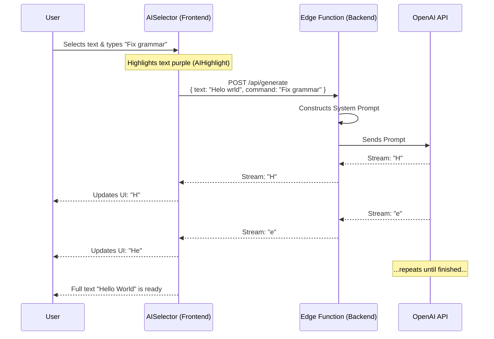

# Chapter 5: AI Autocompletion Pipeline

In the previous chapter, [Slash Command System](04_slash_command_system.md), we built a menu that lets users insert headings, images, and lists. We gave the user a "Magic Wand."

Now, we are going to give that wand a brain.

Welcome to the **AI Autocompletion Pipeline**. This is the feature that allows users to highlight text and ask an Artificial Intelligence to "Fix Grammar," "Make Longer," or "Change Tone."

## The Motivation

### The Problem: Writer's Block
Writing is hard. Sometimes you have a messy sentence, or you just stop mid-thought. You don't want to switch tabs to ChatGPT, paste your text, wait for an answer, copy it, and paste it back.

### The Solution: Built-in Intelligence
We want an experience where the AI lives *inside* the editor.
1.  **Context Aware:** It knows what you are writing.
2.  **Visual Feedback:** It shows you exactly what text it is reading.
3.  **Streaming:** It writes the answer letter-by-letter, just like a ghost typist.

## Key Concepts

To build this, we need to connect four distinct parts. Think of it like a telephone call:

1.  **The Phone (AISelector):** The React component where the user types instructions (e.g., "Make this funnier").
2.  **The Signal (AIHighlight):** A visual purple background that tells the user: "This is the text the AI is thinking about."
3.  **The Operator (Edge Function):** A fast backend script that takes the text and sends it to OpenAI.
4.  **The Voice (Streaming):** The method of sending data back in chunks, so the user doesn't have to wait for the whole message to finish.

---

## Step-by-Step Implementation

Let's build this pipeline from the User Interface back to the Server.

### 1. The Visual Signal (AIHighlight)

Before we process text, we need to visually "grab" it. We use a custom Tiptap **Mark**. Unlike a Block (which is a whole paragraph), a Mark is like a highlighter pen—it wraps specific words.

We created `AIHighlight` in `packages/headless/src/extensions/ai-highlight.ts`.

To use it, we call a helper function when the user opens the AI menu:

```tsx
import { addAIHighlight } from "novel";

// Inside your UI component
onFocus={() => {
  // Paints the selected text purple
  addAIHighlight(editor); 
}}
```

This ensures the user knows exactly what context the AI is using.

### 2. The User Interface (AISelector)

We need a UI that pops up to accept input. We use the **Vercel AI SDK** to handle the heavy lifting. Specifically, we use a hook called `useCompletion`.

This lives in `apps/web/components/tailwind/generative/ai-selector.tsx`.

```tsx
import { useCompletion } from "ai/react";

const { completion, complete, isLoading } = useCompletion({
  api: "/api/generate", // The address of our backend
  onResponse: (response) => {
    // Handle errors (like running out of credits)
    if (response.status === 429) toast.error("Too many requests");
  },
});
```

*   `completion`: The text coming back from the AI (updates in real-time).
*   `complete`: The function we call to start the process.

### 3. Triggering the AI

When the user types a command and hits "Enter", we need to package the data and send it.

```tsx
// Inside the button onClick handler
const slice = editor.state.selection.content();
const text = serializer.serialize(slice.content);

// Send the text AND the user's command to the backend
complete(text, {
  body: { 
    option: "zap", // "zap" means custom command
    command: inputValue // e.g., "Make this shorter" 
  },
});
```

### 4. The Backend Brain (Edge Function)

Now we need a server to receive this call. We use a **Next.js Edge Function** located at `apps/web/app/api/generate/route.ts`.

Why "Edge"? Because AI responses can be slow. Edge functions are lightweight and allow us to keep the connection open for streaming without timing out.

```tsx
// apps/web/app/api/generate/route.ts
import { openai } from "@ai-sdk/openai";
import { streamText } from "ai";

export const runtime = "edge"; // IMPORTANT!

export async function POST(req: Request) {
  const { prompt, command } = await req.json();

  // Logic to call OpenAI...
}
```

### 5. Prompt Engineering

We don't just send raw text to OpenAI. We wrap it in a "System Prompt" to tell the AI how to behave.

```tsx
// We use pattern matching to choose the right personality
const messages = [
  {
    role: "system",
    content: "You are an AI writing assistant. Use Markdown formatting.",
  },
  {
    role: "user",
    content: `For this text: ${prompt}. Respect command: ${command}`,
  },
];
```

### 6. Streaming the Response

Finally, we send the result back to the frontend using `streamText`. This is the magic that makes the text appear to "type itself."

```tsx
const result = await streamText({
  model: openai("gpt-4o-mini"), // The brain model
  messages: messages,
  temperature: 0.7, // Creativity level
});

// Send the stream back to the client
return result.toDataStreamResponse();
```

---

## Under the Hood: The Data Flow

It can be confusing to understand how the frontend and backend talk to each other while streaming. Let's look at the lifecycle of a single request.

### Sequence Diagram



### Internal Implementation Details

Let's look deeper into `ai-selector.tsx` to see how we handle the result.

The `useCompletion` hook gives us a variable called `completion`. This variable changes dozens of times per second as new letters arrive.

We display this in a preview window before replacing the user's text.

```tsx
// apps/web/components/tailwind/generative/ai-selector.tsx

const hasCompletion = completion.length > 0;

return (
  <div className="w-[350px]">
    {/* If we have data, show the preview */}
    {hasCompletion && (
        <div className="prose p-2">
           <Markdown>{completion}</Markdown>
        </div>
    )}
    
    {/* ... Input field code ... */}
  </div>
);
```

By rendering `<Markdown>{completion}</Markdown>`, we ensure that if the AI sends bold text or lists, it looks correct immediately.

## Why use the AI SDK?

You might ask, "Why not just use `fetch`?"

The Vercel AI SDK (`ai/react` and `ai`) handles the complex parts of streaming for us:
1.  **Decoder:** It converts the raw binary stream into text.
2.  **State:** It automatically updates the `completion` variable.
3.  **Error Handling:** It manages network interruptions.

## Conclusion

You have successfully built an **AI Autocompletion Pipeline**.
1.  The **Selector** captures user intent.
2.  The **Highlight** provides visual context.
3.  The **Edge Function** processes the logic.
4.  The **Stream** delivers the result instantly.

Now our editor is smart. But looking at our UI, we have a menu that appears when we type `/` (Slash Command), and now a menu that helps us write AI.

What if we want a menu that appears *immediately* when we select text, just to bold or italicize it, without typing anything?

In the next chapter, we will build the Floating Context Menu (Bubble Menu).

[Next Chapter: Floating Context Menu (Bubble Menu)](06_floating_context_menu__bubble_menu_.md)

---

Generated by [Code IQ](https://github.com/adityasoni99/Code-IQ)