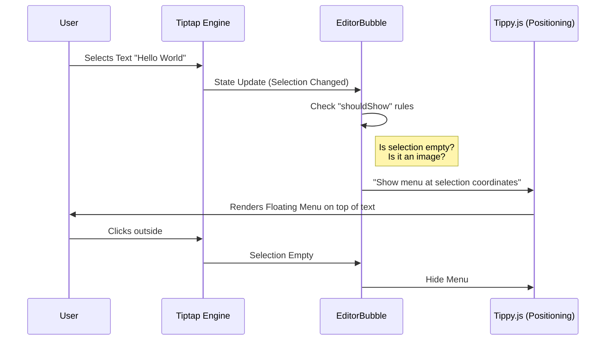

# Chapter 6: Floating Context Menu (Bubble Menu)

In the previous chapter, [AI Autocompletion Pipeline](05_ai_autocompletion_pipeline.md), we built a powerful AI assistant that helps users write content.

However, sometimes you don't need a robot to rewrite your sentence. You just want to make a word **bold**, turn a paragraph into a Heading, or add a link.

Moving your mouse all the way to a toolbar at the top of the screen breaks your focus. We need a menu that comes to *you*.

Welcome to the **Floating Context Menu** (often called a Bubble Menu).

## The Motivation

### The Problem: Breaking the Flow
Imagine you are deep in thought, writing a story. You want to emphasize a word.
1.  You highlight the word.
2.  You look up.
3.  You move your mouse to the top of the page.
4.  You click "B".
5.  You look back down and try to remember what you were writing.

This micro-distraction kills productivity.

### The Solution: Contextual UI
We want a menu that appears instantly, hovering right above the text you just selected.
1.  **Selection Trigger:** It only shows when text is highlighted.
2.  **Smart Positioning:** It centers itself automatically.
3.  **Rich Tools:** It allows standard formatting (Bold/Italic) and complex actions (Changing to a Heading).

## Key Concepts

To build this, we use a component provided by `novel` called `<EditorBubble>`. It relies on three specific tools:

1.  **The Bubble:** The container that floats above the text.
2.  **Node Selector:** A dropdown to change the *type* of block (e.g., Text to Heading 1).
3.  **Link Selector:** A popover to type in URLs.

---

## Step-by-Step Implementation

Let's integrate the Bubble Menu into our editor.

### 1. Adding the Container

The `EditorBubble` component wraps standard React elements. We place it inside our main editor component.

```tsx
import { EditorBubble } from "novel";

// Inside your Editor component
<EditorBubble
  tippyOptions={{ placement: "top" }}
  className="flex w-fit max-w-[90vw] overflow-hidden rounded border bg-white shadow-xl"
>
  {/* Buttons go here */}
</EditorBubble>
```

*Explanation:* `tippyOptions` tells the library where to put the menu (on top of the text). The `className` gives it a nice white background and shadow.

### 2. Adding Basic Formatting Buttons

Inside the bubble, we add standard buttons for Bold, Italic, and Strikethrough. We use `editor.chain()` to execute these commands.

```tsx
import { BoldIcon, ItalicIcon } from "lucide-react"; // Icons

// Inside EditorBubble
<Button
  onClick={() => editor.chain().focus().toggleBold().run()}
  className={editor.isActive("bold") ? "text-blue-500" : ""}
>
  <BoldIcon size={18} />
</Button>

<Button
  onClick={() => editor.chain().focus().toggleItalic().run()}
>
  <ItalicIcon size={18} />
</Button>
```

*Explanation:* When clicked, we focus the editor and toggle the style. `editor.isActive("bold")` checks if the selected text is already bold, so we can color the button blue to show it's active.

### 3. The Node Selector

Sometimes you want to change *what* the text is, not just how it looks. You want to turn a paragraph into a "Heading 1" or a "Checklist".

We use a custom component `NodeSelector`.

```tsx
import { NodeSelector } from "./selectors/node-selector";
import { useState } from "react";

// Inside your Editor component
const [isNodeSelectorOpen, setIsNodeSelectorOpen] = useState(false);

<EditorBubble>
    <NodeSelector 
      open={isNodeSelectorOpen} 
      onOpenChange={setIsNodeSelectorOpen} 
    />
    {/* ... other buttons */}
</EditorBubble>
```

*Explanation:* This renders a button that displays the current type (e.g., "Text"). Clicking it opens a dropdown list of options like "Heading 1", "Quote", or "Code".

### 4. The Link Selector

Finally, users need to add hyperlinks. We use the `LinkSelector` component.

```tsx
import { LinkSelector } from "./selectors/link-selector";

const [isLinkSelectorOpen, setIsLinkSelectorOpen] = useState(false);

<LinkSelector
  open={isLinkSelectorOpen}
  onOpenChange={setIsLinkSelectorOpen}
/>
```

*Explanation:* This component handles the complexity of checking if a URL is valid and applying the link tag to the text.

---

## Under the Hood: How It Works

How does the menu know when to show up and where to float?

### Sequence Diagram



### Internal Implementation Details

Let's look at `packages/headless/src/components/editor-bubble.tsx`.

The core logic lies in the `shouldShow` function. Tiptap calls this on every update to decide if the menu should be visible.

```tsx
// packages/headless/src/components/editor-bubble.tsx

const shouldShow = ({ editor, state }) => {
  const { selection } = state;
  const { empty } = selection;

  // 1. If editor is read-only, hide it
  if (!editor.isEditable) return false;

  // 2. If an image is selected, hide it (images have their own menus)
  if (editor.isActive("image")) return false;

  // 3. If nothing is selected (cursor is blinking), hide it
  if (empty) return false;

  return true;
};
```

This ensures the menu doesn't pop up annoyingly when you are just clicking around or looking at an image.

### Inside the Node Selector

Let's look at `apps/web/components/tailwind/selectors/node-selector.tsx`.

This is a list of commands defined in a simple array. This makes it easy for you to add new block types later.

```tsx
const items = [
  {
    name: "Heading 1",
    icon: Heading1,
    // The command to run
    command: (editor) => editor.chain().focus().toggleHeading({ level: 1 }).run(),
    // How to know if this is active
    isActive: (editor) => editor.isActive("heading", { level: 1 }),
  },
  // ... other items
];
```

When you select an item from the list, it runs the `command` function associated with it.

### Inside the Link Selector

In `apps/web/components/tailwind/selectors/link-selector.tsx`, we handle the logic of adding a URL.

We automatically focus the input field when it opens so the user can just type `cmd+v` to paste a link immediately.

```tsx
// apps/web/components/tailwind/selectors/link-selector.tsx

useEffect(() => {
  inputRef.current?.focus(); // Auto-focus
});

const submitLink = (url) => {
  // Apply the link attribute to the text
  editor.chain().focus().setLink({ href: url }).run();
  onOpenChange(false); // Close the menu
};
```

## Conclusion

You now have a fully functional **Floating Context Menu**.
1.  **`EditorBubble`** handles the visibility and positioning logic.
2.  **Selectors** allow users to transform text and add links without leaving their keyboard flow.
3.  **Tippy.js** ensures the menu stays glued to the selection, even when the page scrolls.

Our editor is now very powerful. We can type, slash-command, generate AI text, and format selections. But there is one major feature missing from a modern editor: **Images**.

Specifically, how do we make image uploading feel instant, even if the file is large?

In the next chapter, we will learn about Optimistic UI patterns for uploads.

[Next Chapter: Optimistic Image Uploads](07_optimistic_image_uploads.md)

---

Generated by [Code IQ](https://github.com/adityasoni99/Code-IQ)