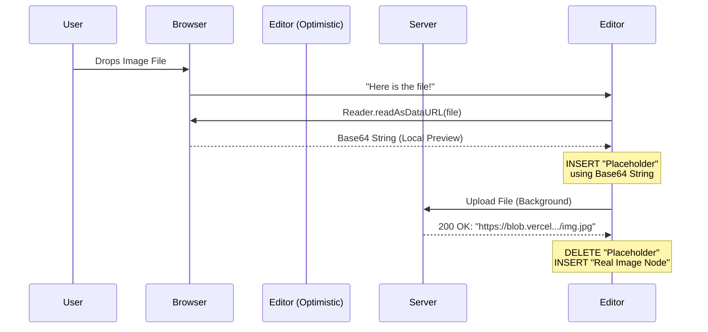

# Chapter 7: Optimistic Image Uploads

In the previous chapter, [Floating Context Menu (Bubble Menu)](06_floating_context_menu__bubble_menu_.md), we polished the text editing experience by bringing menus directly to the cursor.

Now, let's talk about **Media**.

A modern editor isn't just about text; it's about rich content. But uploading images on the web can feel slow. Usually, you select a file, watch a spinning loader for 3 seconds, and *then* the image appears. This breaks your creative flow.

Welcome to **Optimistic Image Uploads**. This chapter explains how `novel` makes image uploading feel instant.

## The Motivation

### The Problem: The "Spinner" Wait
When you drop a 5MB image into an editor, it needs to be sent to a server (like AWS S3 or Vercel Blob) to get a public URL. This takes time.

If we wait for the server to finish before showing the image, the user thinks the editor is broken or slow.

### The Solution: The "Stunt Double"
We use a technique called **Optimistic UI**.
1.  **Instant Preview:** As soon as you drop the image, we read it locally and display it immediately. This is the "Stunt Double."
2.  **Background Upload:** While the user looks at the stunt double, we silently upload the real file in the background.
3.  **The Swap:** Once the upload finishes, we seamlessly swap the stunt double for the real image URL.

## Key Concepts

To make this work, we use three concepts:

1.  **The Blob (Backend):** A cloud storage service where the actual image file lives.
2.  **The Decoration (Frontend):** A temporary visual element in the editor. It looks like part of the document, but it isn't saved to the database.
3.  **The Transaction:** The specific instruction to the editor to "Swap A for B."

---

## Step-by-Step Implementation

Let's build this feature starting from the server and moving to the user interface.

### 1. The Server (Vercel Blob)

We need a place to store files. We use Vercel Blob storage. We create an API route that accepts a file and returns a public URL.

File: `apps/web/app/api/upload/route.ts`

```typescript
import { put } from "@vercel/blob";
import { NextResponse } from "next/server";

export const runtime = "edge"; // fast startup

export async function POST(req: Request) {
  // 1. Get the file from the request
  const file = req.body || "";
  const filename = req.headers.get("x-vercel-filename") || "file.txt";
  const contentType = req.headers.get("content-type") || "text/plain";

  // 2. Upload to Vercel Blob
  const blob = await put(filename, file, {
    contentType,
    access: "public",
  });

  // 3. Return the new public URL
  return NextResponse.json(blob);
}
```

### 2. The Client: Handling the Drop

Now, we need a function in our React app that triggers when a user drops an image. This function coordinates the "Optimistic" magic.

We use `createImageUpload` from the `novel` headless package.

```tsx
import { createImageUpload } from "novel/plugins";

const onUpload = (file: File) => {
  // 1. Return a Promise that uploads to our API
  return fetch("/api/upload", {
    method: "POST",
    headers: {
      "content-type": file.type,
      "x-vercel-filename": file.name,
    },
    body: file,
  }).then((res) => {
    // 2. Return the public URL for the editor to use
    if (res.status === 200) {
      const { url } = await res.json();
      return url; 
    }
  });
};
```

### 3. Connecting it to the Editor

Finally, we pass this logic into the editor using the `handleImageDrop` utility.

```tsx
import { handleImageDrop } from "novel/plugins";

// Inside your Editor component's props:
editorProps={{
  handleDrop: (view, event, _slice, moved) => {
    // Use the helper to handle the drop event
    return handleImageDrop(view, event, moved, uploadFn);
  }
}}
```

*Note: `uploadFn` is the result of calling `createImageUpload` with the `onUpload` function we defined in Step 2.*

---

## Under the Hood: How It Works

How does the editor show an image *before* the server responds? It uses a **FileReader**.

### Sequence Diagram



### Internal Implementation Details

The magic logic lives in `packages/headless/src/plugins/upload-images.tsx`. This is a low-level ProseMirror plugin.

It manages **Decorations**. In ProseMirror, a "Node" is part of your document data. A "Decoration" is just a visual effect (like a spell check red line). We use a Decoration for the loading image because we *don't* want the loading state to be saved to the database.

#### 1. Creating the Preview (The Decoration)

When the plugin receives an "add" action, it creates an HTML `` tag using the local file data.

```typescript
// Inside UploadImagesPlugin state.apply
if (action?.add) {
  const { id, pos, src } = action.add;

  // Create a temporary HTML element
  const placeholder = document.createElement("div");
  const image = document.createElement("img");
  image.src = src; // This is the local Base64 preview
  
  placeholder.appendChild(image);
  
  // Create a "Widget" decoration at the cursor position
  return DecorationSet.create(tr.doc, [
    Decoration.widget(pos + 1, placeholder, { id })
  ]);
}
```

#### 2. The Upload Logic

The `createImageUpload` function handles the timeline. First, it creates the preview. Then, it waits for the upload.

```typescript
// packages/headless/src/plugins/upload-images.tsx

// 1. Read the file locally
const reader = new FileReader();
reader.onload = () => {
  // Tell the plugin to show the placeholder
  tr.setMeta(uploadKey, {
    add: { id, pos, src: reader.result },
  });
  view.dispatch(tr);
};
```

#### 3. The Swap (Success)

When the promise resolves (the server says "OK"), we need to remove the decoration and insert the real image node.

```typescript
onUpload(file).then((src) => {
  // Find where we put the placeholder
  const pos = findPlaceholder(view.state, id);
  
  // Create the REAL image node
  const node = schema.nodes.image?.create({ src: imageSrc });

  // Replace: Insert Node AND Remove Placeholder
  const transaction = view.state.tr
    .replaceWith(pos, pos, node)
    .setMeta(uploadKey, { remove: { id } });
    
  view.dispatch(transaction);
});
```

#### 4. Handling Errors

If the upload fails (maybe the internet cuts out), we must remove the placeholder so the user isn't stuck with a broken image.

```typescript
// Inside the .then() catch block
}, () => {
  // Just remove the placeholder
  const transaction = view.state.tr
    .delete(pos, pos)
    .setMeta(uploadKey, { remove: { id } });
    
  view.dispatch(transaction);
});
```

## Conclusion

You have successfully implemented **Optimistic Image Uploads**.

By separating the **Visual State** (Decorations) from the **Document State** (Nodes), we created an experience that feels instantaneous. The user never waits. They drop the image and keep writing, while the heavy lifting happens invisibly in the background.

### Tutorial Summary

Congratulations! You have completed the **Novel Project Tutorial**. You have built a fully featured, Notion-style WYSIWYG editor from scratch.

Let's recap what you have built:
1.  **Consumer App:** A Next.js page that saves data to LocalStorage.
2.  **Headless Wrapper:** A chassis that connects Tiptap, Jotai, and React.
3.  **Extensions:** Custom blocks like Tweets and Highlights.
4.  **Slash Command:** A floating menu to insert blocks.
5.  **AI Pipeline:** A streaming text generator.
6.  **Bubble Menu:** A context-aware formatting toolbar.
7.  **Optimistic Uploads:** A seamless media handling system.

You now possess the knowledge to customize `novel` further, add your own extensions, or integrate it into complex SaaS applications. Happy coding!

---

Generated by [Code IQ](https://github.com/adityasoni99/Code-IQ)