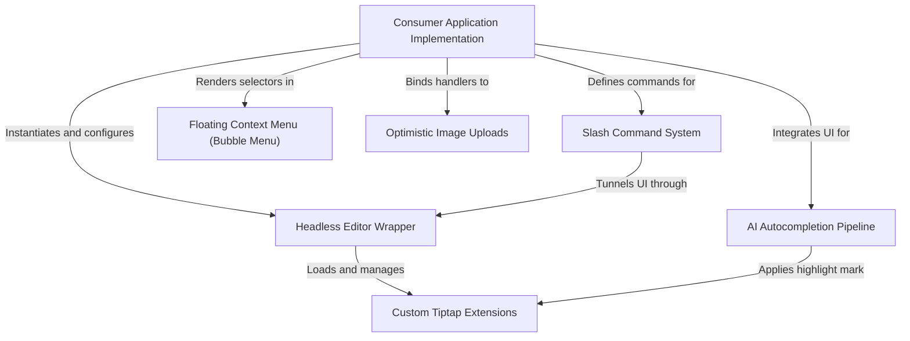

# Tutorial: novel

Novel is a **Notion-style WYSIWYG editor** framework built on top of Tiptap and React. It utilizes a *headless* architecture to decouple the core editing engine from the user interface, allowing developers to seamlessly integrate advanced capabilities like **AI-powered autocompletion**, interactive slash commands, and optimistic image uploads into their applications.

**Source Repository:** [https://github.com/steven-tey/novel](https://github.com/steven-tey/novel)

## Chapters

1. [Consumer Application Implementation](01_consumer_application_implementation.md)
2. [Headless Editor Wrapper](02_headless_editor_wrapper.md)
3. [Custom Tiptap Extensions](03_custom_tiptap_extensions.md)
4. [Slash Command System](04_slash_command_system.md)
5. [AI Autocompletion Pipeline](05_ai_autocompletion_pipeline.md)
6. [Floating Context Menu (Bubble Menu)](06_floating_context_menu__bubble_menu_.md)
7. [Optimistic Image Uploads](07_optimistic_image_uploads.md)

---

Generated by [Code IQ](https://github.com/adityasoni99/Code-IQ)