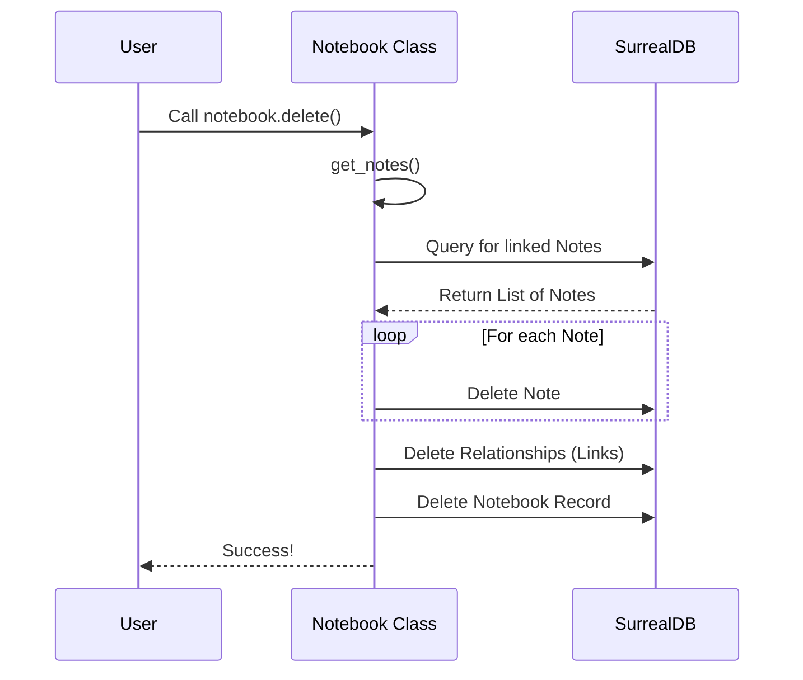

# Chapter 1: Domain Models & Schema

Welcome to the **Open Notebook** project! 

Before we write any AI code or build a user interface, we need to decide what our data actually *looks* like. If you were building a physical filing cabinet, you’d need to decide: "Do I use folders? Binders? How do I label them?"

In software, this is called defining **Domain Models** and the **Schema**.

### The Goal: A Structure for our "Digital Brain"

Our central use case for this chapter is simple: **We want to create a Notebook (a project) and put a Note inside it.**

To do this, we need to answer three questions:
1.  **What is a Notebook?** (Name, description, created date)
2.  **What is a Note?** (Title, content, embedding)
3.  **How are they connected?** (A Notebook *contains* a Note)

---

## Part 1: The Blueprint (SurrealDB Schema)

First, we define the "physical" structure of our data. We use **SurrealDB**, a modern database that handles relationships beautifully.

Think of the Schema files (`database/migrations/*.surrealql`) as the construction workers who build the shelves and drawers in our filing cabinet.

### 1. Defining the Nouns
In `1.surrealql`, we define our core tables. Here is how we define a **Notebook**:

```sql
-- Create a table for notebooks with a schema
DEFINE TABLE IF NOT EXISTS notebook SCHEMAFULL;

-- Define what data goes inside
DEFINE FIELD IF NOT EXISTS name ON TABLE notebook TYPE option<string>;
DEFINE FIELD IF NOT EXISTS description ON TABLE notebook TYPE option<string>;
DEFINE FIELD IF NOT EXISTS archived ON TABLE notebook TYPE option<bool> DEFAULT False;
```
*Explanation: We are telling the database, "Create a box called `notebook`. Inside, expect text for `name` and `description`, and a True/False switch for `archived`."*

### 2. Defining Relationships (The Graph)
SurrealDB is a **Graph Database**. This means we don't just have tables; we have direct links between them.

Instead of complex "Joins" (like in SQL), we create a specific connection called an **Artifact**.

```sql
-- Define a relationship table
DEFINE TABLE IF NOT EXISTS artifact
TYPE RELATION 
FROM note TO notebook;
```
*Explanation: This defines a directional arrow. It says, "An `artifact` is a link that points FROM a `note` TO a `notebook`."*

---

## Part 2: The Rules (Python Domain Models)

The database holds the data, but our Python code enforces the **business rules**. This lives in `domain/notebook.py`.

Think of these Python classes as the **Office Manager**. The database might allow you to shove a blank piece of paper into a folder, but the Office Manager (Python) says, "No, every notebook MUST have a name!"

### 1. The Notebook Class
We use a library called **Pydantic** to define these rules.

```python
# open_notebook/domain/notebook.py

class Notebook(ObjectModel):
    table_name: ClassVar[str] = "notebook"
    name: str
    description: str
    archived: Optional[bool] = False
```
*Explanation: This looks just like the database schema, but in Python. `ObjectModel` is our base class that handles saving to the database.*

### 2. Validation Logic
We can add rules that the database doesn't know about. For example, ensuring a name isn't just empty spaces:

```python
    @field_validator("name")
    @classmethod
    def name_must_not_be_empty(cls, v):
        if not v.strip():
            raise InvalidInputError("Notebook name cannot be empty")
        return v
```
*Explanation: If you try to create a Notebook with the name "   ", this code runs automatically and stops you with an error.*

---

## Part 3: Connecting the Dots

Now, let's solve our use case: **How does a Notebook know which Notes are inside it?**

In our Python `Notebook` class, we add a method to fetch its contents. This wraps a database query into a clean Python function.

```python
    async def get_notes(self) -> List["Note"]:
        # Query the 'artifact' relationship we defined earlier
        srcs = await repo_query(
            """
            select * from (
                select in as note from artifact where out=$id
                fetch note
            )
            """,
            {"id": ensure_record_id(self.id)},
        )
        return [Note(**src["note"]) for src in srcs]
```
*Explanation: `out=$id` refers to the Notebook. `in` refers to the Note. This query asks: "Find all relationship arrows pointing out from ME (the notebook), and give me the items pointing IN (the notes)."*

---

## Under the Hood: The Lifecycle of a Data Request

What actually happens when we ask the system to "Delete a Notebook"? This is where the Domain Model shines. It doesn't just delete the row; it cleans up the mess.



### Implementing Complex Logic
The `delete` method in `domain/notebook.py` handles this "Cleanup" logic. It ensures we don't leave "orphan" notes floating around with no notebook.

```python
    async def delete(self, delete_exclusive_sources: bool = False):
        # 1. Get and delete all notes linked to this notebook
        notes = await self.get_notes()
        for note in notes:
            await note.delete()
            
        # 2. Delete the specific relationships (the arrows)
        await repo_query(
            "DELETE artifact WHERE out = $notebook_id",
            {"notebook_id": self.id},
        )

        # 3. Finally, delete the notebook itself
        await super().delete()
```
*Explanation: This ensures data integrity. A simple database command might miss the related notes, but our Domain Model ensures everything is tidied up.*

---

## AI Concepts: Vector Search

You might notice fields like `embedding` in the schema.

```sql
DEFINE FIELD IF NOT EXISTS embedding ON TABLE note TYPE array<float>;
```

This is crucial for the AI features we will build later. An **embedding** is a list of numbers (e.g., `[0.1, 0.5, -0.2...]`) representing the *meaning* of the text.

In `1.surrealql`, we even define a specialized function to search these numbers:

```sql
DEFINE FUNCTION IF NOT EXISTS fn::vector_search($query: array<float>) {
    -- Find items mathematically close to the query
    RETURN SELECT *, vector::similarity::cosine(embedding, $query) as similarity
    FROM note 
    ORDER BY similarity DESC;
};
```
*Explanation: This function allows us to ask the database, "Find me notes that are conceptually similar to this search," rather than just matching keywords.*

---

## Summary

In this chapter, we established the foundation of **Open Notebook**:

1.  **Schema (SurrealDB):** We defined our drawers and folders (`notebook`, `note`, `source`).
2.  **Domain Models (Python):** We created the "Office Managers" that enforce rules and handle logic.
3.  **Relationships:** We learned how to link items together using Graph concepts.

Now that we have our models defined, we need a reliable way to send these objects back and forth to the database without writing raw queries every single time.

Next, we will learn about the **Repository Pattern**, which acts as the bridge between our Python objects and the database.

[Next Chapter: Repository Pattern (Data Access)](02_repository_pattern__data_access_.md)

---

Generated by [Code IQ](https://github.com/adityasoni99/Code-IQ)