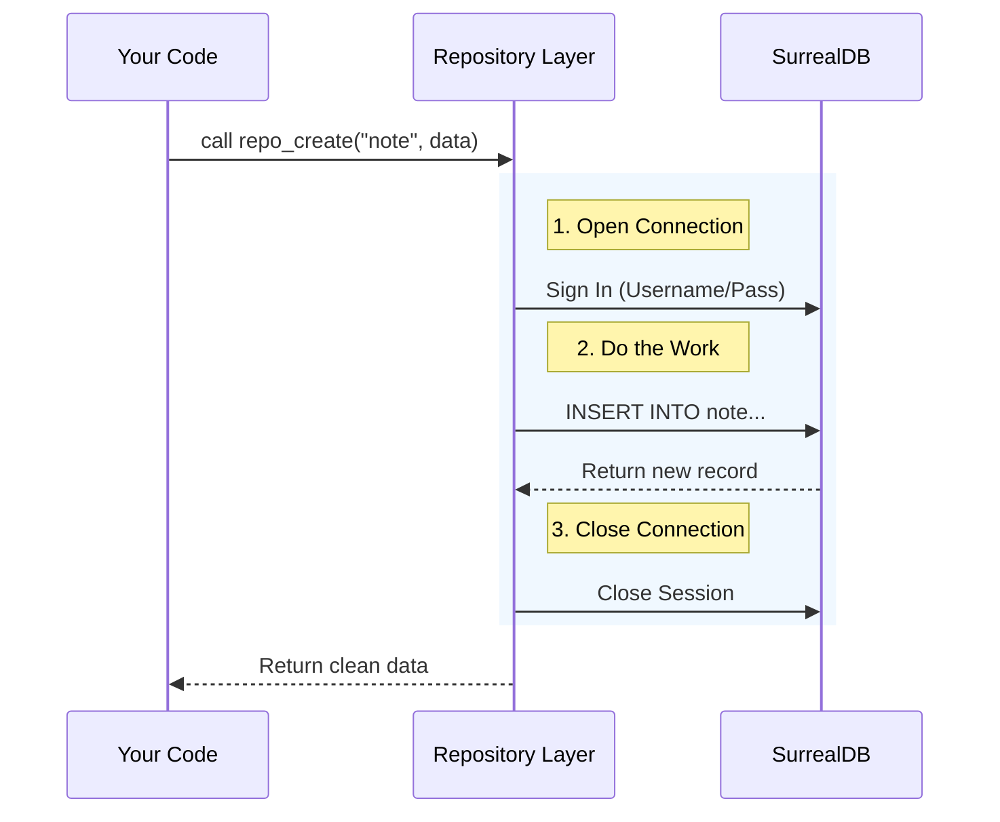

# Chapter 2: Repository Pattern (Data Access)

In the previous chapter, **[Domain Models & Schema](01_domain_models___schema.md)**, we designed the blueprints for our data. We decided what a "Note" and a "Notebook" look like.

Now, we need a way to actually **put data into** and **get data out of** the database.

## The Problem: The "Free-for-All" Library

Imagine a library where anyone is allowed to walk into the restricted stacks, grab any book, scribble on it, or move it to a different shelf. Chaos would ensue! Books would be lost, damaged, or misfiled.

In software, allowing every part of your app to talk directly to the database creates similar chaos.
*   **Security risks:** You might accidentally expose passwords.
*   ** messy code:** You end up writing the same SQL queries in 10 different places.
*   ** fragility:** If you change the database password, you have to fix it everywhere.

## The Solution: The Librarian (Repository Pattern)

We solve this by hiring a **Librarian**. In software architecture, this is called the **Repository Pattern**.

The Repository is a specific file (`database/repository.py`) that acts as the **gatekeeper**. If you want to save a note, you don't talk to the database; you hand the note to the Repository functions, and *they* handle the complex filing logic.

---

## Core Tools: The Repository Functions

In `open-notebook`, we don't write raw SQL inside our API routes. We use these helper functions.

### 1. `repo_create`: Storing New Items
Use this when you have a new object (like a Note) to save.

```python
# Example Usage
note_data = {
    "title": "My First Idea",
    "content": "Hello world!"
}

# The repository handles the SQL INSERT for you
saved_record = await repo_create("note", note_data)
```
*   **Input:** The table name (`"note"`) and a dictionary of data.
*   **What it does:** Inserts the data, automatically adds `created` and `updated` timestamps, and returns the saved record.

### 2. `repo_query`: Asking Questions
Use this when you need to search for something specific or run complex logic.

```python
# Example Usage
# The '$id' is a safety variable (parameter)
query = "SELECT * FROM note WHERE title = $title"
vars = {"title": "My First Idea"}

results = await repo_query(query, vars)
```
*   **Input:** A string of SurrealQL (our SQL flavor) and a dictionary of variables.
*   **What it does:** It safely runs the query. It prevents "SQL Injection" (hackers trying to trick the database) by treating variables strictly as data, not code.

### 3. `repo_relate`: Connecting the Dots
Since we are using a **Graph Database**, connecting items is just as important as creating them. This function draws the "arrow" between two items.

```python
# Example Usage: Put a Note INSIDE a Notebook
# Source -> Relationship -> Target
await repo_relate(
    source="note:123", 
    relationship="artifact", 
    target="notebook:456"
)
```
*   **Input:** The ID of the item starting the link, the name of the link (`artifact`), and the ID of the destination.
*   **What it does:** Creates a graph edge. Now, the Notebook "knows" it contains that Note.

---

## Under the Hood: Opening the Gate

How does this actually work? When you call one of these functions, a specific lifecycle occurs to ensure the database connection is opened safely and closed immediately after.



### The Code: Context Managers

Let's look at `database/repository.py`. The magic happens in a function called `db_connection`.

It uses a Python concept called a **Context Manager** (`asynccontextmanager`). Think of this as an automatic door closer.

```python
# open_notebook/database/repository.py

@asynccontextmanager
async def db_connection():
    # 1. Setup: Create the client and sign in
    db = AsyncSurreal(get_database_url())
    await db.signin({...}) # (Credentials hidden for brevity)
    await db.use(...)      # Select the namespace
    
    try:
        yield db  # <--- PAUSE: This is where your query runs!
    finally:
        # 3. Teardown: ALWAYS runs, even if your query crashed
        await db.close()
```

**Why is this important?**
The `try...finally` block guarantees that we **always** close the connection. If we didn't do this, our application would eventually run out of connections and freeze, like a library with too many people inside and the doors locked.

### The Wrapper: `repo_query`

The `repo_query` function wraps that connection manager so you don't have to type the setup code every time.

```python
async def repo_query(query_str: str, vars: dict = None):
    # Automatically open/close the connection
    async with db_connection() as connection:
        try:
            # Run the actual command
            result = await connection.query(query_str, vars)
            
            # Clean up weird ID formats before returning
            return parse_record_ids(result)
            
        except Exception as e:
            logger.exception(e) # Log errors so we can fix them
            raise
```

**Key Benefit:**
Notice `parse_record_ids`? Database IDs often come back as complex objects (e.g., `RecordID('note', '123')`). The repository converts these into simple strings (`"note:123"`), so the rest of your app doesn't need to struggle with database-specific formats.

---

## Putting It Together: A Real Workflow

Let's revisit the use case from the start: **Creating a Note.**

In the old way (without a Repository), you would have to:
1.  Import the database driver.
2.  Get the password from environment variables.
3.  Connect.
4.  Write the INSERT statement.
5.  Handle errors.
6.  Disconnect.

**With the Repository Pattern**, the code in our application logic (which we will write in future chapters) looks like this:

```python
# Simple, clean, and readable
new_note = await repo_create("note", {
    "title": "Repository Pattern",
    "content": "It abstracts away the database complexity."
})
```

By using the Repository pattern, we have made our code:
1.  **Cleaner:** One line instead of ten.
2.  **Safer:** SQL injection protection is built-in.
3.  **Maintainable:** If we switch databases later, we only change `repository.py`, not the whole app.

---

## Summary

In this chapter, we learned:
1.  The **Repository Pattern** acts as a helpful Librarian between our code and the database.
2.  We use **`repo_create`**, **`repo_query`**, and **`repo_relate`** to manipulate data.
3.  Under the hood, **Context Managers** handle the dirty work of opening and closing connections safely.

Now that we can model our data (Chapter 1) and store it safely (Chapter 2), we are ready to introduce the "Brain" of the operation.

In the next chapter, we will learn how to set up the AI models that will eventually read and understand our notes.

[Next Chapter: Universal AI Provisioning](03_universal_ai_provisioning.md)

---

Generated by [Code IQ](https://github.com/adityasoni99/Code-IQ)