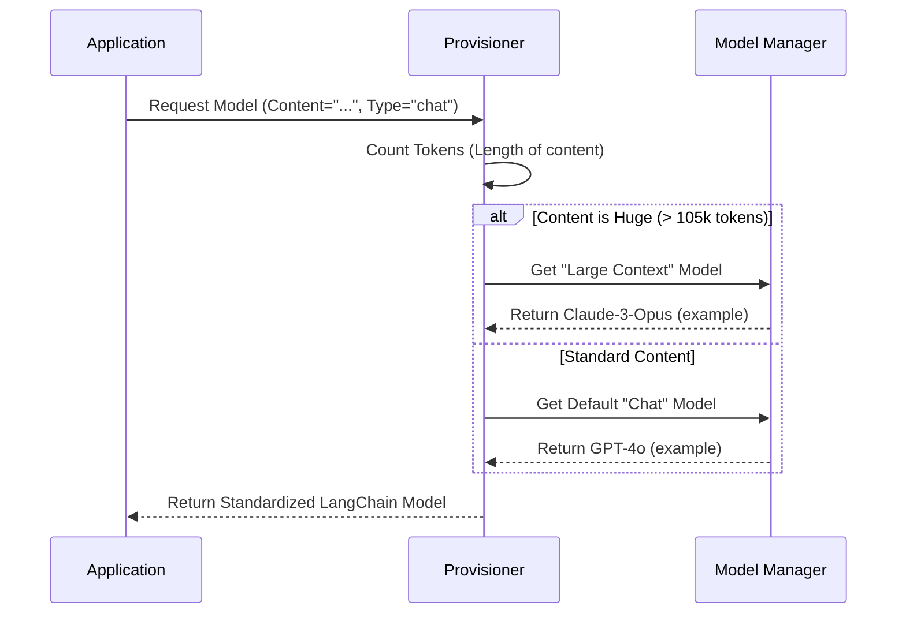

# Chapter 3: Universal AI Provisioning

In the previous chapter, **[Repository Pattern (Data Access)](02_repository_pattern__data_access_.md)**, we built a safe and organized way to store and retrieve our notes using the "Librarian" (Repository) pattern.

Now that we have data, we want to add intelligence. We want our Notebook to summarize text, answer questions, and generate ideas.

## The Problem: The "Wall Socket" Dilemma

Imagine you are building a lamp.
*   If you build it with a **US plug**, it won't work in **Europe**.
*   If you build it for a **Battery**, it won't work with a **Wall Outlet**.

In the world of AI, every provider (OpenAI, Anthropic, Google, Local Ollama) is like a different country's power grid. They all have different code requirements.

If you write your app specifically for OpenAI, and then decide to switch to a free local model later, you would have to rewrite your entire application.

## The Solution: The Universal Adapter

We solve this with **Universal AI Provisioning**.

We create a single function called `provision_langchain_model`. Think of this as a **Universal Travel Adapter**.
1.  Your app plugs into the adapter.
2.  The adapter detects what "electricity" (AI Provider) is available or best for the job.
3.  The adapter handles the connection details.

Your application code never says "Call OpenAI." It says, **"Give me a Model."**

---

## Central Use Case: "Summarize a Note"

Let's look at a concrete goal: **We want to summarize a very long note.**

To do this, we need an AI model. But which one?
*   If the note is short, we can use a cheap, fast model.
*   If the note is an entire novel (100,000+ words), a cheap model will crash. We need a "High Context" model.

Our provisioning layer handles this logic automatically.

### How to Use It

Instead of importing `openai` directly, we use our provisioning function.

```python
# In your application logic
from open_notebook.ai.provision import provision_langchain_model

# 1. We have some content (could be 1 sentence or 100 pages)
note_content = "Once upon a time..."

# 2. Ask the factory for a model capable of reading this
model = await provision_langchain_model(
    content=note_content, 
    model_id=None, 
    default_type="chat"
)

# 3. Now we have a standard 'model' object we can use!
# We don't care if it's GPT-4 or Claude 3.
```
*Explanation: We provide the content so the system can measure it. We ask for a "chat" type model. The function returns a ready-to-use AI object.*

---

## Under the Hood: The Decision Logic

When you call this function, it acts like a smart switchboard operator. It follows a specific flowchart to decide which AI model to give you.



### Implementation Walkthrough

Let's look at `open_notebook/ai/provision.py`. We will break the code down into small chunks.

#### 1. Automatic "Heavy Lifting" Detection
The first thing the function does is protect you from errors. Most AI models have a limit on how much text they can read. If you exceed it, the app crashes.

```python
async def provision_langchain_model(content, model_id, default_type, **kwargs):
    # Count how "heavy" the text is
    tokens = token_count(content)
    model = None

    # If text is huge, FORCE the use of a high-capacity model
    if tokens > 105_000:
        logger.debug(f"Switching to large context model ({tokens} tokens)")
        model = await model_manager.get_default_model("large_context", **kwargs)
```
*Explanation: `token_count` estimates the size. If it's over 105,000 tokens, we ignore the user's request and automatically grab a "large_context" model (like Anthropic's Claude) that won't crash.*

#### 2. Specific Requests vs. Defaults
If the text isn't huge, we check if the user asked for a specific engine, or if we should just use the default.

```python
    elif model_id:
        # The user specifically asked for "gpt-4-turbo" (example)
        model = await model_manager.get_model(model_id, **kwargs)
    else:
        # No specific request? Give them the default for "chat"
        model = await model_manager.get_default_model(default_type, **kwargs)
```
*Explanation: This allows flexibility. Usually, you just want the default. But sometimes, you might want to test a specific model, so we allow an override (`model_id`).*

#### 3. The Safety Check
We need to make sure the `model_manager` actually found something.

```python
    if model is None:
        # If we didn't find a model, stop everything and tell the user
        raise ValueError(
            f"No model found for type '{default_type}'. "
            "Please check Settings -> Models."
        )
```
*Explanation: This is basic error handling. It tells the user to go to their settings if they haven't set up their API keys yet.*

#### 4. The Standardization (The "Adapter")
Finally, we convert the model into a **LangChain** object.

```python
    # Convert internal format to industry-standard LangChain format
    return model.to_langchain()
```
*Explanation: `model.to_langchain()` is the magic step. It ensures that whether the model is from Google, OpenAI, or Meta, the object returned has standard methods like `.invoke()` and `.stream()`. This is what makes the rest of our code "Universal."*

---

## Why "LangChain"?

You'll notice the function returns a `BaseChatModel` from a library called **LangChain**.

LangChain is an industry-standard library that acts as the "USB Port" of AI.
*   Without LangChain: OpenAI uses `openai.chat.completions.create(...)`, Anthropic uses `anthropic.messages.create(...)`.
*   With LangChain: Everyone uses `model.invoke(...)`.

Our `provision_langchain_model` ensures that our entire app only ever speaks this common language.

---

## Summary

In this chapter, we created the **Universal AI Provisioning** layer.

1.  **Abstraction:** We hide the complexity of API keys and providers behind a single function.
2.  **Safety:** We automatically switch to high-capacity models when the text is too long.
3.  **Standardization:** We return a common object type so the rest of the app is easy to write.

Now that we have a way to fetch data (Chapter 2) and a generic way to get an AI Brain (Chapter 3), we need to connect them.

In the next chapter, we will build the **Content Processing Pipeline**, which prepares our messy notes to be read by the AI.

[Next Chapter: Content Processing Pipeline](04_content_processing_pipeline.md)

---

Generated by [Code IQ](https://github.com/adityasoni99/Code-IQ)