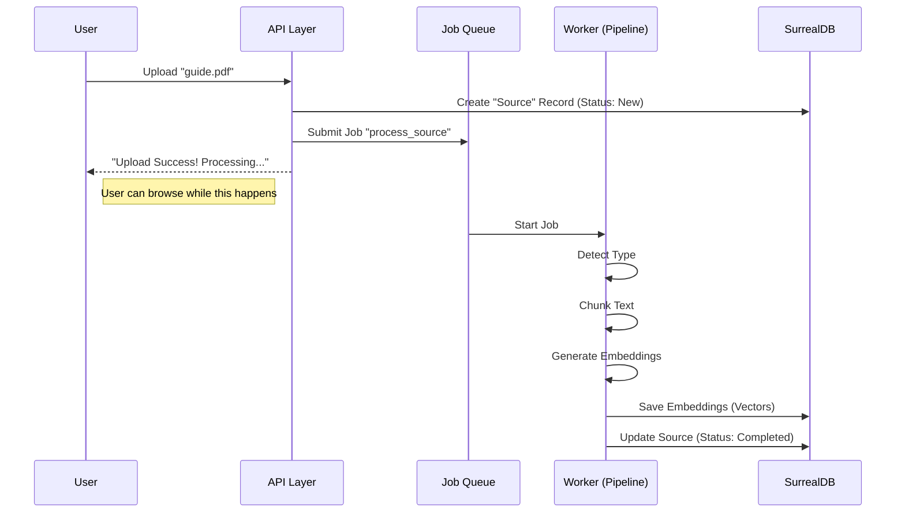

# Chapter 4: Content Processing Pipeline

In the previous chapter, **[Universal AI Provisioning](03_universal_ai_provisioning.md)**, we set up the "Brain" of our application—a universal way to request AI models.

However, a brain is useless without information to process. If you want the AI to understand your personal notes, PDFs, or websites, you can't just throw raw files at it. You need a system to break that information down into a format the AI can understand.

## The Problem: Indigestion

Imagine trying to swallow a whole steak without chewing. You would choke.

AI models have similar limitations:
1.  **Context Limits:** They can only read a certain amount of text at once.
2.  **Focus:** If you feed an AI a 500-page manual and ask a specific question, it might get lost in the noise.
3.  **Language:** Computers don't natively understand words; they understand numbers.

## The Solution: The Digestive System

We solve this with a **Content Processing Pipeline**. It acts exactly like a digestive system:

1.  **Ingest:** We take the raw food (Text, HTML, Markdown).
2.  **Chew (Chunking):** We break it down into small, manageable bites.
3.  **Absorb (Embeddings):** We convert those bites into "nutrients" (vectors/numbers) that the system can use.

---

## Central Use Case: Uploading a Reference Guide

Let's say a user uploads a file called `python_guide.md`.

Our goal is not just to save the file to the disk. We want to:
1.  Recognize it is a **Markdown** file.
2.  Split it by **Headers** (Introduction, Installation, Usage).
3.  Convert those sections into **Vectors** so we can search them later.

---

## Step 1: Ingestion & Detection (The Eyes)

First, the system needs to know what it is looking at. Is this a website? A code file? A plain text note?

We use a utility called `detect_content_type` in `open_notebook/utils/chunking.py`. It uses a two-step strategy:
1.  Check the **file extension** (e.g., `.md`).
2.  Check the **content** (heuristics) if the extension is missing.

### How to use it

```python
from open_notebook.utils.chunking import detect_content_type

# Imagine we loaded this text from a file
raw_text = "# Chapter 1\n\nThis is a header..."
filename = "document.md"

# The system decides how to treat this file
file_type = detect_content_type(raw_text, filename)
print(file_type) 
# Output: ContentType.MARKDOWN
```
*Explanation: The system sees the `.md` extension and confirms it's Markdown. If the file was named `data.txt` but contained HTML tags like `<body>`, the heuristics would detect it as HTML.*

---

## Step 2: Chunking (The Teeth)

Now that we know it is Markdown, we need to "chew" it.

If we just split the text every 1,000 characters, we might cut a sentence in half!
*   **Bad:** "...the secret code is [CUT]"
*   **Good:** We should split at natural boundaries like Headers or Paragraphs.

We use `chunk_text` to handle this intelligently.

### How to use it

```python
from open_notebook.utils.chunking import chunk_text

# A long string of text
long_text = "# Title\n\nIntro...\n\n# Section 2\n\nDetails..."

# Break it into a list of strings
chunks = chunk_text(long_text, content_type=file_type)

for chunk in chunks:
    print(f"Bite size: {len(chunk)} characters")
```
*Explanation: Because we told it the type is `MARKDOWN`, the code uses a specific `MarkdownHeaderTextSplitter`. It tries to keep headers and their paragraphs together.*

---

## Step 3: Embeddings (The Nutrients)

This is the most "Sci-Fi" part of the chapter.

We need to turn text into **Numbers**. Specifically, a list of coordinates called a **Vector**.
*   The word "Dog" might look like `[0.1, 0.5]`
*   The word "Cat" might look like `[0.1, 0.6]` (Close to Dog)
*   The word "Car" might look like `[0.9, -0.2]` (Far away)

This allows us to perform **Semantic Search** (searching by meaning, not just keywords).

We use `generate_embedding` in `open_notebook/utils/embedding.py`.

### How to use it

```python
from open_notebook.utils.embedding import generate_embedding

# Take one of our chunks
text_bite = "Python is a programming language."

# Convert it to math
# This calls the AI model we set up in Chapter 3!
vector = await generate_embedding(text_bite)

print(vector)
# Output: [-0.012, 0.821, -0.154, ... ] (lots of numbers)
```
*Explanation: This function handles the complexity of talking to the AI provider. If the text is too long, it automatically chunks it, embeds the pieces, and averages them (Mean Pooling).*

---

## Under the Hood: The Processing Factory

Processing a large file can take time (seconds or even minutes). We cannot make the user wait while their browser loads.

We use an **Asynchronous Pipeline**. When a user uploads a file, we say "Received!" immediately, and then a background worker processes it.



### The Code: The Orchestrator

In `api/routers/sources.py`, we see this logic in action. When a file is uploaded, we don't process it right there. We submit a **Command**.

```python
# api/routers/sources.py (Simplified)

# 1. Create the database record immediately
source = Source(title="My Document", topics=[])
await source.save()

# 2. Package the work instructions
command_input = SourceProcessingInput(
    source_id=str(source.id),
    content_state={"file_path": "/tmp/uploaded_file"},
    embed=True
)

# 3. Send to the background queue
await CommandService.submit_command_job(
    "open_notebook",
    "process_source", # The name of the worker function
    command_input.model_dump()
)
```
*Explanation: The API acts like a receptionist taking a package. It gives you a receipt (the Source object) and throws the package into the mailroom (Job Queue) to be sorted later.*

### Handling Logic: Mean Pooling

One interesting detail in `open_notebook/utils/embedding.py` is how we handle chunks that are *still* too big for the embedding model. We use a technique called **Mean Pooling**.

```python
async def mean_pool_embeddings(embeddings):
    # If we had to split one chunk into 3 smaller pieces
    # because the AI model has a strict limit...
    
    # We take the mathematical average of the 3 vectors
    # to create one "Master Vector" representing the whole text.
    arr = np.array(embeddings)
    mean = np.mean(arr, axis=0) 
    
    return mean.tolist()
```
*Explanation: This ensures that even if we chop a paragraph into pieces to fit the model, we can still save it as a single concept in our database.*

---

## Summary

In this chapter, we built the digestive system for our Open Notebook:

1.  **Detection:** We identify if input is HTML, Markdown, or Text.
2.  **Chunking:** We intelligently slice text into "bites" using splitters.
3.  **Embeddings:** We convert text into mathematical vectors using the AI tools from **[Chapter 3](03_universal_ai_provisioning.md)**.
4.  **Async Processing:** We learned that this heavy lifting happens in the background so the app stays fast.

Now our database is full of "Smart Data"—text that has been chunked and converted into searchable vectors.

In the next chapter, we will learn how to build the "Conductor" that uses this data to answer complex questions.

[Next Chapter: AI Orchestration (LangGraph)](05_ai_orchestration__langgraph_.md)

---

Generated by [Code IQ](https://github.com/adityasoni99/Code-IQ)