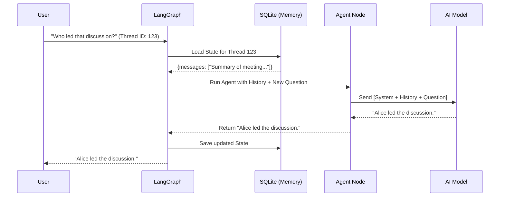

# Chapter 5: AI Orchestration (LangGraph)

In the previous chapter, **[Content Processing Pipeline](04_content_processing_pipeline.md)**, we learned how to digest raw files into "Smart Data" (vectors) that a machine can search.

Now, we have a database full of information and a way to call AI models. But we are missing one critical piece: **Memory**.

## The Problem: The "Goldfish" Memory

By default, Large Language Models (LLMs) are like goldfish. They have no memory of the past.

If you send two separate requests:
1.  **You:** "Who wrote Harry Potter?"
    *   **AI:** "J.K. Rowling."
2.  **You:** "What year was **she** born?"
    *   **AI:** "Who is 'she'? I don't know who you are talking about."

To build a chatbot that feels "real," we need a system that remembers the conversation history and coordinates complex steps (like "Search database" -> "Read results" -> "Answer user").

## The Solution: The Flowchart (LangGraph)

We use a library called **LangGraph**. It treats the AI's thought process like a **Flowchart** (or a Graph).

Instead of just "Input -> Output," we define a loop:
1.  **State:** A shared memory box (the "Clipboard").
2.  **Nodes:** Steps in the flowchart (e.g., "Call AI", "Search Database").
3.  **Edges:** The lines connecting the steps.
4.  **Checkpointer:** A save system that stores the state in a database.

---

## Central Use Case: "The Follow-Up Question"

Our goal is to allow a user to have a multi-turn conversation about their notes.

**User:** "Summarize my meeting notes."
**AI:** "You discussed the Q3 budget."
**User:** "Who led **that** discussion?"

The AI must look at the **State** (history), see the previous message about "meeting notes," and understand that "that discussion" refers to the Q3 budget.

---

## Concept 1: The State (The Clipboard)

First, we define what information the AI needs to carry around in its brain. In `open_notebook/graphs/chat.py`, we define the `ThreadState`.

Think of this as a clipboard that gets passed from person to person in an office.

```python
from typing import TypedDict, Annotated
from langgraph.graph.message import add_messages

class ThreadState(TypedDict):
    # The history of the chat (User says X, AI says Y)
    messages: Annotated[list, add_messages]
    
    # Context about the specific notebook we are in
    notebook: Optional[Notebook]
    
    # Specific text snippets we found in the database
    context: Optional[str]
```
*Explanation: `messages` is a list that grows. `add_messages` is a special rule that says "When you get new messages, append them to the list, don't delete the old ones."*

---

## Concept 2: The Node (The Worker)

Next, we need a function to do the actual work. In LangGraph, this is called a **Node**.

Our main node is `call_model_with_messages`. It takes the State (Clipboard), talks to the AI, and writes the answer back to the State.

```python
# open_notebook/graphs/chat.py

def call_model_with_messages(state: ThreadState, config: RunnableConfig):
    # 1. Get the prompt template (Instructions)
    prompter = Prompter(prompt_template="chat/system")
    
    # 2. Fill in the blanks with current State data
    system_prompt = prompter.render(data=state)
    
    # 3. Create the payload: [System Instructions] + [Chat History]
    payload = [SystemMessage(content=system_prompt)] + state["messages"]
```

### Calling the AI (Connecting to Chapter 3)
Inside this node, we use the tool we built in **[Universal AI Provisioning](03_universal_ai_provisioning.md)**.

```python
    # ... inside call_model_with_messages ...

    # 4. Use our Universal Provisioner to get a model
    # (We wrap this in a helper to handle async/sync code)
    model = provision_langchain_model(
        str(payload), 
        default_type="chat"
    )

    # 5. Ask the AI for a response
    ai_message = model.invoke(payload)

    # 6. Return the new message to update the State
    return {"messages": ai_message}
```
*Explanation: The function receives the history, adds the system instructions ("You are a helpful assistant..."), sends it all to the AI, and returns the AI's response.*

---

## Concept 3: The Checkpoint (The Save Game)

If the server restarts, we don't want the user to lose their conversation. We use a **Checkpointer**.

We use `SqliteSaver`. It acts like a video game save file. Every time the AI speaks, it saves the `ThreadState` to a file called `checkpoints.sqlite`.

```python
import sqlite3
from langgraph.checkpoint.sqlite import SqliteSaver

# Connect to a simple file-based database
conn = sqlite3.connect("checkpoints.sqlite", check_same_thread=False)

# Create the memory manager
memory = SqliteSaver(conn)
```

---

## Concept 4: Building the Graph

Finally, we connect the dots. We tell LangGraph how the flow should move.

```python
from langgraph.graph import StateGraph, START, END

# 1. Create a new Graph based on our State definition
workflow = StateGraph(ThreadState)

# 2. Add our worker node
workflow.add_node("agent", call_model_with_messages)

# 3. Define the flow: Start -> Agent -> End
workflow.add_edge(START, "agent")
workflow.add_edge("agent", END)

# 4. Compile it into a runnable application with Memory
graph = workflow.compile(checkpointer=memory)
```
*Explanation: This is a simple loop. When input comes in (`START`), go to the `agent` (the AI). When the AI replies, we are done (`END`). The `checkpointer` ensures the state is saved after the `agent` finishes.*

---

## Under the Hood: The Conversation Lifecycle

What happens when a user sends a message?



### The "Thinking" Cleanup

You might notice a function called `clean_thinking_content` in `chat.py`.

Some modern AI models (like DeepSeek or high-reasoning models) "think out loud" before answering. They produce output like:
```xml
<think>The user is asking about Alice. I should check the context.</think>
Alice led the discussion.
```

We don't want to show that internal monologue to the user.

```python
    # Clean thinking content from AI response
    content = ai_message.content
    cleaned_content = clean_thinking_content(content)
    
    # Update the message with only the final answer
    cleaned_message = ai_message.model_copy(update={"content": cleaned_content})
```
*Explanation: We strip out the `<think>` tags so the user sees a clean, professional response.*

---

## The System Prompt

How does the AI know it's a "Study Assistant" and not a "Pirate"? We use a template file: `prompts/chat/system.jinja`.

This file is injected into the conversation at the very start of the `call_model_with_messages` function.

```jinja
# SYSTEM ROLE
You are a cognitive study assistant...


# CONTEXT
The user has selected this context:
{{context}}


# CITING INSTRUCTIONS
If your answer is based on context, cite it like this: [note:123].
```
*Explanation: This template uses Logic (``). If the user selected a specific note, we inject that note's text directly into the AI's instructions. This is how the AI "knows" what you are reading.*

---

## Summary

In this chapter, we built the **Orchestration Layer**:

1.  **State:** We defined a "Clipboard" (`ThreadState`) to hold conversation history.
2.  **Nodes:** We created a worker function to call the AI (using the tool from Chapter 3).
3.  **Checkpoints:** We connected a database (`SqliteSaver`) so the AI remembers the conversation forever.
4.  **Graph:** We wired these together into a runnable application.

Now we have a working AI brain that can remember context! But currently, it only lives inside a Python script. We need a way for our web frontend to talk to it.

In the next chapter, we will build the **API Service Layer** to expose this graph to the world.

[Next Chapter: API Service Layer](06_api_service_layer.md)

---

Generated by [Code IQ](https://github.com/adityasoni99/Code-IQ)